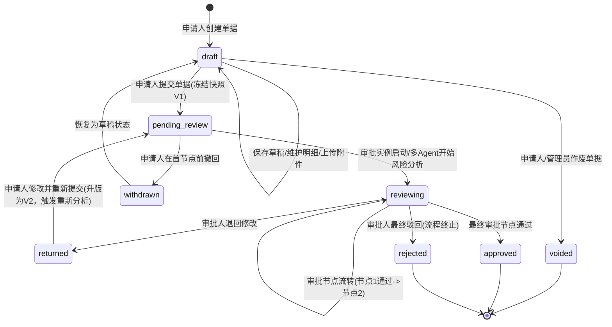
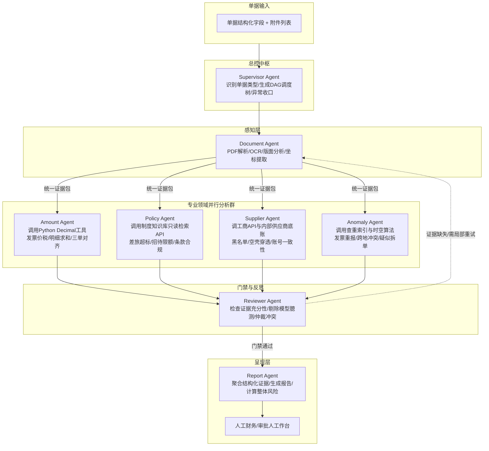
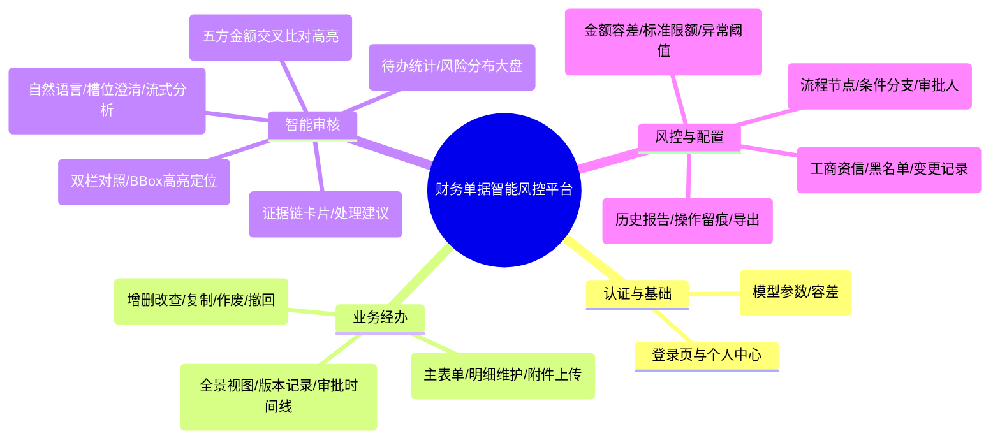
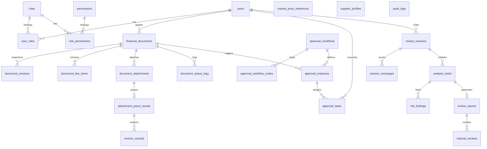

# 财务单据智能风险审核系统 PRD（产品需求文档）

**文档版本：** V1.0 正式版（基于第2.7章标准需求与多Agent技术深度优化）  
**项目定位：** 融合确定性规则工具与多 Agent 认知协同的企业级财务单据智能风险审核与人机复核平台  
**产品原则：** 
1. **AI 赋能而非越权：** AI 负责调查、计算、举证、预警与建议，绝不代替具备法定权限的审批人做最终审批，严禁系统自动触碰银行打款。
2. **算归算，想归想：** 金额精确加减、税率计算、发票查重、税号验证等一律交由确定性代码工具；事由合理性、非标条款语义比对、模糊异常推理交由大模型。
3. **证据链绝对闭环：** 每一个风险项必须包含“实际值、参考值、规则阈值、原文定位证据（页码/坐标BBox）、制度切片不可变引用、处理建议”。

---

## 1. 项目背景与业务痛点（小白通俗导读）

### 1.1 什么是财务单据审核？为什么企业必须做？
在企业日常运营中，每天都会产生大量的“花钱单据”：
- **员工找公司报销**：出差打车发票、高铁票、酒店账单、团队聚餐发票等。
- **公司对外付款**：向供应商采购原材料、付IT软件实施费、付办公室房租、分期支付工程款。

传统人工审核存在**“四大致命痛点”**：
1. **肉眼核算繁琐易错**：财务审核员需要手动用计算器算几十张发票金额是否与单据总额一致、税额是否计算正确，80%的时间浪费在机械查验上。
2. **制度繁杂难以全面落地**：大企业的差旅和报销制度长达上百页（例如不同职级在不同城市酒店限额不同、机票折扣限制、招待标准按人头限额）。财务人员无法全凭记忆执行，经常漏审或人情放行。
3. **隐蔽欺诈与合规漏洞难识破**：
   - *重复报销*：一张电子发票打成两份，隔一个月在不同部门找不同领导报销两次。
   - *假公济私/时空冲突*：员工利用周末自驾游，却开具周日晚上的大额异地海鲜餐饮发票；或者发票时间显示人在上海开会，但同一下午却报销了北京的打车发票。
   - *恶意拆单*：部门经理单笔审批权限是10万元，为了绕过副总裁审批，故意拆成3笔9.8万元的付款单。
   - *空壳供应商与利益输送*：采购向成立刚满1个月、社保人数为0的空壳公司打款500万，法人竟是采购经理亲戚。
4. **审计举证成本极高**：遭遇内外部审计或税务倒查时，由于缺乏数字化证据锚定，翻找几年前的纸质发票、旧版制度文本极度艰难。

### 1.2 系统的破局之道
本系统构建了一个**“前端交互 + 后端业务服务 + 确定性计算引擎 + LangGraph多Agent智能调查团队 + 证据链落库”**的全闭环平台。让系统像“财务特侦组”一样，秒级完成五类核心单据的合规审查，自动生成带证据高亮的体检报告，并推送到审批工作台供财务人员复核。

---

## 2. 系统建设目标与交付范围

### 2.1 建设目标
1. **全单据覆盖**：完整支持企业五大主流单据（对公付款、预付款、批量付款、费用报销、差旅报销）全生命周期流转。
2. **多轮对话智能澄清**：提供“智能审核对话工作台”，支持通过自然语言对话完成单据类型与单据编号的槽位填补（Slot-Filling），并能针对歧义信息反问澄清。
3. **确定性与AI结合的多Agent协同**：基于 LangGraph 编排 8 个专业 Agent，实现“文档解析 → 金额核算 → 制度检索 → 外部资信 → 行为反欺诈 → 门禁反思 → 报告汇总”的自动化调度。
4. **证据链穿透与不可变溯源**：发票识别精确到页码与图片 BBox 坐标；制度引用精确到知识库不可变版本与切片 Chunk ID；金额计算可公式复现。
5. **严密审批流与审计追踪**：支持多节点审批流程配置（条件分支）、退回修改版本快照管理、全链路操作审计日志留痕。

### 2.2 交付形态与范围边界
- **交付形态**：可独立运行的 Web 前端控制台、后端业务与 AI 服务、PostgreSQL 数据库初始化脚本、本地/对象文件存储模块、演示用假数据集合、完整审核全链路演示。
- **支持的单据类型（五类）**：
  1. `对公付款单`（B2B Payment）：合同款、外包服务费、设备采购款等；
  2. `预付款单`（Prepayment）：合同签署后的前期定金/首付款；
  3. `批量付款单`（Batch Payment）：代发劳务报酬、多笔供货集中结算；
  4. `费用报销单`（Expense Reimbursement）：日常办公、耗材、招待费等；
  5. `差旅报销单`（Travel Reimbursement）：机票、高铁、酒店、打车、差旅补贴等。
- **支持的附件类型**：PDF（单页/多页电子发票、合同文本）、PNG、JPG 图片（发票照片、行程单、送货单）。
- **安全与合规红线**：
  - 系统绝对不具备直连银行网银的转账打款接口。
  - AI 判定结论仅作为“审核辅助证据与建议”，最终决策必须由具名审批人人工确认。
  - 密码强哈希加盐存储，接口基于 JWT 鉴权，支持细粒度 RBAC 角色与数据权限控制。

---

## 3. 用户角色与权限体系

| 角色标识 | 角色名称 | 核心职责与权限边界 |
|---|---|---|
| `applicant` | **单据申请人** | 创建/编辑草稿、录入费用或付款明细、上传单据附件、提交审批、撤回尚未进入终审的单据、查看本人单据流转进度与退回原因。 |
| `approver` | **审批人员** | 接收待办审批任务、进入智能审核对话页发起/查阅分析、在审核工作台查看风险证据链、填写复核批注、执行“通过/退回修改/驳回”操作。 |
| `finance_officer` | **财务/风控专员** | 查看全公司所有单据风险分析结果与金额核对面板、维护审核规则（容差、异常阈值）、维护市场价参考库、维护供应商信用档案与黑名单。 |
| `system_admin` | **系统管理员** | 维护用户、角色与权限分配、配置审批工作流（节点与条件）、维护大模型 API 与任务调度配置、查看全量操作审计日志。 |
| `auditor` | **审计人员** | 具备全局只读权限，查询历史审批单据、单据版本快照、风险判定历史底稿、知识库历史引用版本与系统审计日志。 |

---

## 4. 核心业务流程与交互机制

### 4.1 单据全生命周期状态机



### 4.2 智能审核对话交互与槽位填补（Slot-Filling）机制
系统在 `智能审核对话页` 提供多轮人机交互式审单能力，支持以下典型场景：
1. **未指定单据类型**：
   - 用户输入：“帮我查一下昨天的单子有什么问题”
   - 系统响应：发送 `slot_required` 消息：“请问您要审核的是哪种单据类型？（选项：对公付款单 / 预付款单 / 批量付款单 / 费用报销单 / 差旅报销单）”
2. **未指定单据编号**：
   - 用户输入：“我想审核差旅报销单”
   - 系统识别单据类型为 `差旅报销单`，但缺少编号，追问：“请输入您要审核的差旅报销单单据编号（例如：EXP-20260901-001）。”
3. **歧义或多候选项**：
   - 用户输入：“查一下张三上周提的那笔电脑采购”
   - 系统检测到张三上周提交了2笔采购付款单，展示候选列表（单号、金额、提交时间），请求用户点选确认。
4. **槽位锁定与任务触发**：
   - 当 `单据类型 + 单据编号` 槽位全部补齐且校验用户具备该单据的数据权限后，会话锁定槽位，后台异步发起 `analysis_tasks`。
   - 对话流式推送进度事件：`querying_document` → `loading_attachments` → `parsing_attachments` → `analyzing` → `report_ready`。

---

## 5. 多 Agent 架构与分工协作机制

为彻底杜绝大模型计算幻觉，系统采用 **LangGraph StateGraph** 构建多 Agent 编排体系，实行**“确定性工具先行，大模型认知补充”**的双轨判定范式。



### 5.1 八大 Agent 职责与工具边界矩阵

| Agent 名称 | 输入内容 | 核心职责 | 依赖工具（确定性 vs 模型） | 产出结构（强类型 JSON） |
|---|---|---|---|---|
| **Supervisor Agent** | 单据类型、单据快照、系统配置 | 分析单据类型，决定分发哪些子 Agent 并行（如差旅单不跑供应商Agent，对公付款全量跑）。 | **代码逻辑**：LangGraph 状态机路由器。 | DAG 调度计划与任务状态事件。 |
| **Document Agent** | 附件文件路径（PDF/图片） | 执行版面分析、OCR识别、数电票XML提取，建立发票/合同字段到图片坐标（BBox）的映射。 | **混合**：OCR/PDF提取器 + VLM 多模态大模型修正。 | 附件结构化证据包（含文本、字段、页码、BBox、置信度）。 |
| **Amount Agent** | 单据金额、明细列表、发票数据、合同金额 | **绝对禁止大模型心算**！严密校验总分平衡、发票税额、分期付款累计、批量笔数与总额。 | **确定性代码**：Python `Decimal` 精确运算工具，严格舍入模式。 | 金额核对对比表（实际值、计算值、差额、容差命中判定）。 |
| **Policy Agent** | 费用科目、发生地点、职级、申请事由、日期 | 检索当前单据对应的不可变财务制度切片，判定是否存在超标、未按规定舱位订票等。 | **大模型 + 知识库**：只读知识库向量检索 API + LLM 条款语义理解。 | 制度违规项（命中条款、标准上限、申报值、引用 `chunk_id`）。 |
| **Supplier Agent** | 供应商名称、税号、银行账号、开户行 | 针对对公/预付款，核查供应商是否处于经营异常、是否是新成立空壳公司、收款账号是否突变。 | **确定性代码 + 外部API**：工商查询 API、内部黑名单表查询。 | 供应商风险项（失信记录、空壳风险得分、公章一致性、账号变更警报）。 |
| **Anomaly Agent** | 本单特征、申请人历史30天单据、同行人 | 识别发票查重碰撞、同日异地时空冲突（人在北京报销广州晚餐）、长假异地消费、拆单避审。 | **确定性代码 + 规则引擎**：发票唯一哈希索引库、时空冲突轨迹算法。 | 异常行为证据（发票重报关联单号、时空冲突时间线、疑似拆单明细）。 |
| **Reviewer Agent** | 各专业 Agent 提交的初审风险项集合 | 充当“质检法官”：核查每项风险是否有硬证据支撑，剔除大模型莫须有的臆测，仲裁冲突。 | **大模型认知 Prompt**：批判性质检与证据充分性检验规则。 | 最终确认的风险集、是否打回子 Agent 重跑判断。 |
| **Report Agent** | Reviewer 确认的风险集与证据链 | 汇总形成符合财务阅读习惯的体检报告，计算综合风险等级（High/Medium/Low），给出处理建议。 | **大模型文本生成**：结构化报告模板渲染器。 | `review_reports`（多维摘要、风险卡片、BBox标注底稿）。 |

---

## 6. 十大核心风险审核规则与判定标准

| 规则编号 | 风险规则名称 | 适用单据 | 判定逻辑与确定性算法 | 风险等级定义 |
|---|---|---|---|---|
| **R01** | **单据与发票金额一致性** | 全部单据 | 计算 $\Delta = |\text{单据申请金额} - \sum \text{有效发票含税金额}|$。若 $\Delta > \text{容差阈值}$（默认0.00元），标记异常。 | $\Delta > 50$ 元为 `high`；$0 < \Delta \le 50$ 为 `medium`。 |
| **R02** | **明细与总金额一致性** | 全部单据 | 计算 $\text{Diff} = |\text{单据总额} - \sum \text{明细行金额}|$。识别漏填明细、重复行项目。 | $\text{Diff} \ne 0$ 为 `high`（阻断流转）。 |
| **R03** | **合同与付款一致性** | 对公付款、预付款 | 校验：1. 收款单位名称必须与合同乙方公章一致；2. 当前期款比例与合同约定一致；3. $\sum \text{累计付款} \le \text{合同总额}$。 | 主体不符为 `high`；超合同金额为 `high`；比例不符为 `medium`。 |
| **R04** | **批量付款一致性** | 批量付款单 | 校验：1. 单笔明细之和 $==$ 批次总金额；2. 明细总笔数 $==$ 单据申报笔数；3. 检查收款卡号重复出现情况。 | 笔数或金额不平为 `high`；存在异常重复收款人为 `medium`。 |
| **R05** | **费用标准合规性** | 差旅、费用报销 | RAG检索知识库《差旅制度》：按（申请人职级、差旅城市、季节）匹配酒店限额、交通舱位标准；餐补按天数核算。 | 超标 $20\%$ 以上为 `high`；超标 $20\%$ 以内为 `medium`（提示自理）。 |
| **R06** | **市场价格合理性** | 全部采购与报销 | 匹配 `market_price_references` 表：计算偏离度 $\text{Dev} = \frac{\text{申报单价} - \text{市场基准高位}}{\text{市场基准高位}} \times 100\%$。 | $\text{Dev} > 30\%$ 为 `high`；$10\% < \text{Dev} \le 30\%$ 为 `medium`。 |
| **R07** | **消费行为异常（时空/拆单）** | 差旅、费用报销 | 1. **时空冲突**：两张发票发生地距离 $> 500\text{km}$ 且时间间隔 $< 4\text{小时}$；<br>2. **疑似拆单**：同申请人、同科目在3天内累计金额超审批阈值。 | 时空物理不可能为 `high`（疑似买假票）；疑似拆单为 `high`。 |
| **R08** | **供应商资信与账户风险** | 对公付款、预付款 | 1. 命中失信被执行人/税收违法黑名单；<br>2. 成立时间 $< 90\text{天}$ 且参保人数为0；<br>3. 收款账户与历史签约账户不一致且无变更公函。 | 黑名单为 `high`；账号未授权突变为 `high`；新成立空壳为 `medium`。 |
| **R09** | **附件完整性与清晰度** | 全部单据 | 1. 检查是否存在未上传发票的明细行；<br>2. 检查合同关键页（盖章页、付款条款页）是否缺失；<br>3. OCR置信度 $< 0.6$ 标记模糊附件。 | 关键发票/合同盖章页缺失为 `high`；图片模糊为 `medium`。 |
| **R10** | **发票全局查重风险** | 全部单据 | 全局已报发票库唯一性校验：`Hash(发票代码 + 发票号码)` 在数据库中状态为已报或审批中。 | 命中重复发票为 `high`（直接拦截）。 |

- **综合风险等级计算规则**：
  - 若包含任一 `high` 风险项，整体风险为 **高风险（High）**，建议操作为“建议驳回”或“强人工复核”；
  - 若无 `high` 但包含 `medium` 风险项，整体风险为 **中风险（Medium）**，建议操作为“人工复核/补充材料”；
  - 若仅包含 `low` 或无风险，整体风险为 **低风险（Low）**，建议操作为“建议通过”。

---

## 7. 页面功能清单与原型交互说明

根据系统建设要求，系统包含 13 个功能页面/面板：



### 7.1 核心页面交互亮点说明
1. **智能审核对话页**：
   - 左侧为多轮对话流，支持用户自然语言询问单据风险。
   - 具有槽位记忆组件（展示当前已识别的 `单据类型`、`单据编号`、`申请人`）。
   - 触发分析后展示 Agent 协作时序动画（Supervisor → Document → Parallel 4-Agents → Reviewer → Report），最后输出富文本卡片。
2. **金额核对面板（Amount Comparison View）**：
   - 采用多栏矩阵横向对比：`单据总额` vs `明细合计` vs `发票价税合计` vs `合同约定总额/分期额` vs `本次实付额`。
   - 任何差额字段用红色高亮（如 `+50.00 (多报)`），鼠标悬浮展示公式与出处。
3. **附件解析与原文证据定位页（Document Proof View）**：
   - 页面左侧为 PDF/图片阅览器（支持缩放、旋转、多页切换）；
   - 页面右侧为提取出的结构化键值对（发票代码、税额、开票日期、购买方税号等）；
   - 点击右侧任意字段，左侧阅览器自动平移聚焦并在原图上绘制绿色高亮矩形框（Bounding Box）。

---

## 8. 核心数据实体与设计规划（25 张核心表映射）

系统数据库严格遵循第 2.7.10 节规范，定义 25 张实体表：



### 实体表职责与核心字段概要表

| 序号 | 表名 | 中文说明 | 关键字段规划 |
|---|---|---|---|
| 1 | `users` | 系统用户表 | `id`, `username`, `display_name`, `password_hash`, `status`, `created_at` |
| 2 | `roles` | 角色定义表 | `id`, `role_code` (`applicant`/`approver`/`finance_officer`/`admin`), `role_name` |
| 3 | `permissions` | 权限资源表 | `id`, `permission_code`, `permission_name`, `resource_type`, `action_type` |
| 4 | `user_roles` | 用户角色关联表 | `id`, `user_id`, `role_id` |
| 5 | `role_permissions` | 角色权限关联表 | `id`, `role_id`, `permission_id` |
| 6 | `review_sessions` | 智能审核会话表 | `id`, `user_id`, `document_type`, `document_no`, `session_status`, `updated_at` |
| 7 | `session_messages` | 对话消息历史表 | `id`, `session_id`, `role`, `content`, `message_type` (`slot_req`/`text`/`card`) |
| 8 | `financial_documents` | 财务单据主表 | `id`, `document_type` (5类), `document_no`, `applicant_id`, `applicant_dept`, `budget_dept`, `payee_name`, `payee_account`, `expense_category`, `total_amount`, `currency`, `apply_date`, `reason_text`, `document_status`, `current_version` |
| 9 | `document_versions` | 单据不可变快照表 | `id`, `document_id`, `version_no`, `document_snapshot_json`, `created_by` |
| 10 | `document_line_items`| 单据支出明细表 | `id`, `document_id`, `item_type`, `item_name`, `expense_date`, `expense_location`, `quantity`, `unit_price`, `amount`, `remark` |
| 11 | `document_attachments`| 单据附件表 | `id`, `document_id`, `document_version`, `file_name`, `file_type`, `file_size`, `file_path`, `file_hash`, `storage_status`, `parse_status` |
| 12 | `attachment_parse_results`| 附件解析结果表 | `id`, `attachment_id`, `document_category`, `full_text`, `fields_json`, `evidence_positions_json` (BBox), `confidence` |
| 13 | `invoice_records` | 发票专属查验底账表 | `id`, `attachment_id`, `invoice_code`, `invoice_no`, `seller_name`, `buyer_name`, `invoice_date`, `amount_excluding_tax`, `tax_amount`, `amount_including_tax`, `currency` (唯一索引防重报) |
| 14 | `approval_workflows` | 审批流程定义表 | `id`, `workflow_name`, `document_type`, `match_conditions_json`, `status` |
| 15 | `approval_workflow_nodes`| 审批流程节点表 | `id`, `workflow_id`, `node_name`, `node_order`, `approver_role`, `approval_mode` (`AND`/`OR`) |
| 16 | `approval_instances` | 审批运行实例表 | `id`, `workflow_id`, `document_id`, `document_version`, `instance_status`, `current_node_id`, `started_at`, `finished_at` |
| 17 | `approval_tasks` | 具名审批待办任务表 | `id`, `instance_id`, `node_id`, `approver_id`, `task_status`, `review_comment`, `processed_at` |
| 18 | `document_status_logs` | 单据状态流转日志表 | `id`, `document_id`, `from_status`, `to_status`, `operator_id`, `remark`, `created_at` |
| 19 | `analysis_tasks` | 多Agent分析任务表 | `id`, `session_id`, `document_id`, `task_status`, `current_step`, `started_at`, `finished_at`, `error_message` |
| 20 | `risk_findings` | 识别出的风险项列表 | `id`, `task_id`, `risk_type`, `risk_level`, `risk_title`, `description`, `actual_value_json`, `reference_value_json`, `threshold_json`, `evidence_json`, `suggestion_text`, `review_status` |
| 21 | `review_reports` | 综合风险体检报告表 | `id`, `task_id`, `document_id`, `overall_risk_level`, `risk_summary_json`, `amount_comparison_json`, `recommendation`, `report_markdown` |
| 22 | `market_price_references`| 市场价参考基准库 | `id`, `item_name`, `specification`, `region`, `price_min`, `price_max`, `currency`, `source_name`, `effective_date` |
| 23 | `supplier_profiles` | 供应商风控档案表 | `id`, `supplier_code`, `supplier_name`, `credit_status`, `blacklist_status`, `risk_tags_json`, `bank_accounts_json` |
| 24 | `manual_reviews` | 人工复核与特批记录 | `id`, `report_id`, `reviewer_id`, `review_result` (`pass`/`reject`/`return`), `review_comment`, `reviewed_at` |
| 25 | `audit_logs` | 全局安全审计日志表 | `id`, `user_id`, `action_type`, `resource_type`, `resource_id`, `detail_json`, `created_at` |

---

## 9. 知识库联动与五维证据链设计规范

### 9.1 制度知识库不可变版本机制
企业差旅与财务制度随年份动态变动。为了保证多年后的审计倒查一致性：
- 知识库制度发布时，自动打上唯一版本号（如 `POLICY-TRAVEL-2025-V1.2`）；
- Policy Agent 检索知识库时，记录并持久化以下引用元数据到风险项中：
  - `policy_unit_id`：制度文档单元 ID
  - `policy_version`：制度不可变版本号
  - `chunk_id`：切片唯一标识
  - `quote_text`：被命中的制度条款原文摘录（作为审计事实镜像保存，知识库后续更新不影响已生成历史报告）。

### 9.2 结构化证据链 JSON Schema 规范
每个 `risk_findings` 记录的 `evidence_json` 必须满足以下标准结构：
```json
{
  "finding_code": "R05_TRAVEL_HOTEL_EXCEEDED",
  "anchors": [
    {
      "type": "ATTACHMENT_BBOX",
      "attachment_id": 1024,
      "file_name": "上海全季酒店发票.pdf",
      "page": 1,
      "box_2d": [180, 220, 420, 260],
      "ocr_text": "金额：￥650.00"
    },
    {
      "type": "POLICY_CHUNK",
      "unit_id": "POL-FIN-002",
      "version": "2025.1",
      "chunk_id": "CHK-SH-HOTEL-L2",
      "clause_title": "第二章第七条 住宿限额标准",
      "clause_text": "P2级员工赴上海出差，普通发票住宿标准上限为450元/夜。"
    },
    {
      "type": "DETERMINISTIC_CALC",
      "tool": "decimal_diff_calc",
      "formula": "650.00 - 450.00",
      "variance": "+200.00",
      "ratio": "+44.4%"
    }
  ]
}
```

---

## 10. API 接口体系全景规划（完全对齐第 2.7.11 & 2.7.12 节规范）

系统后端提供统一的 RESTful API（全量采用 `/api/v1` 前缀）与基于 WebSocket/SSE 的实时消息推送。

### 10.1 核心 RESTful 接口清单（共 35 项）

#### 1. 用户认证与当前身份（2项）
- `POST /api/v1/auth/login`：用户登录并返回访问令牌（JWT Token）
- `GET /api/v1/auth/me`：查询当前登录用户基本信息与角色权限

#### 2. 单据管理与全生命周期（8项）
- `POST /api/v1/documents`：创建单据（初始化草稿状态）
- `GET /api/v1/documents`：按单据类型、申请人、部门、状态和日期等多条件分页查询单据列表
- `GET /api/v1/documents/{document_id}`：查询指定单据详情、明细、附件、历史版本和审批进度
- `PATCH /api/v1/documents/{document_id}`：编辑草稿或退回修改状态的单据
- `POST /api/v1/documents/{document_id}/copy`：复制已有单据并生成新草稿单据
- `POST /api/v1/documents/{document_id}/submit`：提交单据，冻结版本快照，创建审批实例和风险分析任务
- `POST /api/v1/documents/{document_id}/withdraw`：撤回未处理（首个审批节点前）的单据
- `POST /api/v1/documents/{document_id}/void`：作废符合条件的草稿或撤回单据

#### 3. 单据明细维护（子资源）（3项）
- `POST /api/v1/documents/{document_id}/line-items`：新增单据明细（费用明细或付款明细）
- `PATCH /api/v1/documents/{document_id}/line-items/{line_item_id}`：更新单据指定明细项
- `DELETE /api/v1/documents/{document_id}/line-items/{line_item_id}`：删除单据指定明细项

#### 4. 单据附件与解析管理（4项）
- `POST /api/v1/documents/{document_id}/attachments`：上传单据附件（PDF、PNG、JPG）
- `GET /api/v1/documents/{document_id}/attachments/{attachment_id}`：下载或在线预览单据附件
- `DELETE /api/v1/documents/{document_id}/attachments/{attachment_id}`：删除单据指定附件
- `POST /api/v1/documents/{document_id}/attachments/{attachment_id}/parse`：创建单个附件异步解析任务（OCR与版面提取）

#### 5. 智能审核对话与槽位交互（3项）
- `POST /api/v1/review-sessions`：创建审核会话
- `POST /api/v1/review-sessions/{session_id}/messages`：发送消息，返回澄清提问（槽位补全）或触发分析任务信息
- `GET /api/v1/review-sessions/{session_id}/messages`：查询会话历史消息记录

#### 6. 风险分析任务与报告（8项）
- `POST /api/v1/documents/{document_id}/analysis`：手动或批量创建单据风险分析任务
- `GET /api/v1/analysis-tasks/{task_id}`：查询分析任务状态、当前执行步骤与进度百分比
- `GET /api/v1/analysis-tasks/{task_id}/findings`：查询分析生成的风险项列表及判定证据
- `GET /api/v1/analysis-tasks/{task_id}/report`：查询综合风险报告和看板展示数据
- `GET /api/v1/documents/{document_id}/amount-comparison`：查询五方金额交叉核对结果与差异分析
- `GET /api/v1/suppliers/{supplier_code}/risks`：查询指定供应商风险档案、失信标签与历史异常记录
- `PATCH /api/v1/risk-findings/{finding_id}/review-status`：更新单个风险项的人工复核状态（`confirmed`/`dismissed`）
- `POST /api/v1/review-reports/{report_id}/manual-reviews`：提交人工终审复核意见与审批结论
- `GET /api/v1/review-reports/{report_id}/export`：导出 PDF/Markdown 格式的风险审核体检报告

#### 7. 审批任务与流程流转（4项）
- `GET /api/v1/approval-tasks`：查询当前登录用户的待审批任务列表
- `POST /api/v1/approval-tasks/{task_id}/approve`：通过当前节点的审批任务，推进至下一节点或终审通过
- `POST /api/v1/approval-tasks/{task_id}/return`：退回审批任务，要求申请人修改重提
- `POST /api/v1/approval-tasks/{task_id}/reject`：驳回审批任务，流程直接终止

#### 8. 流程定义与风控规则配置（6项）
- `GET /api/v1/approval-workflows`：查询审批流程配置列表
- `POST /api/v1/approval-workflows`：创建新的审批流程定义（包含节点与条件）
- `PATCH /api/v1/approval-workflows/{workflow_id}`：更新指定审批流程配置
- `GET /api/v1/rules`：查询审核风控规则列表（金额容差、费用标准、异常阈值）
- `POST /api/v1/rules`：创建新的审核风控规则
- `PATCH /api/v1/rules/{rule_id}`：更新指定风控规则的阈值与启停用状态

---

### 10.2 实时推送事件消息类型（对齐第 2.7.12 节）

系统通过 WebSocket（`/api/v1/ws/review`）或 SSE 机制，向前端实时推送以下 9 类状态变更消息：

| 消息事件类型 | 核心推送字段 | 业务含义与触发时机 |
|---|---|---|
| `document_status` | `document_id`, `document_status`, `current_version` | 单据提交、撤回、退回修改、作废等生命周期状态变更时推送 |
| `approval_status` | `document_id`, `instance_id`, `node_id`, `task_status` | 审批流程流转、节点通过、退回或驳回时向相关人推送 |
| `slot_required` | `session_id`, `slot_name`, `question_text`, `candidate_values` | 对话过程中缺失单据类型或单据编号时，向用户提问补齐 |
| `task_status` | `task_id`, `task_status`, `current_step`, `progress` | 多 Agent 异步分析任务进度流转（如 `parsing` $\rightarrow$ `analyzing`） |
| `attachment_status`| `attachment_id`, `storage_status`, `parse_status` | 附件上传完成、OCR解析成功或失败时通知前端刷新 |
| `risk_finding` | `task_id`, `finding_id`, `risk_type`, `risk_level`, `risk_title` | 专业 Agent 识别出特定风险项时实时推送到审核面板 |
| `report_ready` | `task_id`, `report_id`, `overall_risk_level` | 全量多 Agent 审核完成，报告生成完毕，提示复核 |
| `error` | `task_id`, `error_code`, `error_message` | 分析、解析或执行失败时推送错误详情与重试建议 |
| `done` | `task_id`, `finished_at` | 本轮审核会话或后台任务彻底结束标记 |

---

### 10.3 外部系统集成接口（企业知识库 RAG 联动）
- `POST /api/ai/search`（调用知识库服务）：Policy Agent 以服务鉴权身份调用企业知识库，传入业务问题、费用科目、职级与部门，返回被授权的制度切片（不可变版本 `unit_version` 与 `chunk_id`），单据涉密原文与金额默认不向外部传输。

---

## 11. 项目验收标准与全链路演示基准

系统建设完成后，需通过以下标准的验收：
1. **五类单据全覆盖演示**：申请人成功录入对公付款、预付款、批量付款、费用报销、差旅报销五类单据，维护各自特有字段（如对公关联供应商与合同、差旅关联出差起止地、批量关联多笔收款账户）。
2. **多附件解析与原文坐标对齐**：上传 PDF 与图片格式的发票、合同、行程单，系统准确提取结构化字段并在原图上成功框选高亮。
3. **多轮对话槽位补全**：在智能审核对话页输入模糊需求，系统通过 `slot_required` 准确反问补齐单据类型与单据编号，并流式反馈分析进度。
4. **确定性金额零误差核算**：金额核对面板清晰展示单据总额、明细之和、发票之和、合同额差额，计算过程毫厘不差，符合 Python Decimal 严格算法。
5. **多 Agent 协同与风险检出演示**：
   - 演示场景1（差旅报销）：精准识别“酒店超标”、“同日异地时空冲突”发票；
   - 演示场景2（对公付款）：精准拦截“新成立空壳供应商”、“关联方交易嫌疑”、“收款账户擅自变更”；
   - 演示场景3（重复发票）：精准拦截跨单跨人员的发票二次报销。
6. **人工审批与版本流转闭环**：审批人确认风险项，执行“退回修改”；申请人修改金额与附件后重新提交，系统生成 `V2` 版本并重新跑通分析，审批人最终“通过审批”。
7. **报告导出与审计留痕**：一键导出包含证据链的 Markdown/PDF 体检底稿，系统后台日志完整记录操作人、时间与 IP。
