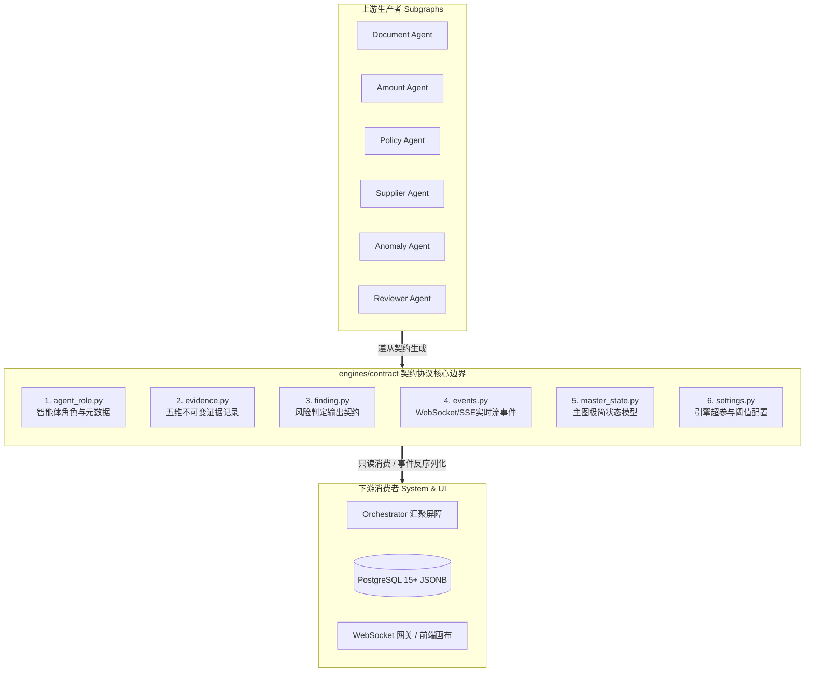

# 模块详细设计 Spec —— 01. engines/contract 智能体契约与事件规范

**文档版本：** V1.0  
**所属模块：** `backend/engines/contract/`  
**依据文档：** 《PRD-v1.0.md》、《数据实体设计.md》、《概要设计.md》  
**设计目标：** 制定多 Agent 推理引擎的核心契约规范。作为整个智能审核系统的“宪章协议”，该模块严格定义智能体角色枚举、五维不可变证据模型、风险发现契约、WebSocket 实时流式事件载荷与全局状态机契约，实现 Agent 间无状态解耦与全链路可溯源。

---

## 1. 模块设计理念与职责边界



### 核心设计原则
1. **强类型不可变（Immutability & Slots）**：
   证据与风险一旦检出即为“法律事实”，禁止在流转过程中被下游篡改。采用 Python `dataclass(frozen=True, slots=True)` 或 Pydantic `frozen=True`，保证只读性与纳秒级反序列化性能。
2. **五维立体存证（5-Dimensional Evidence）**：
   任何风险判定必须关联完整的五维链条：`文件哈希 + 归一化 BBox 坐标 + 原始字符 + 纯代码精算公式 + 制度不可变切片 ID`，杜绝大模型“无凭无据”产生幻觉。
3. **零 Web/SQL 依赖**：
   本模块为纯粹的领域契约，**严禁引入任何 FastAPI、SQLAlchemy、Redis 具体的数据库或网络驱动依赖**，保持纯纯的协议原子性。

---

## 2. 详细文件规格与数据模型定义

### 2.1 智能体角色定义：`agent_role.py`

定义系统内 8 大核心 Agent 角色的枚举、显示名称、执行阶段与超时熔断控制。

```python
"""
backend/engines/contract/agent_role.py
定义多智能体系统的角色枚举与元数据
"""
from enum import Enum
from dataclasses import dataclass

class AgentRoleEnum(str, Enum):
    """智能体角色枚举 (符合 PRD 与概要设计规范)"""
    SUPERVISOR = "supervisor"          # 主控中枢：意图识别与动态 DAG 编排
    DOCUMENT = "document_agent"        # 票据专家：OCR、版面分析与归一化 BBox 提取
    AMOUNT = "amount_agent"            # 精算专家：确定性 Decimal 核算与五方交叉比对
    POLICY = "policy_agent"            # 制度合规：财务知识库 RAG 检索与超标/合理性判定
    SUPPLIER = "supplier_agent"        # 工商风控：失信穿透、空壳企业与银行账户变更核验
    ANOMALY = "anomaly_agent"          # 反欺诈专家：行程时空冲突、发票全局查重
    REVIEWER = "reviewer_agent"        # 终审质检：证据链门禁质检、反思纠偏与仲裁
    REPORT = "report_agent"            # 报告专家：综合风险打分、报告结构化渲染与摘要草拟

@dataclass(frozen=True, slots=True)
class AgentRoleMeta:
    """角色元数据规约"""
    role: AgentRoleEnum
    name_cn: str                       # 中文名称 (用于前端展示与日志)
    description: str                   # 职责描述
    timeout_seconds: float             # 硬超时时间 (秒)
    max_retries: int                   # 失败重试上限
    stage_order: int                   # 默认编排阶段顺序 (1-前置解析, 2-并行核算, 3-终审总结)

AGENT_ROLE_REGISTRY: dict[AgentRoleEnum, AgentRoleMeta] = {
    AgentRoleEnum.SUPERVISOR: AgentRoleMeta(
        role=AgentRoleEnum.SUPERVISOR,
        name_cn="主控调度中枢",
        description="解析单据意图，拆解动态审查 DAG 计划",
        timeout_seconds=10.0,
        max_retries=2,
        stage_order=0
    ),
    AgentRoleEnum.DOCUMENT: AgentRoleMeta(
        role=AgentRoleEnum.DOCUMENT,
        name_cn="票据结构化解析智能体",
        description="多模态 OCR、版面分块与坐标提取",
        timeout_seconds=60.0,          # OCR 属于重型计算，宽限超时
        max_retries=1,
        stage_order=1
    ),
    AgentRoleEnum.AMOUNT: AgentRoleMeta(
        role=AgentRoleEnum.AMOUNT,
        name_cn="金额确定性精算智能体",
        description="Python Decimal 纯代码核算与五方交叉对账",
        timeout_seconds=15.0,
        max_retries=2,
        stage_order=2
    ),
    AgentRoleEnum.POLICY: AgentRoleMeta(
        role=AgentRoleEnum.POLICY,
        name_cn="制度合规匹配智能体",
        description="企业财务制度 RAG 语义检索与合规裁定",
        timeout_seconds=30.0,
        max_retries=2,
        stage_order=2
    ),
    AgentRoleEnum.SUPPLIER: AgentRoleMeta(
        role=AgentRoleEnum.SUPPLIER,
        name_cn="供应商工商风控智能体",
        description="工商信用穿透、空壳与账户突变排查",
        timeout_seconds=20.0,
        max_retries=2,
        stage_order=2
    ),
    AgentRoleEnum.ANOMALY: AgentRoleMeta(
        role=AgentRoleEnum.ANOMALY,
        name_cn="时空与行为反欺诈智能体",
        description="跨单据时空轨迹冲突与发票哈希防重碰撞",
        timeout_seconds=20.0,
        max_retries=2,
        stage_order=2
    ),
    AgentRoleEnum.REVIEWER: AgentRoleMeta(
        role=AgentRoleEnum.REVIEWER,
        name_cn="证据质检与仲裁智能体",
        description="证据完整性门禁过滤、冲突仲裁与反思",
        timeout_seconds=25.0,
        max_retries=1,
        stage_order=3
    ),
    AgentRoleEnum.REPORT: AgentRoleMeta(
        role=AgentRoleEnum.REPORT,
        name_cn="报告生成与综合评分智能体",
        description="风险加权打分、多维证据报告渲染与摘要生成",
        timeout_seconds=30.0,
        max_retries=2,
        stage_order=4
    ),
}
```

---

### 2.2 五维不可变证据模型：`evidence.py`

#### 2.2.1 五维存证概念范畴与“按需装配”核心原则
“五维存证”是指系统具备的 **五种立体存证能力（视觉空间、客观事实、数学精算、制度合规、外部时空背景）**。  
**核心原则：绝非每条风险都强求 5 维全满，而是根据规则类型按需装配 2~4 个必要维度**。

| 规则编码 | 规则名称 | 必需证据维度 (Required Dimensions) | 说明 |
|---|---|---|---|
| **`R01_HEADER_LINE_MISMATCH`** | 单据与明细求和不平 | **[数学精算维, 客观事实维]** | 纯表单算术差额，无需发票坐标或外部工商 |
| **`R02_INVOICE_SUM_MISMATCH`** | 单据总额与发票总计不符 | **[视觉空间维, 数学精算维, 客观事实维]** | 关联发票红框坐标 + 累加差额公式 |
| **`R05_POLICY_EXCEEDED`** | 差旅标准超标报销 | **[视觉空间维, 客观事实维, 数学精算维, 制度合规维]** | 最完整4维链条：发票红框 + 申报事实 + 超标计算公式 + 制度切片 |
| **`R15_SHELL_COMPANY`** | 供应商疑似空壳企业 | **[客观事实维, 外部权威维, 制度合规维]** | 企查查实缴资本/成立年限快照 + 准入制度依据 |
| **`R21_TIMELINE_CONFLICT`** | 跨单行程时空冲突 | **[客观事实维, 外部时空维]** | 提取重叠时间段的机票/火车行程比对记录 |

```python
"""
backend/engines/contract/evidence.py
五维不可变证据实体规约 (Five-Dimensional Evidence Record)
"""
from enum import Enum
from typing import Optional, List, Tuple
from decimal import Decimal
from datetime import datetime
from pydantic import BaseModel, Field, ConfigDict
import uuid

class EvidenceCategoryEnum(str, Enum):
    """证据维度大类"""
    INVOICE_VISUAL = "invoice_visual"       # 1. 视觉空间维 (发票PDF/图片红框 BBox 坐标)
    CALC_FORMULA = "calc_formula"           # 2. 数学精算维 (Decimal 纯代码确定性算式)
    POLICY_CLAUSE = "policy_clause"         # 3. 制度合规维 (财务制度不可变切片 ChunkID 与正文)
    ENTERPRISE_CREDIT = "enterprise_credit" # 4. 外部权威维 (企查查/天眼查征信快照)
    CROSS_RECORD = "cross_record"           # 5. 跨单时空维 (跨单行程轨迹碰撞比对)

class BoundingBox(BaseModel):
    """归一化几何坐标 [ymin, xmin, ymax, xmax] (取值范围 0.0 - 1.0)"""
    model_config = ConfigDict(frozen=True)
    
    ymin: float = Field(..., ge=0.0, le=1.0, description="左上角 Y 比例")
    xmin: float = Field(..., ge=0.0, le=1.0, description="左上角 X 比例")
    ymax: float = Field(..., ge=0.0, le=1.0, description="右下角 Y 比例")
    xmax: float = Field(..., ge=0.0, le=1.0, description="右下角 X 比例")
    page_number: int = Field(default=1, ge=1, description="所在 PDF 页码 (1-based)")

    def to_list(self) -> List[float]:
        return [self.ymin, self.xmin, self.ymax, self.xmax]

class VisualAnchor(BaseModel):
    """视觉锚定详情 (支持前端联动平移聚焦)"""
    model_config = ConfigDict(frozen=True)
    
    attachment_id: int = Field(..., description="绑定的附件表 attachment_id")
    file_name: str = Field(..., description="原文件名")
    file_hash: str = Field(..., description="文件 SHA-256 哈希")
    bbox: BoundingBox = Field(..., description="视觉高亮矩形框")
    field_key: str = Field(..., description="锚定字段标识 (如 invoice_amount / seller_tax_id)")
    ocr_raw_text: str = Field(..., description="OCR 识别出的原文字符 (客观事实维)")
    ocr_confidence: float = Field(default=1.0, ge=0.0, le=1.0, description="OCR 置信度")

class CalculationProof(BaseModel):
    """确定性计算核算存证 (数学精算维)"""
    model_config = ConfigDict(frozen=True)
    
    formula_expr: str = Field(..., description="算式明细字符串，如 '(1250.00 - 800.00) = 450.00'")
    operand_left: Decimal = Field(..., description="左操作数")
    operand_right: Decimal = Field(..., description="右操作数")
    result: Decimal = Field(..., description="运算结果")
    tolerance: Decimal = Field(default=Decimal("0.00"), description="允许公差")
    is_balanced: bool = Field(..., description="是否平账/核对一致")

class PolicyProof(BaseModel):
    """制度条款引用存证 (制度合规维)"""
    model_config = ConfigDict(frozen=True)
    
    policy_id: int = Field(..., description="制度主表 ID")
    policy_name: str = Field(..., description="制度规范名称")
    policy_version: str = Field(..., description="制度版本号 (如 2026-V1)")
    chunk_id: str = Field(..., description="切片唯一指纹 Chunk ID")
    clause_title: str = Field(..., description="章节条款标题")
    clause_content: str = Field(..., description="条款原文正文")
    retrieval_similarity: float = Field(..., description="语义检索相似度余弦分值")

class EvidenceRecord(BaseModel):
    """
    五维不可变证据记录 (完整证据链单元)
    严格声明为只读不可变 (frozen=True)，可直接序列化落库为 PG JSONB
    根据规则类型按需填充载荷字段，无需强求全部具备
    """
    model_config = ConfigDict(frozen=True)

    evidence_id: str = Field(default_factory=lambda: str(uuid.uuid4()), description="全局唯一证据指纹 ID")
    category: EvidenceCategoryEnum = Field(..., description="证据大类")
    produced_by: str = Field(..., description="生产该证据的 Agent 角色名")
    created_at: datetime = Field(default_factory=datetime.utcnow, description="生成时间 (UTC)")
    
    # 五维具体证据载荷 (按需装配，可选填充)
    visual_anchor: Optional[VisualAnchor] = Field(default=None, description="视觉空间维证据")
    calc_proof: Optional[CalculationProof] = Field(default=None, description="数学精算维证据")
    policy_proof: Optional[PolicyProof] = Field(default=None, description="制度合规维证据")
    extra_data: Optional[dict] = Field(default=None, description="外部权威或时空冲突快照")
```

---

### 2.3 风险判定契约：`finding.py`

规范各 Agent 产出的风险事实项，与数据库 `risk_findings` 表结构形成 1:1 映射。

```python
"""
backend/engines/contract/finding.py
智能体风险发现项统一输出契约 (Risk Finding Contract)
"""
from enum import Enum
from typing import Optional, List, Any, Dict
from decimal import Decimal
from datetime import datetime
import uuid
from pydantic import BaseModel, Field, ConfigDict
from .evidence import EvidenceRecord
from .agent_role import AgentRoleEnum

class RiskLevelEnum(str, Enum):
    """风险严重等级"""
    HIGH = "high"          # 高危风险：一票否决/涉嫌欺诈/税号假冒/金额严重不符
    MEDIUM = "medium"      # 中危风险：超标报销/缺少附件/成立时间不足1年
    LOW = "low"            # 低危提示：信息轻微不全/事由模糊建议补充

class RiskFindingContract(BaseModel):
    """
    跨 Agent 与主图流转的标准风险契约对象
    采用“引用与主图账本分离”模式：主图只存放轻量 evidence_ids 索引，避免全量嵌套导致深层反序列化与内存开销
    """
    model_config = ConfigDict(frozen=True)

    finding_id: str = Field(default_factory=lambda: str(uuid.uuid4()), description="风险全局指纹 ID")
    rule_code: str = Field(..., description="风控规则编码 (如 R01_AMOUNT_MISMATCH / R05_POLICY_EXCEEDED)")
    rule_name: str = Field(..., description="风控规则名称")
    risk_level: RiskLevelEnum = Field(..., description="风险等级")
    agent_role: AgentRoleEnum = Field(..., description="检出该风险的智能体角色")
    
    title: str = Field(..., max_length=128, description="风险短标题")
    description: str = Field(..., description="详细风险阐述与上下文事实")
    
    # 申报事实与标准基准快照
    actual_value: Dict[str, Any] = Field(default_factory=dict, description="申报事实快照 (如 {'claimed_amount': 700.00})")
    expected_value: Dict[str, Any] = Field(default_factory=dict, description="标准基准快照 (如 {'policy_limit': 400.00})")
    discrepancy_amount: Optional[Decimal] = Field(default=None, description="差异/超标金额数值")
    
    # 轻量化引用关联 (方案 B：引用与主图账本分离)
    evidence_ids: List[str] = Field(default_factory=list, description="关联的不可变证据指纹 ID 列表 (指向主图账本)")
    primary_visual_anchor: Optional[VisualAnchor] = Field(default=None, description="首选视觉原图高亮锚点 (便于前端秒级框选，无需展开完整链条)")
    
    # 完整证据链 (仅在报告落库持久化阶段按需回填组装)
    evidence_chain: List[EvidenceRecord] = Field(default_factory=list, description="持久化时的完整证据链条快照")
    
    # 审批人建议与处置约束
    suggestion: str = Field(..., description="给财务审批人的具名处置建议")
    is_overridable: bool = Field(default=True, description="人工审批人是否允许具名签字强制放行")
    produced_at: datetime = Field(default_factory=datetime.utcnow, description="检出时间 (UTC)")
```

---

### 2.4 WebSocket 实时流事件协议：`events.py`

严格对接 PRD 2.7.12 章节的 9 种实时推送消息，提供统一的序列化与分发契约。

#### 2.4.1 WebSocket 断线重连与事件流暂存机制 (Redis Streams)
为保障前端因网络抖动断开 3~5 秒后不丢失关键的“发票原图红框跳出”高光事件，系统舍弃“阅后即焚”的普通 Pub/Sub，采用 **Redis Streams 暂存队列**：
1. **暂存 Stream Key**：每个分析任务设立独立 Stream：`stream:task:{task_id}`，设置 1 小时自动过期（TTL）；
2. **断点续传（Event Resumption）**：前端重连时携带 `GET /api/v1/ws/tasks/{task_id}?last_event_id=1710400000000-0`。服务端收到后通过 `XREAD` 补发客户端错过的中间事件，确保页面进度与高亮无缝衔接。

```python
"""
backend/engines/contract/events.py
WebSocket / SSE 实时流式事件协议定义
"""
from enum import Enum
from typing import Optional, List, Dict, Any
from datetime import datetime
import uuid
from pydantic import BaseModel, Field, ConfigDict
from .agent_role import AgentRoleEnum
from .evidence import EvidenceRecord, VisualAnchor
from .finding import RiskFindingContract, RiskLevelEnum

class EventTypeEnum(str, Enum):
    """PRD 对齐的 9 种 WebSocket 消息类型"""
    TASK_STARTED = "task_started"             # 分析任务已受理启动
    TASK_PROGRESS = "task_progress"           # 全局分析进度更新 (0-100%)
    NODE_STATUS = "node_status"               # 某个 Agent 节点进入/完成
    EVIDENCE_FOUND = "evidence_found"         # 实时捕获到新的高维证据 (原图红框跳出)
    RISK_DETECTED = "risk_detected"           # 检出新的风险发现项
    ROLE_ERROR = "role_error"                 # 单个 Agent 发生异常 (触发软降级)
    REVIEW_REFLECT = "review_reflect"         # 终审质检进行反思仲裁
    TASK_COMPLETED = "task_completed"         # 全流程分析完毕，报告生成
    TASK_FAILED = "task_failed"               # 任务遭遇不可恢复的崩溃

class BaseEventEnvelope(BaseModel):
    """WebSocket 统一消息外层信封"""
    model_config = ConfigDict(frozen=True)
    
    event_id: str = Field(default_factory=lambda: str(uuid.uuid4()))
    event: EventTypeEnum = Field(..., description="事件类型")
    task_id: str = Field(..., description="所属分析任务 task_id")
    document_id: int = Field(..., description="单据 ID")
    timestamp: datetime = Field(default_factory=datetime.utcnow)
    data: Dict[str, Any] = Field(default_factory=dict, description="事件具体业务载荷")

# --- 具体的事件业务载荷 DTO (Data Payloads) ---

class TaskProgressPayload(BaseModel):
    percent: int = Field(..., ge=0, le=100, description="总体进度百分比")
    current_stage: str = Field(..., description="当前所处阶段描述")
    active_roles: List[AgentRoleEnum] = Field(default_factory=list, description="正在活跃计算的角色")

class NodeStatusPayload(BaseModel):
    role: AgentRoleEnum = Field(..., description="节点角色")
    status: str = Field(..., description="状态: RUNNING / COMPLETED / FAILED / SKIPPED")
    message: str = Field(..., description="节点状态说明")
    elapsed_ms: int = Field(default=0, description="耗时毫秒")

class EvidenceFoundPayload(BaseModel):
    evidence: EvidenceRecord = Field(..., description="捕获到的证据对象")
    highlight_message: str = Field(..., description="前端高亮气泡文字")

class RiskDetectedPayload(BaseModel):
    finding: RiskFindingContract = Field(..., description="检出的风险项")
    realtime_badge: RiskLevelEnum = Field(..., description="用于前端界面右上角弹出的告警角标")

class TaskCompletedPayload(BaseModel):
    report_id: int = Field(..., description="落库生成的审计报告 report_id")
    overall_risk_level: RiskLevelEnum = Field(..., description="综合风险评级")
    risk_score: int = Field(..., ge=0, le=100, description="风控加权总评分")
    high_risks_count: int = Field(..., description="高危数量")
    medium_risks_count: int = Field(..., description="中危数量")
    low_risks_count: int = Field(..., description="低危数量")
    summary: str = Field(..., description="执行摘要草拟文本")

class TaskFailedPayload(BaseModel):
    error_code: str = Field(..., description="错误编码")
    error_detail: str = Field(..., description="人类可读的错误排查指引")
```

---

### 2.5 极简主图状态与契约类型：`master_state.py`

主图通过 `operator.add` 保证各并行子图结果安全追加，避免单图超大 State 反模式。

```python
"""
backend/engines/contract/master_state.py
LangGraph 顶层 MasterAuditState 极简契约定义
"""
from typing import TypedDict, List, Dict, Any, Annotated, Optional
import operator
from .evidence import EvidenceRecord
from .finding import RiskFindingContract

class MasterAuditState(TypedDict):
    """
    主编排图顶层状态 (极简契约设计)
    绝不包含任何子图内部临时变量！
    """
    # 1. 任务不可变元数据
    task_id: str                              # 任务 UUID
    document_id: int                          # 单据 ID
    document_type: str                        # 单据类型 (CORP_PAYMENT 等)
    current_version: int                      # 单据版本号
    
    # 2. 全局事实账本 (通过 operator.add 实现并行子图安全合流)
    evidence_records: Annotated[List[EvidenceRecord], operator.add]
    risk_findings: Annotated[List[RiskFindingContract], operator.add]
    
    # 3. 门禁与反思决策标记
    needs_retry: bool                         # 质检门禁是否打回
    retry_count: int                          # 重试计数器 (防死循环，上限 2 次)
    retry_feedback: Optional[str]             # 质检不通过时的补充反思指令
    
    # 4. 终审结果落库指引
    final_report_id: Optional[int]            # 报告主表 ID
    overall_risk_level: Optional[str]         # 综合风险等级 (high/medium/low)
    execution_status: str                     # PENDING / PROCESSING / COMPLETED / FAILED
```

---

### 2.6 引擎全局设置与超参：`settings.py`

```python
"""
backend/engines/contract/settings.py
引擎推理超参数、阈值与熔断配置
"""
from decimal import Decimal
from pydantic import BaseModel, Field

class EngineSettings(BaseModel):
    """多 Agent 推理引擎配置项"""
    # 模型接入配置
    default_model_name: str = Field(default="deepseek-chat")
    model_temperature: float = Field(default=0.1, description="严谨审核场景统一采用极低采样温度")
    max_tokens: int = Field(default=4096)
    
    # 确定性核算阈值
    amount_tolerance: Decimal = Field(default=Decimal("0.00"), description="严禁容差，必须毫厘不差")
    price_deviation_warning_pct: Decimal = Field(default=Decimal("0.15"), description="市价偏离预警阈值 (15%)")
    
    # 工商风控阈值
    supplier_min_registered_years: int = Field(default=1, description="供应商成立时间不足1年高危预警")
    
    # 熔断与超时配置
    global_task_timeout_seconds: int = Field(default=180, description="单次审核全图超时上限 3 分钟")
    circuit_breaker_enabled: bool = Field(default=True, description="子 Agent 超时允许软降级跳过")

ENGINE_CONFIG = EngineSettings()
```

---

## 3. 单元测试与契约验证规范 (Test Verification Plan)

在后续 Step 5 编码阶段，本模块需通过以下 3 项关键自动化测试：

1. **不可变性校验测试 (`test_contract_immutability`)**：
   - 实例化 `EvidenceRecord`，尝试修改其属性（如 `ev.category = ...`），验证必须抛出 `FrozenInstanceError` 或 `ValidationError`。
2. **精度与 JSONB 序列化闭环测试 (`test_decimal_serialization`)**：
   - 测试包含 `Decimal('1250.00')` 的 `CalculationProof` 能否无缝执行 JSON 序列化，且反序列化后类型仍然保持为高精度 `Decimal`，不存在 `1250.0000000001` 等浮点漂移。
3. **主状态合流追加测试 (`test_master_state_operator_add`)**：
   - 模拟 4 个子图并发返回各自的 `List[RiskFindingContract]`，验证通过 `operator.add` 能够正确将它们合流为唯一的无损列表，无元素覆盖与丢失。

---

## 4. 下一步衔接

本 Spec 确立了系统多 Agent 的共同通信语言。  
下一模块 Spec 将制定：**《02. engines/amount_agent 确定性金额精算子图详细设计 Spec》**，直接消费并实现本契约中的 `CalculationProof` 与 `R01_AMOUNT_MISMATCH` 判定。
