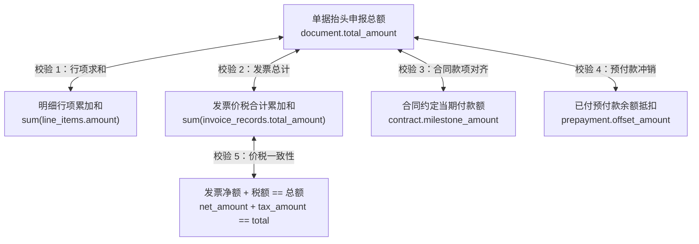
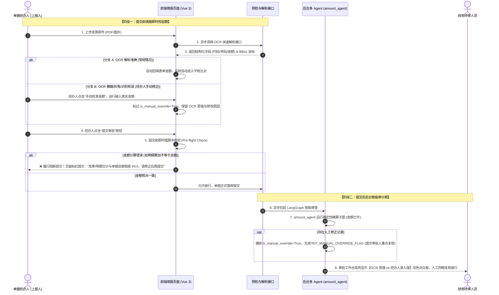
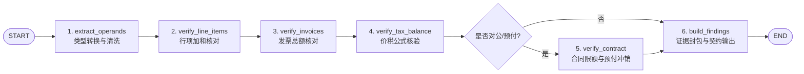

# 模块详细设计 Spec —— 02. engines/amount_agent 确定性金额精算子图

**文档版本：** V1.0  
**所属模块：** `backend/engines/amount_agent/`  
**依据文档：** 《PRD-v1.0.md》、《数据实体设计.md》、《概要设计.md》、《01_engines_contract_spec.md》  
**设计目标：** 制定金额核算智能体（`amount_agent`）的独立 LangGraph 子图技术规格。该模块坚决贯彻**“算归算，想归想”**铁律，**严禁大模型自主执行任何加减乘除计算**，纯粹由 Python `Decimal` 高精度代码算子执行五方金额交叉对账，产出不可变数学公式存证 `CalculationProof` 与 `R01_AMOUNT_MISMATCH` 风险项。

---

## 1. 业务场景与核心风控规则

金额核算是财务审计的一票否决项。针对企业 5 类单据（对公付款、预付款、批量付款、费用报销、差旅报销），`amount_agent` 必须对以下五方数据进行交叉核对：



### 1.1 经办人人工修正机制与两阶段交互规约 (Two-Stage Human-in-the-loop Fallback)

在真实财务场景中，发票常因**折角、物理污损、红色发票章遮挡金额末位数字**导致 OCR 识别偶发失真（如将 `580.00` 识别为 `500.00`）。若强行以不准确的 OCR 结果拦截，会导致整个报销流程被锁死；但若允许随意提交，又容易引入算术垃圾数据。

为此，系统确立严格的**“两阶段交互规约”**（前置提交强阻断 + 后置多 Agent 审计留痕）：



#### 两阶段核心规约明细：
1. **上传即预解析**：发票上传对象存储后，异步触发快速 OCR 提取，将发票代码、号码、金额与 BBox 坐标实时回填至前端表单；
2. **可选人工校准**：若经办人核对发现 OCR 识别失真，可在**提交前**手动录入真实票面金额。前端打标 `is_manual_override = True`，固化 OCR 原值 `ocr_extracted_amount`，并强制经办人填写修正说明（如“发票折角遮挡”）；
3. **提交前强阻断（Pre-flight Check）**：经办人点击“提交审批”按钮时，前端配合轻量接口立即执行纯前端高精度 Decimal 求和校验。**若各行项累加和与单据总额存在差额，直接弹出错误并强行阻断提交，绝不允许低级算术笔误流入后台审批流**；
4. **提交后精准存证（Post-submission Audit）**：经办人算平提交后，后台 `amount_agent` 执行深度防篡改精算。子图以手工修正后的真实值进行整体平衡演算，同时针对打标项生成 `R07_MANUAL_OVERRIDE_FLAG` 审计发现，在审批端呈现【OCR 识别值 vs 手工录入值】双色对比框，**提示财务审批人员在审批时重点调阅原件肉眼复核确认**。

---

### 1.2 规则编码字典与判定标准

| 规则编码 | 风险等级 | 触发条件 | 误差容差 (`tolerance`) | 拦截建议 |
|---|:---:|---|:---:|---|
| **`R01_HEADER_LINE_MISMATCH`** | **HIGH** | `abs(total_amount - sum(line_items)) > tolerance` | `Decimal("0.00")` | 驳回修改，明细行累加与总额不一致 |
| **`R02_INVOICE_SUM_MISMATCH`** | **HIGH** | `abs(total_amount - sum(invoices)) > tolerance` | `Decimal("0.00")` | 标记高危，发票总额小于或大于申报总额 |
| **`R03_CONTRACT_OVERPAYMENT`** | **HIGH** | 累计付款总额 + 本次付款额 > 合同总标的额 | `Decimal("0.00")` | 严重预警，涉嫌超合同总额超额付款 |
| **`R04_PREPAYMENT_OVER_OFFSET`** | **HIGH** | 本次抵扣冲销额 > 该预付款单剩余未抵扣可用余额 | `Decimal("0.00")` | 阻断审批，预付款已被超额冲销 |
| **`R05_TAX_AMOUNT_MISMATCH`** | **MEDIUM** | 发票票面 `net_amount + tax_amount != total_amount` | **动态公差**：$\min(0.01 \times N, 0.05\text{元})$ ($N$为发票张数) | 允许合法发票分位尾差，超差提示人工复核 |
| **`R06_NEGATIVE_AMOUNT_ILLEGAL`** | **HIGH** | 任何常规行项金额 $\le 0$（除明确冲销红字行外） | `Decimal("0.00")` | 驳回修改，非法负数或零元报销 |
| **`R07_MANUAL_OVERRIDE_FLAG`** | **MEDIUM** | 发票存在 `is_manual_override == True` | 无 (事实标识) | 提示审核人重点调阅原图，人工核实修正数据 |
| **`R08_EXCHANGE_RATE_MISMATCH`** | **HIGH** | 外币折算本币不平 `base != round(orig * rate, 2)` | `Decimal("0.01")` | 驳回修改，外币发票折算汇率计算有误 |

---

## 2. 模块文件规划

`engines/amount_agent/` 目录组织严格遵循独立封装的子图架构：

```
backend/engines/amount_agent/
├── __init__.py
├── agent.py                     # 对外门面类 AmountAgent (封装子图 compiled_graph.ainvoke)
├── graph.py                     # LangGraph StateGraph 构建器 (节点装配与条件边配置)
├── state.py                     # 子图私有状态定义 AmountPrivateState
└── nodes/                       # 原子化可测试的确定性核算节点
    ├── __init__.py
    ├── extract_operands.py      # 1. 提取入参并转换为强类型 Decimal (含汇率快照折算)
    ├── verify_line_items.py     # 2. 校验单据总额 vs 行项求和
    ├── verify_invoices.py       # 3. 校验单据总额 vs 发票总额 (含人工修正标记与比对)
    ├── verify_contract.py       # 4. 校验合同节点金额与历史已付累计
    ├── verify_tax_balance.py    # 5. 校验发票价税计算一致性 (采用发票张数动态公差)
    └── build_findings.py        # 6. 生成标准 CalculationProof 与 RiskFindingContract
```

---

## 3. 详细设计与代码契约

### 3.1 子图私有状态：`state.py`

状态内部完全使用 Python `Decimal`，计算过程日志 `calc_formula_log` 用于记录给人类审计员查看的纯公式字符串。

```python
"""
backend/engines/amount_agent/state.py
金额精算子图内部私有状态 (完全与全局主图隔离)
"""
from typing import TypedDict, List, Dict, Any, Optional
from decimal import Decimal
from engines.contract.evidence import EvidenceRecord
from engines.contract.finding import RiskFindingContract

class LineItemOperand(TypedDict):
    line_id: int
    item_name: str
    original_currency: str               # 原币币种 (如 'USD', 'EUR', 'CNY')
    original_amount: Decimal             # 原币金额
    exchange_rate: Decimal               # 填报时锁定的基准汇率快照 (如 7.1500)
    amount: Decimal                      # 折合本币人民币金额 (base_amount)

class InvoiceOperand(TypedDict):
    invoice_id: int
    invoice_no: str
    ocr_extracted_amount: Optional[Decimal] # OCR 原始识别票面金额 (存证留痕)
    is_manual_override: bool             # 是否被经办人手工修正
    override_reason: Optional[str]       # 手工修正原因 (如 "发票折角遮挡")
    net_amount: Decimal                  # 不含税金额
    tax_amount: Decimal                  # 税额
    total_amount: Decimal                # 价税合计 (若有人工修正，优先取人工修正后的真实值)

class AmountPrivateState(TypedDict):
    """金额精算子图内部私有状态"""
    # 1. 输入操作数投影 (由 Agent 入口函数初始化注入)
    document_id: int
    document_type: str
    claimed_total_amount: Decimal
    line_items: List[LineItemOperand]
    invoices: List[InvoiceOperand]
    contract_total_amount: Optional[Decimal]
    contract_paid_amount: Optional[Decimal]
    contract_milestone_amount: Optional[Decimal]
    prepayment_remaining_balance: Optional[Decimal]
    prepayment_offset_claimed: Optional[Decimal]
    
    # 2. 算子配置与动态公差
    tolerance: Decimal                        # 基础允许公差 (默认 Decimal('0.00'))
    dynamic_tax_tolerance: Decimal            # 发票张数动态公差: min(0.01 * N, 0.05)
    
    # 3. 算术核对过程数据
    sum_line_items: Decimal                   # 明细求和结果
    sum_invoices: Decimal                     # 发票求和结果
    calc_formula_log: List[str]               # 审计公式日志列表
    
    # 4. 产出的契约事实账本 (准备输出给主图)
    evidence_records: List[EvidenceRecord]    # 产出的数学存证列表
    risk_findings: List[RiskFindingContract]  # 检出的风险发现项
```

---

### 3.2 子图流程与节点实现规范

#### 子图执行流程 DAG



#### 关键节点算子算法实现规约

##### 节点 1：`verify_line_items.py` (单据抬头 vs 明细行求和)
```python
from decimal import Decimal, ROUND_HALF_UP
from engines.contract.evidence import EvidenceRecord, CalculationProof, EvidenceCategoryEnum
from engines.contract.finding import RiskFindingContract, RiskLevelEnum
from engines.contract.agent_role import AgentRoleEnum

def verify_line_items_node(state: AmountPrivateState) -> dict:
    """严格核验单据总额与行项求和，严禁 LLM 介入算数"""
    claimed = state["claimed_total_amount"]
    tolerance = state["tolerance"]
    
    # Python 高精度纯代码求和
    computed_sum = sum((item["amount"] for item in state["line_items"]), Decimal("0.00"))
    diff = (claimed - computed_sum).quantize(Decimal("0.01"), rounding=ROUND_HALF_UP)
    is_balanced = abs(diff) <= tolerance
    
    formula_expr = f"({claimed:.2f} - {computed_sum:.2f}) = {diff:.2f}"
    
    # 1. 构造不可变数学计算存证
    calc_proof = CalculationProof(
        formula_expr=formula_expr,
        operand_left=claimed,
        operand_right=computed_sum,
        result=diff,
        tolerance=tolerance,
        is_balanced=is_balanced
    )
    evidence = EvidenceRecord(
        category=EvidenceCategoryEnum.CALC_FORMULA,
        produced_by=AgentRoleEnum.AMOUNT.value,
        calc_proof=calc_proof
    )
    
    findings = []
    if not is_balanced:
        # 2. 检出高危风险项
        findings.append(RiskFindingContract(
            rule_code="R01_HEADER_LINE_MISMATCH",
            rule_name="单据总额与明细行合计不一致",
            risk_level=RiskLevelEnum.HIGH,
            agent_role=AgentRoleEnum.AMOUNT,
            title="单据总额与明细求和存在差额",
            description=f"单据申报总额为 ¥{claimed:,.2f}，但 {len(state['line_items'])} 笔明细行累加和为 ¥{computed_sum:,.2f}，相差 ¥{diff:,.2f}。",
            actual_value={"claimed_total": str(claimed)},
            expected_value={"line_items_sum": str(computed_sum)},
            discrepancy_amount=abs(diff),
            evidence_chain=[evidence],
            suggestion="请退回经办人核对每一笔明细金额或修改单据抬头总额。",
            is_overridable=False  # 数学算术不平属于绝对硬性错误，严禁审批人强行放行
        ))
        
    return {
        "sum_line_items": computed_sum,
        "calc_formula_log": state["calc_formula_log"] + [formula_expr],
        "evidence_records": state["evidence_records"] + [evidence],
        "risk_findings": state["risk_findings"] + findings
    }
```

##### 节点 2：`verify_invoices.py` (发票总额核对与经办人手工修正处理)
```python
def verify_invoices_node(state: AmountPrivateState) -> dict:
    """
    核验发票累计总额 vs 单据总额，并敏锐捕获经办人手工修正标记 (Human-in-the-loop)
    """
    claimed = state["claimed_total_amount"]
    tolerance = state["tolerance"]
    
    # 累加发票金额 (优先取 manual_amount，保障算术不因 OCR 识别偶发错误而中断)
    computed_invoice_sum = sum((inv["total_amount"] for inv in state["invoices"]), Decimal("0.00"))
    diff = (claimed - computed_invoice_sum).quantize(Decimal("0.01"), rounding=ROUND_HALF_UP)
    is_balanced = abs(diff) <= tolerance
    
    formula_expr = f"发票合计比对: ({claimed:.2f} - {computed_invoice_sum:.2f}) = {diff:.2f}"
    
    findings = []
    evidence_records = []
    
    # 1. 检查是否存在经办人手工修正发票金额 (亮点风控：人机协同留痕)
    manual_overridden_invoices = [inv for inv in state["invoices"] if inv.get("is_manual_override")]
    for inv in manual_overridden_invoices:
        ocr_val = inv.get("ocr_extracted_amount")
        manual_val = inv["total_amount"]
        reason = inv.get("override_reason") or "经办人标记OCR识别失真并手工填报"
        
        findings.append(RiskFindingContract(
            rule_code="R07_MANUAL_OVERRIDE_FLAG",
            rule_name="发票金额存在经办人手工修正",
            risk_level=RiskLevelEnum.MEDIUM,
            agent_role=AgentRoleEnum.AMOUNT,
            title=f"发票[{inv['invoice_no']}]存在手工修正金额",
            description=f"该发票原图 OCR 识别金额为 ¥{ocr_val if ocr_val is not None else '未识别'}，经办人手动校准为 ¥{manual_val:,.2f}。修正备注：{reason}。子图已采用修正值参与加和，请财务审批人重点调阅原件肉眼复核确认。",
            actual_value={"manual_input_amount": str(manual_val), "override_reason": reason},
            expected_value={"ocr_extracted_amount": str(ocr_val) if ocr_val is not None else "N/A"},
            suggestion="请财务审批人员在审批端调阅原图高亮附件，确认票面真实金额与手工录入一致后再放行。",
            is_overridable=True
        ))
        
    # 2. 检查发票总计与申报总额是否一致
    if not is_balanced:
        findings.append(RiskFindingContract(
            rule_code="R02_INVOICE_SUM_MISMATCH",
            rule_name="发票价税合计与申报总额不符",
            risk_level=RiskLevelEnum.HIGH,
            agent_role=AgentRoleEnum.AMOUNT,
            title="发票累计金额与单据总额存在差额",
            description=f"单据申报总额为 ¥{claimed:,.2f}，但所附 {len(state['invoices'])} 张发票累计金额为 ¥{computed_invoice_sum:,.2f}，差额为 ¥{diff:,.2f}。",
            actual_value={"claimed_total": str(claimed)},
            expected_value={"invoices_sum": str(computed_invoice_sum)},
            discrepancy_amount=abs(diff),
            suggestion="请核对上传发票是否有遗漏或多传，或调整申报总额。",
            is_overridable=False
        ))
        
    return {
        "sum_invoices": computed_invoice_sum,
        "calc_formula_log": state["calc_formula_log"] + [formula_expr],
        "evidence_records": state["evidence_records"] + evidence_records,
        "risk_findings": state["risk_findings"] + findings
    }
```

##### 节点 3：`verify_contract.py` (合同履约与预付额度穿透)
针对 `CORP_PAYMENT`（对公付款）或 `PREPAYMENT`（预付款）：
1. **合同超付校验**：
   $$\text{已付总额} + \text{本次申报额} \le \text{合同总标的额}$$
   若超出，触发 `R03_CONTRACT_OVERPAYMENT`；
2. **预付款冲销额度校验**：
   $$\text{本次抵扣冲销额} \le \text{关联预付款单剩余可用余额}$$
   若超出，触发 `R04_PREPAYMENT_OVER_OFFSET`。

---

### 3.3 子图组装与对外门面：`graph.py` & `agent.py`

```python
"""
backend/engines/amount_agent/graph.py
组装 LangGraph StateGraph 子图
"""
from langgraph.graph import StateGraph, START, END
from .state import AmountPrivateState
from .nodes.extract_operands import extract_operands_node
from .nodes.verify_line_items import verify_line_items_node
from .nodes.verify_invoices import verify_invoices_node
from .nodes.verify_tax_balance import verify_tax_balance_node
from .nodes.verify_contract import verify_contract_node
from .nodes.build_findings import build_findings_node

def is_contract_applicable(state: AmountPrivateState) -> bool:
    """条件边路由：仅对公与预付款单执行合同穿透检查"""
    return state["document_type"] in ("CORP_PAYMENT", "PREPAYMENT")

def create_amount_subgraph():
    builder = StateGraph(AmountPrivateState)
    
    # 注册节点
    builder.add_node("extract_operands", extract_operands_node)
    builder.add_node("verify_line_items", verify_line_items_node)
    builder.add_node("verify_invoices", verify_invoices_node)
    builder.add_node("verify_tax_balance", verify_tax_balance_node)
    builder.add_node("verify_contract", verify_contract_node)
    builder.add_node("build_findings", build_findings_node)
    
    # 编排边流转
    builder.add_edge(START, "extract_operands")
    builder.add_edge("extract_operands", "verify_line_items")
    builder.add_edge("verify_line_items", "verify_invoices")
    builder.add_edge("verify_invoices", "verify_tax_balance")
    
    # 条件分支
    builder.add_conditional_edges(
        "verify_tax_balance",
        is_contract_applicable,
        {
            True: "verify_contract",
            False: "build_findings"
        }
    )
    builder.add_edge("verify_contract", "build_findings")
    builder.add_edge("build_findings", END)
    
    return builder.compile()

# 导出已编译子图
amount_subgraph = create_amount_subgraph()
```

#### 对外统一门面类：`agent.py`
```python
"""
backend/engines/amount_agent/agent.py
对外门面，主图通过此门面调用子图
"""
from typing import Dict, Any, List
from decimal import Decimal
from .graph import amount_subgraph
from .state import AmountPrivateState
from engines.contract.evidence import EvidenceRecord
from engines.contract.finding import RiskFindingContract

class AmountAgent:
    @staticmethod
    async def run(
        document_id: int,
        document_type: str,
        claimed_total_amount: Decimal,
        line_items: List[Dict[str, Any]],
        invoices: List[Dict[str, Any]],
        contract_info: Optional[Dict[str, Any]] = None,
        prepayment_info: Optional[Dict[str, Any]] = None,
        tolerance: Decimal = Decimal("0.00")
    ) -> Dict[str, Any]:
        """
        供主图 Supervisor 调用的异步执行入口
        返回值仅包含标准化契约：{"evidence_records": [...], "risk_findings": [...]}
        """
        # 初始化子图私有状态
        initial_state: AmountPrivateState = {
            "document_id": document_id,
            "document_type": document_type,
            "claimed_total_amount": claimed_total_amount,
            "line_items": line_items,
            "invoices": invoices,
            "contract_total_amount": contract_info.get("total_amount") if contract_info else None,
            "contract_paid_amount": contract_info.get("paid_amount") if contract_info else None,
            "contract_milestone_amount": contract_info.get("milestone_amount") if contract_info else None,
            "prepayment_remaining_balance": prepayment_info.get("remaining_balance") if prepayment_info else None,
            "prepayment_offset_claimed": prepayment_info.get("offset_claimed") if prepayment_info else None,
            "tolerance": tolerance,
            "sum_line_items": Decimal("0.00"),
            "sum_invoices": Decimal("0.00"),
            "calc_formula_log": [],
            "evidence_records": [],
            "risk_findings": []
        }
        
        # 异步调用独立子图
        final_state = await amount_subgraph.ainvoke(initial_state)
        
        # 仅向外界返回契约事实
        return {
            "evidence_records": final_state["evidence_records"],
            "risk_findings": final_state["risk_findings"],
            "calc_formula_log": final_state["calc_formula_log"]
        }
```

---

## 4. 单元测试与边界验证用例 (Test Cases)

在后续 Step 5 编码阶段，本模块必须 100% 通过以下测试用例：

| 用例编号 | 测试场景 | 测试输入数据 | 预期结果 |
|---|---|---|---|
| **`TC_AMT_01`** | 正常平账报销单 | `claimed: 1000.00`, 行项: `[400.00, 600.00]`, 发票: `[1000.00]` | 0 风险项，生成 2 个平衡 `CalculationProof` |
| **`TC_AMT_02`** | 行项差 1 分钱 (尾差截断) | `claimed: 1000.00`, 行项: `[333.33, 333.33, 333.33]` (和为 999.99) | 检出 `R01_HEADER_LINE_MISMATCH`，差额 `0.01` |
| **`TC_AMT_03`** | 发票总额小于申报额 | `claimed: 5000.00`, 发票: `[2000.00, 2500.00]` (和为 4500.00) | 检出 `R02_INVOICE_SUM_MISMATCH`，高危阻断 |
| **`TC_AMT_04`** | 对公付款超合同总额 | `contract_total: 100,000.00`, `paid: 80,000.00`, `claimed: 30,000.00` | 检出 `R03_CONTRACT_OVERPAYMENT`，超付 `10,000.00` |
| **`TC_AMT_05`** | 预付款超额冲销 | `prepayment_balance: 5,000.00`, `offset_claimed: 6,000.00` | 检出 `R04_PREPAYMENT_OVER_OFFSET`，超冲 `1,000.00` |
| **`TC_AMT_06`** | 发票价税合计动态尾差容差 | 5 张发票累计价税与总额差 0.03 元 (在动态公差 0.05 内) | 价税核验通过，记录动态容差放行日志 |
| **`TC_AMT_07`** | 经办人手工修正发票金额 | `ocr_val: 500.00`, 经办人修正为 `580.00`, 申报总额 `580.00` | 算术求和平衡，检出 `R07_MANUAL_OVERRIDE_FLAG` 提示审批人重点复核原件 |
| **`TC_AMT_08`** | 外币发票汇率折算核算 | `USD: 100.00`, 锁定汇率 `7.1500`, 折算本币 `715.00` | 汇率核验通过，公式记录 `(100.00 * 7.1500) = 715.00` |

---

## 5. 下一步衔接

本 Spec 完成了数字核算的核心安全网。  
下一模块 Spec 将制定：**《03. app/repositories 泛型仓储与单据多版本快照 Spec》**，定义底层 25 张表的高性能异步 CRUD 以及基于 PostgreSQL 15 `JSONB` 的单据不可变多版本快照持久化机制。
