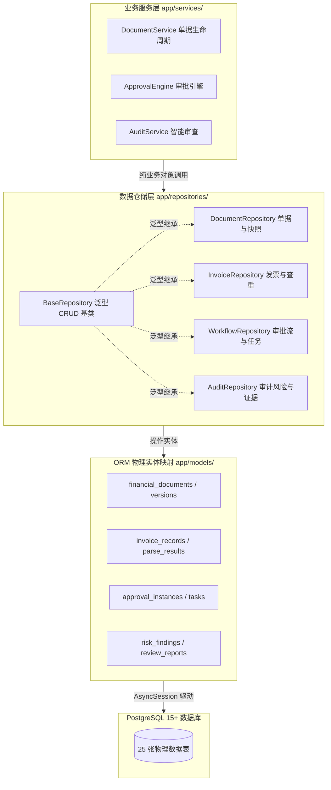

# 模块详细设计 Spec —— 03. app/repositories 泛型仓储与单据多版本快照

**文档版本：** V1.0  
**所属模块：** `backend/app/repositories/`  
**依据文档：** 《PRD-v1.0.md》、《数据实体设计.md》、《概要设计.md》  
**设计目标：** 建立基于 SQLAlchemy 2.0 原生异步（`AsyncSession`）的仓储访问层。彻底将 SQL 组装、事务一致性保障、多表级联装配以及 PostgreSQL 15 `JSONB` 不可变快照逻辑收口于仓储层，实现对上层 `services` 屏蔽 SQL 细节，确保财务数据的高性能检索与金融级不可篡改留痕。

---

## 1. 模块设计理念与架构分工



### 核心设计原则
1. **统一泛型抽象（Generic CRUD）**：
   通过 `BaseRepository[ModelType, CreateSchemaType, UpdateSchemaType]` 提供标准的异步 `get`, `list`, `create`, `update`, `delete`，消灭 80% 的机械重复代码。
2. **单据快照不可变（Immutable Versioning）**：
   财务单据每次保存或提交时，仓储层在同一事务中向 `document_versions` 写入一份完整的 `snapshot_data`（PostgreSQL `JSONB` 类型），版本号递增。后续无论是审计排查还是审批对比，直接读取历史版本快照，杜绝单据被篡改后无据可查。
3. **严格异步会话注入（AsyncSession）**：
   全量采用 `async/await`，支持外层 Service 传入同一个 `AsyncSession` 实现跨表多仓储的事务原子提交（Atomic Transaction）。

---

## 2. 模块文件规划

```
backend/app/repositories/
├── __init__.py
├── base.py                 # 泛型仓储抽象基类 BaseRepository
├── document_repo.py        # 单据主表、明细行项、附件与版本快照
├── invoice_repo.py         # 发票结构化记录与全局哈希唯一查重
├── approval_repo.py        # 审批实例、流转任务与待办列表查询
├── audit_repo.py           # 分析任务状态、风险发现项与五维证据链
├── session_repo.py         # 智能审查会话、槽位状态与历史消息
└── master_repo.py          # 供应商主数据、市场基准价与审计日志
```

---

## 3. 详细设计与代码实现契约

### 3.1 泛型仓储基类：`base.py`

```python
"""
backend/app/repositories/base.py
SQLAlchemy 2.0 异步泛型仓储基类
"""
from typing import Generic, TypeVar, Type, Optional, List, Any, Sequence
from pydantic import BaseModel
from sqlalchemy.ext.asyncio import AsyncSession
from sqlalchemy import select, update, delete, func
from app.models.base import Base

ModelType = TypeVar("ModelType", bound=Base)
CreateSchemaType = TypeVar("CreateSchemaType", bound=BaseModel)
UpdateSchemaType = TypeVar("UpdateSchemaType", bound=BaseModel)

class BaseRepository(Generic[ModelType, CreateSchemaType, UpdateSchemaType]):
    def __init__(self, model: Type[ModelType]):
        self.model = model

    async def get(self, db: AsyncSession, id: Any) -> Optional[ModelType]:
        """根据主键 ID 检索单条记录"""
        result = await db.execute(select(self.model).where(self.model.id == id))
        return result.scalars().first()

    async def get_multi(
        self,
        db: AsyncSession,
        skip: int = 0,
        limit: int = 20,
        order_by: Any = None
    ) -> Sequence[ModelType]:
        """分页获取列表"""
        query = select(self.model).offset(skip).limit(limit)
        if order_by is not None:
            query = query.order_by(order_by)
        else:
            query = query.order_by(self.model.id.desc())
        result = await db.execute(query)
        return result.scalars().all()

    async def count(self, db: AsyncSession) -> int:
        """统计总记录数"""
        result = await db.execute(select(func.count()).select_from(self.model))
        return result.scalar() or 0

    async def create(self, db: AsyncSession, obj_in: CreateSchemaType) -> ModelType:
        """创建单条记录"""
        obj_data = obj_in.model_dump(exclude_unset=True)
        db_obj = self.model(**obj_data)
        db.add(db_obj)
        await db.flush()
        await db.refresh(db_obj)
        return db_obj

    async def update(
        self,
        db: AsyncSession,
        db_obj: ModelType,
        obj_in: UpdateSchemaType | dict[str, Any]
    ) -> ModelType:
        """更新记录"""
        if isinstance(obj_in, dict):
            update_data = obj_in
        else:
            update_data = obj_in.model_dump(exclude_unset=True)

        for field, value in update_data.items():
            setattr(db_obj, field, value)

        db.add(db_obj)
        await db.flush()
        await db.refresh(db_obj)
        return db_obj

    async def remove(self, db: AsyncSession, id: Any) -> Optional[ModelType]:
        """物理删除 (业务表通常推荐使用软删除，可在子类覆写)"""
        obj = await self.get(db, id)
        if obj:
            await db.delete(obj)
            await db.flush()
        return obj
```

---

### 3.2 单据与版本快照仓储：`document_repo.py`

解决复合单据保存、明细原子级替换与多版本不可变快照归档的核心仓储。

```python
"""
backend/app/repositories/document_repo.py
单据与多版本快照专属仓储
"""
from typing import Optional, List, Dict, Any
from decimal import Decimal
from sqlalchemy.ext.asyncio import AsyncSession
from sqlalchemy import select, and_
from sqlalchemy.orm import selectinload
from .base import BaseRepository
from app.models.document import FinancialDocument, DocumentVersion, DocumentLineItem, DocumentAttachment
from app.schemas.document import DocumentCreateReq, DocumentUpdateReq

class DocumentRepository(BaseRepository[FinancialDocument, DocumentCreateReq, DocumentUpdateReq]):
    def __init__(self):
        super().__init__(FinancialDocument)

    async def get_with_details(self, db: AsyncSession, document_id: int) -> Optional[FinancialDocument]:
        """
        级联加载单据全部完整明细与附件 (用于审核工作台看板展示)
        采用 selectinload 避免 N+1 性能陷阱
        """
        query = (
            select(FinancialDocument)
            .where(FinancialDocument.id == document_id)
            .options(
                selectinload(FinancialDocument.line_items),
                selectinload(FinancialDocument.attachments),
                selectinload(FinancialDocument.versions)
            )
        )
        result = await db.execute(query)
        return result.scalars().first()

    async def create_with_snapshot(
        self,
        db: AsyncSession,
        applicant_id: int,
        doc_in: DocumentCreateReq,
        snapshot_dict: Dict[str, Any]
    ) -> FinancialDocument:
        """
        原子创建单据主表、行项明细与首个初始版本快照 (Version 1)
        在一个数据库事务内完成
        """
        # 1. 插入单据主表
        db_doc = FinancialDocument(
            doc_no=doc_in.doc_no,
            doc_type=doc_in.doc_type,
            title=doc_in.title,
            applicant_id=applicant_id,
            department_id=doc_in.department_id,
            total_amount=doc_in.total_amount,
            currency=doc_in.currency,
            status="DRAFT",
            current_version=1
        )
        db.add(db_doc)
        await db.flush()  # 获取 db_doc.id

        # 2. 批量插入明细行项
        for item in doc_in.line_items:
            db_item = DocumentLineItem(
                document_id=db_doc.id,
                item_name=item.item_name,
                category=item.category,
                amount=item.amount,
                expense_date=item.expense_date,
                remarks=item.remarks
            )
            db.add(db_item)

        # 3. 固化 Version 1 不可变快照 (JSONB)
        db_version = DocumentVersion(
            document_id=db_doc.id,
            version_no=1,
            snapshot_data=snapshot_dict,  # 完整单据及明细 JSON
            change_summary="初始草稿创建",
            operator_id=applicant_id
        )
        db.add(db_version)

        await db.flush()
        await db.refresh(db_doc)
        return db_doc

    async def create_new_version(
        self,
        db: AsyncSession,
        document_id: int,
        operator_id: int,
        expected_version: int,
        change_summary: str,
        new_snapshot: Dict[str, Any]
    ) -> int:
        """
        单据驳回重新编辑提交时，自增版本号并追加快照
        采用乐观锁 (CAS: Compare-And-Swap) 机制防止并发更新覆盖
        """
        next_version = expected_version + 1
        
        # 1. 乐观锁原子更新主表版本号 (若已被他人更新，影响行数为 0)
        stmt = (
            update(FinancialDocument)
            .where(
                and_(
                    FinancialDocument.id == document_id,
                    FinancialDocument.current_version == expected_version
                )
            )
            .values(current_version=next_version)
        )
        res = await db.execute(stmt)
        if res.rowcount == 0:
            raise ValueError(f"并发冲突：单据 {document_id} 已被他人更新或产生了新版本，请刷新重试。")

        # 2. 插入新版本不可变快照记录 (JSONB)
        db_version = DocumentVersion(
            document_id=document_id,
            version_no=next_version,
            snapshot_data=new_snapshot,
            change_summary=change_summary,
            operator_id=operator_id
        )
        db.add(db_version)
        await db.flush()
        return next_version

    async def get_version_snapshot(
        self,
        db: AsyncSession,
        document_id: int,
        version_no: int
    ) -> Optional[Dict[str, Any]]:
        """获取指定版本的不可变快照 JSON"""
        query = select(DocumentVersion.snapshot_data).where(
            and_(
                DocumentVersion.document_id == document_id,
                DocumentVersion.version_no == version_no
            )
        )
        result = await db.execute(query)
        return result.scalar()

    async def transition_status(
        self,
        db: AsyncSession,
        document_id: int,
        target_status: str,
        expected_current_status: Optional[List[str]] = None
    ) -> bool:
        """安全流转单据主状态 (如审核完成后从 SUBMITTED 流转至 PENDING_APPROVAL)"""
        doc = await self.get(db, document_id)
        if not doc:
            return False
        if expected_current_status and doc.status not in expected_current_status:
            return False
        doc.status = target_status
        await db.flush()
        return True
```

---

### 3.3 发票与哈希防重仓储：`invoice_repo.py`

提供纳秒级发票代码+号码唯一性检测与布隆过滤器数据同步。

```python
"""
backend/app/repositories/invoice_repo.py
发票明细与防重唯一哈希检索仓储
"""
from typing import Optional, List
from sqlalchemy.ext.asyncio import AsyncSession
from sqlalchemy import select, and_
from .base import BaseRepository
from app.models.invoice import InvoiceRecord

class InvoiceRepository(BaseRepository[InvoiceRecord, Any, Any]):
    def __init__(self):
        super().__init__(InvoiceRecord)

    async def find_by_code_and_no(
        self,
        db: AsyncSession,
        invoice_code: str,
        invoice_no: str
    ) -> Optional[InvoiceRecord]:
        """依据发票代码+发票号码精确检索是否已入库"""
        query = select(InvoiceRecord).where(
            and_(
                InvoiceRecord.invoice_code == invoice_code,
                InvoiceRecord.invoice_no == invoice_no
            )
        )
        result = await db.execute(query)
        return result.scalars().first()

    async def find_by_file_hash(
        self,
        db: AsyncSession,
        file_hash: str
    ) -> Optional[InvoiceRecord]:
        """依据发票原件 SHA-256 哈希碰撞检索"""
        query = select(InvoiceRecord).where(InvoiceRecord.file_hash == file_hash)
        result = await db.execute(query)
        return result.scalars().first()

    async def get_invoices_by_document(
        self,
        db: AsyncSession,
        document_id: int
    ) -> List[InvoiceRecord]:
        """获取某张单据挂载的所有有效发票列表"""
        query = select(InvoiceRecord).where(InvoiceRecord.document_id == document_id)
        result = await db.execute(query)
        return list(result.scalars().all())
```

---

### 3.4 风险审核与五维证据仓储：`audit_repo.py`

持久化认知推理流水线交付的 `AuditResultDTO` 标准出参，原子化写入报告、证据项并更新任务。

```python
"""
backend/app/repositories/audit_repo.py
智能风控分析任务、发现项与证据链仓储
"""
from typing import List, Dict, Any, Optional
from sqlalchemy.ext.asyncio import AsyncSession
from sqlalchemy import select
from .base import BaseRepository
from app.models.audit import AnalysisTask, RiskFinding, ReviewReport
from engines.contract.result import AuditResultDTO

class AuditRepository(BaseRepository[ReviewReport, Any, Any]):
    def __init__(self):
        super().__init__(ReviewReport)

    async def save_audit_result(
        self,
        db: AsyncSession,
        result: AuditResultDTO
    ) -> ReviewReport:
        """
        在一个事务内原子保存：
        1. 审计综合报告 (review_reports)
        2. 结构化风险发现项及关联五维证据 (risk_findings)
        3. 更新/新增任务状态为 COMPLETED (analysis_tasks)
        """
        # 1. 保存报告
        report = ReviewReport(
            task_id=result.task_id,
            document_id=result.document_id,
            overall_risk_level=result.overall_risk_level,
            final_score=result.final_score,
            summary=result.summary,
            high_risks_count=result.high_risks_count,
            medium_risks_count=result.medium_risks_count,
            low_risks_count=result.low_risks_count,
            full_report_payload=result.full_report_payload
        )
        db.add(report)
        await db.flush()

        # 2. 批量保存风险发现项与视觉锚点
        for f in result.verified_findings:
            finding_db = RiskFinding(
                report_id=report.id,
                finding_id=f.finding_id,
                rule_code=f.rule_code,
                rule_name=f.rule_name,
                risk_level=f.risk_level.value if hasattr(f.risk_level, "value") else str(f.risk_level),
                agent_role=f.agent_role.value if hasattr(f.agent_role, "value") else str(f.agent_role),
                title=f.title,
                description=f.description,
                actual_value=f.actual_value,
                expected_value=f.expected_value,
                discrepancy_amount=f.discrepancy_amount,
                evidence_ids=f.evidence_ids,
                primary_visual_anchor=f.primary_visual_anchor.model_dump(mode="json") if f.primary_visual_anchor else {},
                evidence_chain=[e.model_dump(mode="json") for e in f.evidence_chain] if f.evidence_chain else [],
                suggestion=f.suggestion,
                is_overridable=f.is_overridable
            )
            db.add(finding_db)

        # 3. 更新任务表
        task_stmt = select(AnalysisTask).where(AnalysisTask.task_id == result.task_id)
        task = (await db.execute(task_stmt)).scalars().first()
        if not task:
            task = AnalysisTask(
                task_id=result.task_id,
                document_id=result.document_id,
                status="COMPLETED",
                current_stage="COMPLETED",
                progress_pct=100,
                completed_at=result.completed_at
            )
            db.add(task)
        else:
            task.status = "COMPLETED"
            task.current_stage = "COMPLETED"
            task.progress_pct = 100
            task.completed_at = result.completed_at

        await db.flush()
        return report
```

---

## 4. 单元测试与事务回滚验证 (Verification Plan)

在后续 Step 5 编码阶段，仓储层必须通过以下测试套件：

1. **事务原子性测试 (`test_transaction_rollback`)**：
   - 模拟单据创建时，故意在插入 `document_versions` 时注入数据库错误，验证单据主表 `financial_documents` 与明细表自动回滚，数据库不残留脏数据。
2. **多版本快照独立性测试 (`test_version_snapshot_immutability`)**：
   - 创建单据（V1），修改金额并保存（V2）。检索 V1 快照，验证 V1 中的明细与金额仍然保持初始值，未被 V2 覆盖。
3. **发票防重哈希索引性能测试 (`test_invoice_duplicate_query_plan`)**：
   - 验证 `find_by_code_and_no` 命中唯一复合索引，查询时间控制在 5 毫秒内。

---

## 5. 阶段成果总结与后续步骤

至此，已顺利完成核心架构三大模块的详细设计 Spec：
1. [01_engines_contract_spec.md](file:///e:/面试项目实战/财务单据智能风险审核系统/specs/01_engines_contract_spec.md)：智能体契约、五维证据与实时流事件规范；
2. [02_engines_amount_agent_spec.md](file:///e:/面试项目实战/财务单据智能风险审核系统/specs/02_engines_amount_agent_spec.md)：确定性金额核算子图与五方交叉比对；
3. [03_app_repositories_spec.md](file:///e:/面试项目实战/财务单据智能风险审核系统/specs/03_app_repositories_spec.md)：泛型仓储 CRUD 与 PostgreSQL 15 多版本快照。

这三份 Spec 为核心代码编写打下了坚不可摧的基础。
