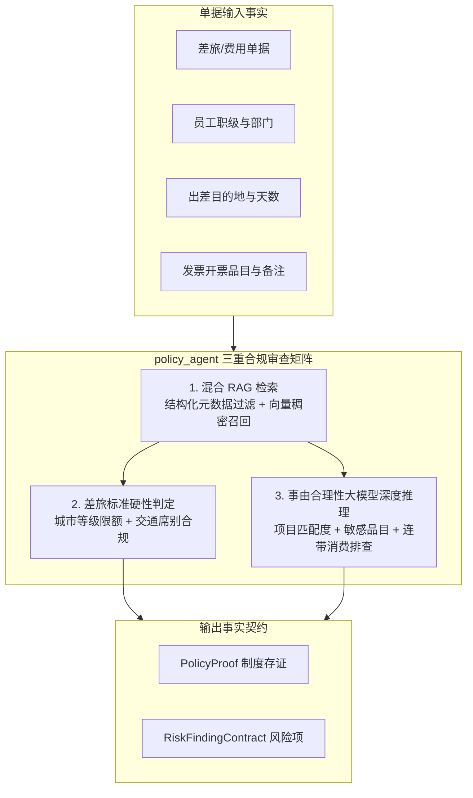
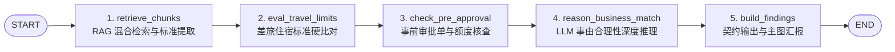

# 模块详细设计 Spec —— 04. engines/policy_agent 制度合规 RAG 检索与差旅审查子图

**文档版本：** V1.0  
**所属模块：** `backend/engines/policy_agent/`  
**依据文档：** 《PRD-v1.0.md》、《数据实体设计.md》、《概要设计.md》、《01_engines_contract_spec.md》  
**设计目标：** 制定制度合规智能体（`policy_agent`）的独立 LangGraph 子图技术规格。该模块融合**“结构化制度标准硬比对”**与**“大模型上下文长程语义推理”**，负责动态检索企业最新财务制度切片（RAG）、差旅住宿/交通超标判定、报销事由与发票品目合理性审查，并产出带有不可变 `chunk_id` 的制度证据 `PolicyProof` 与对应风险发现。

---

## 1. 业务场景与核心风控规则

在费用报销与差旅报销中，最复杂的审核难点在于**“制度繁多且动态更新”**以及**“事由与品目存在模糊违规”**。`policy_agent` 承担以下三重审查职责：



### 1.1 四大核心架构原则与三层降级兜底体系 (Core Principles & Graceful Degradation)

#### 1. 结构化条款级切分（章-节-条粒度）
彻底废除固定字符数（如 500 字符）的机械切分，知识库入库按“章-节-条”结构化解析，以“第 X 条”为最小原子切片，切片元数据固化 `{policy_name, version_no, chapter, article, applies_to_levels}`。确保条款中的“原则、限额与例外豁免条件”处于同一语义块内，避免条款断裂。

#### 2. 静态行政区划字典映射（确定性城市等级）
全国城市等级采用不可变的 `city_tier_mapping.json` 进行纯代码映射：
* 下属区县（如常熟市、昆山市）自动通过行政区划代码或地名别名**上卷（Roll-up）**至上级地级市（如苏州市 $\rightarrow$ 二线标准）；
* **严禁让大模型自由推断城市等级**，杜绝大模型今日判二线、明日判三线的波动幻觉。

#### 3. 事由合理性双门禁双轨制（防大模型过度敏感与误杀）
* **硬黑名单确定性过滤**：对明显的纯私人消费（烟草、高档名酒、珠宝奢侈品、足疗养生会所等）直接触发报警；
* **大模型语义推理门禁**：仅在 LLM 判定不合理且 `confidence_score >= 0.85` 时才触发 `R09`，且**仅作为 MEDIUM 建议级风险**，不卡死单据，交由财务人员肉眼参考。

#### 4. 三层弹性降级兜底防御体系（数据盲区与制度缺失应对）
当单据涉及冷门业务品目、数据库未录入相关制度，或出差地属于偏僻乡镇时，系统执行以下降级策略：
* **第一层：偏僻地名回退兜底**：若城市无法上卷识别，系统不抛错，自动归入 `TIER_OTHER`（三线及以下基准限额，如默认标间 350元/天），并在证据中注明待人工确认；
* **第二层：制度缺失软降级 (`R14_POLICY_NOT_FOUND`)**：若 RAG 检索相似度 `< 0.70` 或命中数为 0，系统**不抛异常、不卡单**，自动跳过超标自动计算，生成 `R14` 提示级风险项，转由财务人员按部门传统惯例线下审定；
* **第三层：大模型幻觉禁令**：Prompt 严格注入负向约束：“若上下文未提供相关公司制度原文，严禁使用预训练社会常识捏造公司规定，直接标记 `policy_found = false`”。

---

### 1.2 规则编码字典与判定标准

| 规则编码 | 风险等级 | 触发条件 | 判定机制 | 处置建议 |
|---|:---:|---|:---:|---|
| **`R05_POLICY_EXCEEDED`** | **MEDIUM / HIGH** | 住宿费超过目的地城市职级标准（如二线城市标间 > 400元/天） | 确定性比对：超标 $\le 20\%$ 记为中危；超标 $> 20\%$ 或超 200 元记为高危 | 提示超标金额，建议扣除超标部分或加签分管VP特批 |
| **`R09_UNREASONABLE_EXPENSE`** | **MEDIUM** | 发票品目与报销事由严重脱节（如研发出差报销“高档茶具”、“足疗养生”） | 双门禁：敏感品目黑名单 + 大模型语义推理 ($Conf \ge 0.85$) | 驳回修改，要求补充业务招待证明或剔除私人消费 |
| **`R10_MISSING_PRE_APPROVAL`** | **HIGH** | 单笔招待费/采购超 2000 元，但单据未关联事前审批单 | 结构化外键与事前单据状态关联查验 | 阻断审批，强制要求补录前置审批单号 |
| **`R12_POLICY_VERSION_MISMATCH`** | **LOW** | 报销所依据的制度版本已废止，存在新版制度生效 | 制度元数据 `effective_date` 判定 | 提示经办人按最新制度重新核定标准 |
| **`R13_SEAT_CLASS_VIOLATION`** | **HIGH** | 普通员工乘坐高铁商务座或飞机头等舱/公务舱 | 席别字典与职级权限矩阵匹配 | 驳回修改，按二等座/经济舱标准降额核算 |
| **`R14_POLICY_NOT_FOUND`** | **LOW / INFO** | 知识库未收录对应品目制度，或相似度 $< 0.70$ | RAG 检索盲区软降级机制 | 提示财务审批岗该费用暂无明确制度，按线下惯例审定 |

---

## 2. 模块文件规划

`engines/policy_agent/` 严格遵循独立子图封装标准：

```
backend/engines/policy_agent/
├── __init__.py
├── agent.py                     # 对外门面类 PolicyAgent (封装子图 compiled_graph.ainvoke)
├── graph.py                     # LangGraph StateGraph 构建器 (节点装配与条件边配置)
├── state.py                     # 子图私有状态定义 PolicyPrivateState
└── nodes/                       # 原子化可测试的合规审查算子
    ├── __init__.py
    ├── retrieve_chunks.py       # 1. 制度知识库混合 RAG 检索与重排序
    ├── eval_travel_limits.py    # 2. 差旅住宿/交通席别标准确定性核对
    ├── check_pre_approval.py    # 3. 额度门槛事前审批单查验
    ├── reason_business_match.py # 4. LLM 事由合理性与敏感品目深度推理
    └── build_findings.py        # 5. 组装 PolicyProof 与生成风险发现契约
```

---

## 3. 详细设计与代码契约

### 3.1 子图私有状态：`state.py`

```python
"""
backend/engines/policy_agent/state.py
制度合规审查子图内部私有状态
"""
from typing import TypedDict, List, Dict, Any, Optional
from decimal import Decimal
from engines.contract.evidence import EvidenceRecord, PolicyProof, CalculationProof
from engines.contract.finding import RiskFindingContract

class RetrievedPolicyChunk(TypedDict):
    """RAG 检索到的切片数据载荷"""
    policy_id: int
    policy_name: str
    policy_version: str
    chunk_id: str
    clause_title: str
    clause_content: str
    similarity_score: float

class PolicyPrivateState(TypedDict):
    """制度合规子图内部私有状态 (完全与全局主图隔离)"""
    # 1. 输入数据投影
    document_id: int
    document_type: str                        # TRAVEL_REIMBURSE / EXPENSE_REIMBURSE 等
    applicant_job_level: str                  # 职级: P3_STAFF, P6_MANAGER, P9_DIRECTOR
    department: str
    claim_title: str                          # 报销单标题/事由说明
    remarks: str
    total_amount: Decimal
    
    # 2. 差旅与明细专属事实
    travel_city: Optional[str]                # 目的地城市 (如 '武汉市', '深圳市')
    travel_days: Optional[int]                # 出差天数
    hotel_daily_amounts: List[Decimal]        # 每日住宿发票实际金额
    transport_seat_types: List[str]           # 交通席别 (如 'HIGH_SPEED_FIRST', 'ECONOMY')
    line_item_categories: List[str]           # 费用品目名称列表 (如 '办公用品', '招待餐费')
    pre_approval_id: Optional[str]            # 前置事前审批单编号
    
    # 3. 过程运算数据
    city_tier: str                            # TIER_1(一线), TIER_2(二线), OTHER
    hotel_limit_per_day: Decimal              # 制度规定的单日住宿限额标准
    retrieved_chunks: List[RetrievedPolicyChunk] # RAG 检索命中切片
    semantic_risk_reasons: List[str]          # 大模型事由推理违规理由
    
    # 4. 产出的标准化契约事实
    evidence_records: List[EvidenceRecord]    # 产出的制度与精算存证列表
    risk_findings: List[RiskFindingContract]  # 检出的风险发现项
```

---

### 3.2 子图节点算法与核心代码规范

#### 节点 1：`retrieve_chunks.py`（混合 RAG 检索）
为了彻底规避纯向量检索导致的“版本漂移”或“城市等级切片张冠李戴”，系统采取**“结构化元数据硬过滤 + 向量余弦重排”**的混合检索方案：

```python
"""
backend/engines/policy_agent/nodes/retrieve_chunks.py
"""
from engines.common.tools.kb_client import PolicyRagClient
from ..state import PolicyPrivateState

async def retrieve_chunks_node(state: PolicyPrivateState) -> dict:
    """
    检索制度知识库切片：
    先依据单据类型、职级、有效版本进行精准元数据路由，再对出差城市与事由进行语义检索
    """
    kb_client = PolicyRagClient()
    
    # 1. 结构化参数构造
    filters = {
        "doc_type": state["document_type"],
        "status": "ACTIVE",
        "job_level": state["applicant_job_level"]
    }
    query_text = f"{state['travel_city'] or ''} {state['claim_title']} {state['remarks']} {' '.join(state['line_item_categories'])}"
    
    # 2. 只读检索外部 RAG 服务
    chunks = await kb_client.search_policy_chunks(
        query=query_text,
        filters=filters,
        top_k=5
    )
    
    findings = []
    # 3. 制度缺失软降级处理 (R14)
    if not chunks or (chunks and max(c["similarity_score"] for c in chunks) < 0.70):
        findings.append(RiskFindingContract(
            rule_code="R14_POLICY_NOT_FOUND",
            rule_name="未检索到匹配的财务制度",
            risk_level=RiskLevelEnum.LOW,
            agent_role=AgentRoleEnum.POLICY,
            title="知识库缺少对应品目制度",
            description=f"针对报销品目【{', '.join(state['line_item_categories'])}】，系统知识库中未检索到匹配度充足的有效制度条款。已自动跳过硬性限额比对。",
            actual_value={"categories": state["line_item_categories"]},
            expected_value={"matched_chunks_count": len(chunks)},
            suggestion="请财务审批人员依据线下项目传统惯例进行人工审阅放行。",
            is_overridable=True
        ))
    
    # 4. 解析城市基准标准 (纯字典静态映射，区县上卷，缺失回退 TIER_OTHER)
    city_tier = kb_client.resolve_city_tier(state.get("travel_city")) or "TIER_OTHER"
    hotel_standard = kb_client.get_lodging_standard(city_tier, state["applicant_job_level"])
    
    return {
        "retrieved_chunks": chunks,
        "city_tier": city_tier,
        "hotel_limit_per_day": hotel_standard,
        "risk_findings": state["risk_findings"] + findings
    }
```

#### 节点 2：`eval_travel_limits.py`（差旅标准确定性硬比对）
**严禁大模型算差额**，由纯代码比对住宿费是否超标，并挂载 `CalculationProof` 与 `PolicyProof` 双重存证：

```python
"""
backend/engines/policy_agent/nodes/eval_travel_limits.py
"""
from decimal import Decimal
from engines.contract.evidence import EvidenceRecord, PolicyProof, CalculationProof, EvidenceCategoryEnum
from engines.contract.finding import RiskFindingContract, RiskLevelEnum
from engines.contract.agent_role import AgentRoleEnum
from ..state import PolicyPrivateState

def eval_travel_limits_node(state: PolicyPrivateState) -> dict:
    findings = []
    evidences = []
    
    limit = state.get("hotel_limit_per_day", Decimal("400.00"))
    actual_daily_amounts = state.get("hotel_daily_amounts", [])
    chunks = state.get("retrieved_chunks", [])
    
    # 找到制度条款存证切片
    policy_chunk = chunks[0] if chunks else None
    
    for idx, actual_amt in enumerate(actual_daily_amounts, start=1):
        if actual_amt > limit:
            over_amount = actual_amt - limit
            over_ratio = over_amount / limit
            
            # 超标 > 20% 判定为 HIGH 高危；超标 <= 20% 为 MEDIUM 中危
            risk_level = RiskLevelEnum.HIGH if over_ratio > Decimal("0.20") else RiskLevelEnum.MEDIUM
            
            # 1. 生成数学精算存证
            calc_proof = CalculationProof(
                formula_expr=f"第{idx}天住宿超标计算: ({actual_amt:.2f} - {limit:.2f}) = {over_amount:.2f}",
                operand_left=actual_amt,
                operand_right=limit,
                result=over_amount,
                tolerance=Decimal("0.00"),
                is_balanced=False
            )
            ev_calc = EvidenceRecord(
                category=EvidenceCategoryEnum.CALC_FORMULA,
                produced_by=AgentRoleEnum.POLICY.value,
                calc_proof=calc_proof
            )
            evidences.append(ev_calc)
            
            # 2. 生成制度依据存证
            ev_policy = None
            if policy_chunk:
                policy_proof = PolicyProof(
                    policy_id=policy_chunk["policy_id"],
                    policy_name=policy_chunk["policy_name"],
                    policy_version=policy_chunk["policy_version"],
                    chunk_id=policy_chunk["chunk_id"],
                    clause_title=policy_chunk["clause_title"],
                    clause_content=policy_chunk["clause_content"],
                    retrieval_similarity=policy_chunk["similarity_score"]
                )
                ev_policy = EvidenceRecord(
                    category=EvidenceCategoryEnum.POLICY_CLAUSE,
                    produced_by=AgentRoleEnum.POLICY.value,
                    policy_proof=policy_proof
                )
                evidences.append(ev_policy)
            
            # 3. 产出强类型风险项
            evidence_ids = [ev_calc.evidence_id] + ([ev_policy.evidence_id] if ev_policy else [])
            findings.append(RiskFindingContract(
                rule_code="R05_POLICY_EXCEEDED",
                rule_name="差旅住宿费用超标",
                risk_level=risk_level,
                agent_role=AgentRoleEnum.POLICY,
                title=f"第 {idx} 天住宿费超标 ¥{over_amount:.2f}",
                description=f"出差目的地 [{state.get('travel_city')}] 属于 {state.get('city_tier')}，当前职级标准为 ¥{limit:.2f}/天，实际申报 ¥{actual_amt:.2f}/天，超标幅度 {over_ratio*100:.1f}%。",
                actual_value={"actual_amount": str(actual_amt)},
                expected_value={"standard_limit": str(limit), "city_tier": state.get("city_tier")},
                discrepancy_amount=over_amount,
                evidence_ids=evidence_ids,
                suggestion=f"建议核减超标金额 ¥{over_amount:.2f}，或按公司特批制度提交部门 VP 级加签审批。",
                is_overridable=True
            ))
            
    return {
        "evidence_records": state["evidence_records"] + evidences,
        "risk_findings": state["risk_findings"] + findings
    }
```

#### 节点 3：`reason_business_match.py`（事由合理性与敏感品目深度推理）
调用大模型执行严格的上下文语义匹配，排查报销事由与发票真实开票品目的逻辑断层：

```python
"""
backend/engines/policy_agent/nodes/reason_business_match.py
"""
import json
from engines.common.llm import get_llm_client
from engines.contract.finding import RiskFindingContract, RiskLevelEnum
from engines.contract.agent_role import AgentRoleEnum
from ..state import PolicyPrivateState

PROMPT_TEMPLATE = """你是一名资深企业财务审计专家。请根据以下报销信息，严格评估开票品目与报销事由的真实合理性。

【单据信息】
- 报销事由/标题：{claim_title}
- 经办人备注说明：{remarks}
- 申报部门：{department}
- 发票开票品目列表：{categories}

【审查要求】
1. 排查是否存在明显的私人消费夹带公款报销（如以'办公用品'为由报销高档烟酒、数码礼品、洗发沐浴等）；
2. 排查报销品目是否与事由目的有合理因果关系；
3. 输出严格的 JSON 格式：
{{
  "is_reasonable": true/false,
  "confidence_score": 0.0 - 1.0,
  "violation_reasons": ["具体违规违常疑点，若合规为空列表"],
  "audit_suggestion": "对财务专员的具体排查建议"
}}
"""

async def reason_business_match_node(state: PolicyPrivateState) -> dict:
    llm = get_llm_client()
    prompt = PROMPT_TEMPLATE.format(
        claim_title=state["claim_title"],
        remarks=state["remarks"] or "无",
        department=state["department"],
        categories=", ".join(state["line_item_categories"])
    )
    
    response = await llm.chat_completion(
        messages=[{"role": "user", "content": prompt}],
        temperature=0.1,
        response_format={"type": "json_object"}
    )
    
    result = json.loads(response.choices[0].message.content)
    findings = []
    
    if not result.get("is_reasonable", True) and result.get("confidence_score", 0.0) >= 0.8:
        for reason in result.get("violation_reasons", []):
            findings.append(RiskFindingContract(
                rule_code="R09_UNREASONABLE_EXPENSE",
                rule_name="报销事由与开票品目不合理",
                risk_level=RiskLevelEnum.MEDIUM,
                agent_role=AgentRoleEnum.POLICY,
                title="报销品目真实合理性存疑",
                description=f"经语义上下文审查：{reason}。申报事由为'{state['claim_title']}'，但发票开票品目包含敏感或脱节项目。",
                actual_value={"categories": state["line_item_categories"]},
                expected_value={"expected_purpose": state["claim_title"]},
                suggestion=result.get("audit_suggestion", "建议退回经办人补充具体业务往来接待说明或消费明细小票。"),
                is_overridable=True
            ))
            
    return {
        "semantic_risk_reasons": result.get("violation_reasons", []),
        "risk_findings": state["risk_findings"] + findings
    }
```

---

### 3.3 子图装配与对外门面：`graph.py` & `agent.py`



#### 对外统一调用门面：`agent.py`
```python
"""
backend/engines/policy_agent/agent.py
"""
from typing import Dict, Any, List, Optional
from decimal import Decimal
from .graph import policy_subgraph
from .state import PolicyPrivateState

class PolicyAgent:
    @staticmethod
    async def run(
        document_id: int,
        document_type: str,
        applicant_info: Dict[str, Any],
        claim_title: str,
        remarks: str,
        total_amount: Decimal,
        line_item_categories: List[str],
        travel_info: Optional[Dict[str, Any]] = None,
        pre_approval_id: Optional[str] = None
    ) -> Dict[str, Any]:
        """供 Supervisor 异步调用的制度审查子图门面"""
        initial_state: PolicyPrivateState = {
            "document_id": document_id,
            "document_type": document_type,
            "applicant_job_level": applicant_info.get("job_level", "P3_STAFF"),
            "department": applicant_info.get("department", "未指定"),
            "claim_title": claim_title,
            "remarks": remarks,
            "total_amount": total_amount,
            "travel_city": travel_info.get("city") if travel_info else None,
            "travel_days": travel_info.get("days") if travel_info else None,
            "hotel_daily_amounts": travel_info.get("hotel_daily_amounts", []) if travel_info else [],
            "transport_seat_types": travel_info.get("seat_types", []) if travel_info else [],
            "line_item_categories": line_item_categories,
            "pre_approval_id": pre_approval_id,
            "city_tier": "TIER_2",
            "hotel_limit_per_day": Decimal("400.00"),
            "retrieved_chunks": [],
            "semantic_risk_reasons": [],
            "evidence_records": [],
            "risk_findings": []
        }
        
        final_state = await policy_subgraph.ainvoke(initial_state)
        
        return {
            "evidence_records": final_state["evidence_records"],
            "risk_findings": final_state["risk_findings"]
        }
```

---

## 4. 单元测试与验证用例 (Test Cases)

| 用例编号 | 场景 | 输入数据 | 预期结果 |
|---|---|---|---|
| **`TC_POL_01`** | 正常差旅住宿合规 | 武汉市(二线)，P3员工，标准 400元/天，实际报销 380元/天 | 0 风险项，生成对应制度切片存证 |
| **`TC_POL_02`** | 差旅严重超标 (>20%) | 深圳市(一线标准600)，实际报销 850元/天 (超标 41.7%) | 检出 `R05_POLICY_EXCEEDED` (HIGH)，超标金额 250元 |
| **`TC_POL_03`** | 事由与品目严重违背 | 事由为“拜访客户日常技术支持”，开票品目包含“高档茶具一套 ¥2,800” | 检出 `R09_UNREASONABLE_EXPENSE` (MEDIUM) |
| **`TC_POL_04`** | 大额业务招待缺事前审批 | 业务招待餐饮报销 ¥3,500，`pre_approval_id` 为空 | 检出 `R10_MISSING_PRE_APPROVAL` (HIGH)，阻断放行 |
| **`TC_POL_05`** | 员工高铁席别违规 | 普通研发工程师（P3）报销高铁“商务座”车票 | 检出 `R13_SEAT_CLASS_VIOLATION` (HIGH) |

---

## 5. 阶段成果与下一步

至此，系统已拥有两大核心分析 Agent 的 Spec：
1. `amount_agent`：确保数字与加减算术毫厘不差；
2. `policy_agent`：确保文字、制度条款与业务合理性严密合规。

下一模块 Spec 规划：**《05. app/services/approval_engine 审批工作流与状态机驱动引擎 Spec》**，制定审批流节点流转、条件分支与财务加签处理规范。
