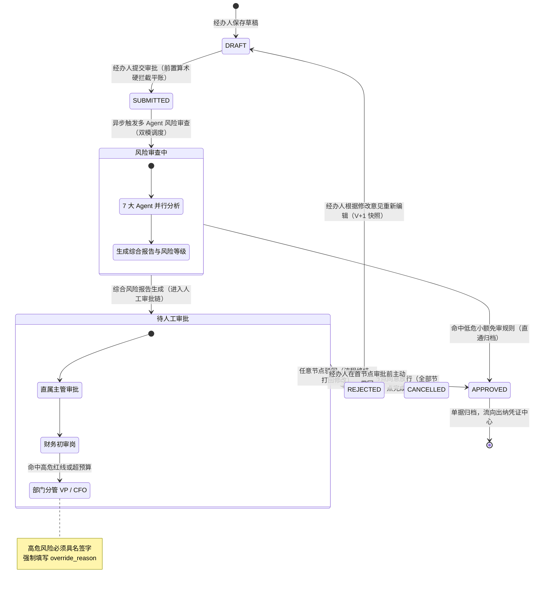
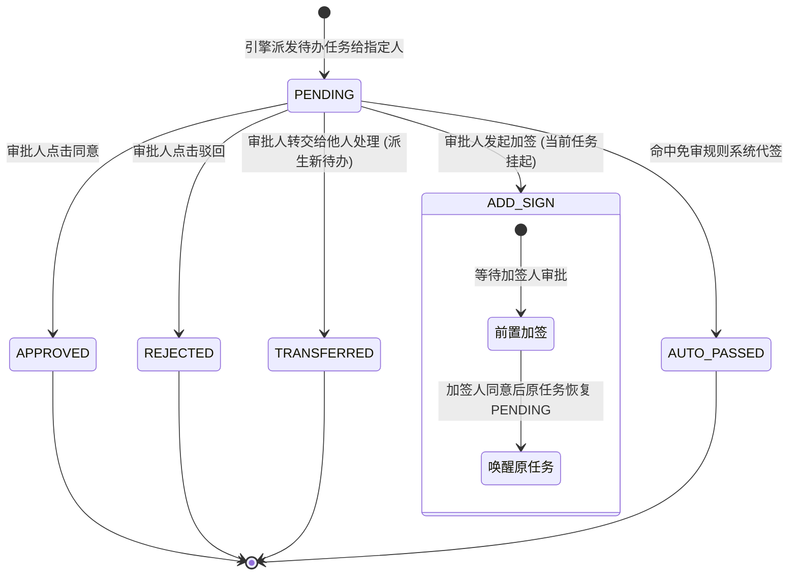
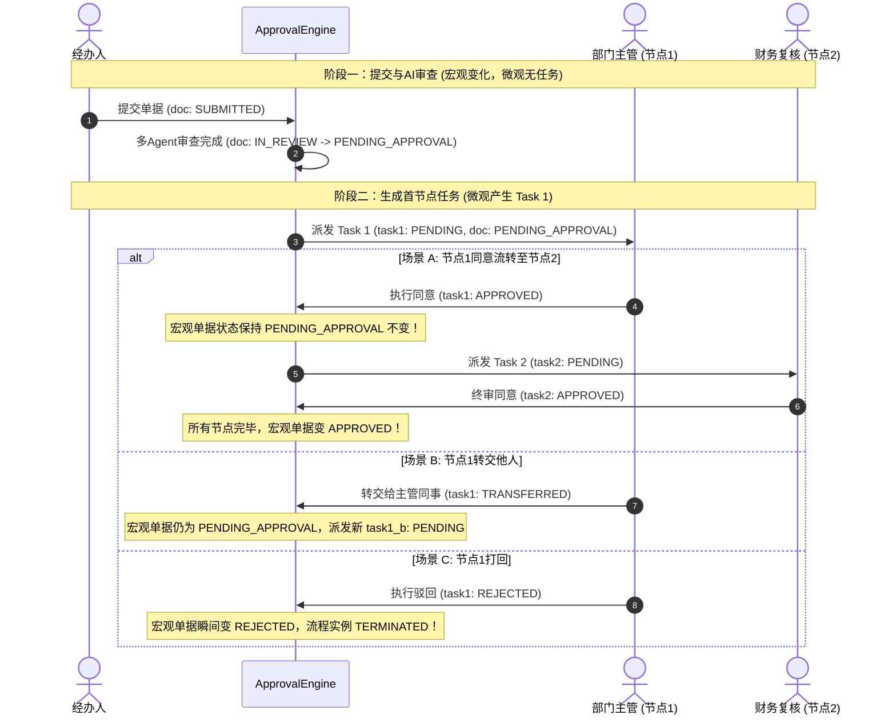
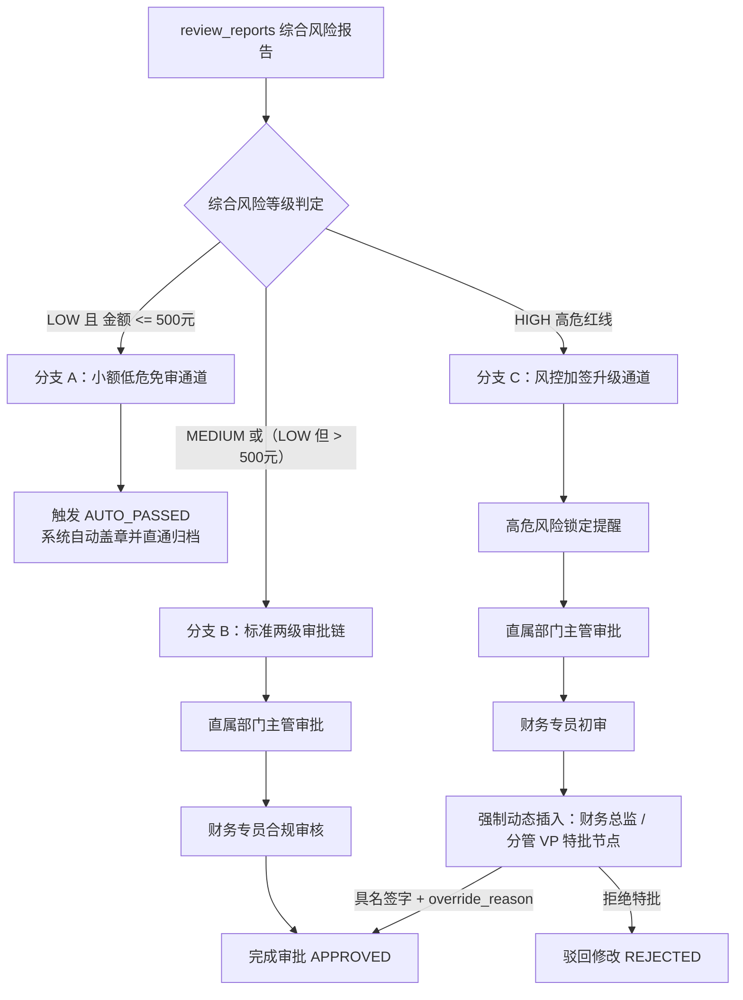

# 模块详细设计 Spec —— 05. app/services 审批工作流与状态机驱动引擎

**文档版本：** V1.0  
**所属模块：** `backend/app/services/approval_engine.py` & `approval_service.py`  
**依据文档：** 《PRD-v1.0.md》、《数据实体设计.md》、《概要设计.md》  
**设计目标：** 制定企业级审批工作流引擎（`ApprovalEngine`）的技术规格。该引擎负责驱动 5 类单据在不同审批节点间的有序流转，深度集成多 Agent 风险审查门禁（低危免审直通、中危常规审核、高危红线特批），并支持加签、转交、驳回至经办人（版本自增快照）及金融级审计留痕。

---

## 1. 业务场景与工作流双轨状态机拓扑

审批引擎是业务流转的心脏。在企业级审批系统中，**“单据/流程实例的整体状态（宏观）”**与**“具体审批人待办任务的状态（微观）”**存在本质维度的不同，两者呈现 **1对多（1:N）** 的树状协同关系：

- **宏观轨（Macro Track）**：刻画单据从草稿、前置审查、流转中到终审办结/归档的完整生命周期（面向经办人与全局业务，体现在 `financial_documents.status` 与 `approval_instances.status`）；
- **微观轨（Micro Track）**：刻画具体审批人名下的待办卡片生命周期，包含处理、加签挂起、转交派生、超时等细粒度状态（面向各个审批人待办工作台，体现在 `approval_tasks.status`）。

---

### 1.1 宏观轨：单据与流程实例状态机

单据与审批实例从发起至办结的全局流转拓扑如下：



#### 宏观单据主状态字典 (`financial_documents.status`)

| 单据状态 | 编码 | 语义说明 | 对应流程实例状态 (`approval_instances.status`) |
|---|---|---|---|
| **草稿中** | `DRAFT` | 经办人编辑保存，未正式提交 | 无流程实例 / 或历史被驳回实例已终结 |
| **已提交** | `SUBMITTED` | 经办人点击提交，等待异步调度启动审查 | 尚未启动 (`PENDING`) |
| **AI审查中** | `IN_REVIEW` | 多 Agent 并行推理、规则引擎核算中 | 实例处于运行中 (`RUNNING`) |
| **审批流转中** | `PENDING_APPROVAL` | AI 审查完成并出具报告，进入人工审批链 | 实例处于运行中 (`RUNNING`) |
| **终审通过** | `APPROVED` | 所有审批节点同意放行或命中低危免审直通 | 实例已完成 (`COMPLETED`) |
| **已被驳回** | `REJECTED` | 审批链中任意审批人点击驳回 | 实例异常终结 (`TERMINATED`) |
| **经办人撤回** | `CANCELLED` | 首节点审批前经办人主动撤回修改 | 实例已被取消 (`CANCELLED`) |

---

### 1.2 微观轨：审批待办任务状态机

针对审批链中分配给每个具体人员的单项任务卡片（`approval_tasks`），其生命周期状态机如下：



#### 微观审批待办状态字典 (`approval_tasks.status`)

| 任务状态 | 编码 | 说明 | 可触发的动作与后续状态 |
|---|---|---|---|
| **待审批** | `PENDING` | 当前审批人名下待处理任务 | `APPROVE` -> `APPROVED`<br>`REJECT` -> `REJECTED`<br>`TRANSFER` -> `TRANSFERRED`<br>`ADD_SIGN` -> `ADD_SIGN` |
| **已通过** | `APPROVED` | 当前审批人已签字放行 | 终态（若存在下一节点，引擎派生下一节点 `PENDING` 任务） |
| **已驳回** | `REJECTED` | 当前审批人打回单据 | 终态（联动触发宏观单据变 `REJECTED`） |
| **已转交** | `TRANSFERRED` | 当前审批人将任务授权转交给他人处理 | 终态（引擎派生被转交人的新 `PENDING` 任务） |
| **加签挂起中** | `ADD_SIGN` | 发起协同会签，当前节点处于挂起等待中 | 挂起中间态（等待加签人审批通过后唤醒恢复为 `PENDING`） |
| **自动免审通过** | `AUTO_PASSED` | 命中系统小额低危规则，系统自动盖章放行 | 终态（无人工待办） |

---

### 1.3 宏观与微观状态双轨联动映射时序

宏观单据主状态与微观审批人待办任务之间的映射与流转时序如下：



#### 双轨联动映射矩阵表

| 业务发生事件 | 宏观单据状态 (`doc.status`) | 宏观实例状态 (`instance.status`) | 微观当前任务状态 (`task.status`) | 后续系统动作 |
|---|---|---|---|---|
| **经办人提交，进入AI审查** | `IN_REVIEW` | `RUNNING` | 无任务 | 多 Agent 异步审查执行中 |
| **AI审查完成，派发首节点** | `PENDING_APPROVAL` | `RUNNING` | 节点1 = `PENDING` | 审批人1收到待办通知 |
| **首节点审批人点击【同意】(非终审)** | `PENDING_APPROVAL` (不变) | `RUNNING` (不变) | 节点1 = `APPROVED` | 自动创建节点2待办 (`PENDING`) |
| **终审节点审批人点击【同意】** | `APPROVED` (终态) | `COMPLETED` (终态) | 终审节点 = `APPROVED` | 单据归档，推送出纳凭证中心 |
| **任意节点审批人点击【驳回】** | `REJECTED` (被打回) | `TERMINATED` (终态) | 当前节点 = `REJECTED` | 全单流程终止，退回发起人草稿箱 |
| **审批人点击【转交】给 B** | `PENDING_APPROVAL` (不变) | `RUNNING` (不变) | 原任务 = `TRANSFERRED`<br>新任务(B) = `PENDING` | 待办转入 B 名下，防死循环校验 |
| **审批人发起【前置加签】给 C** | `PENDING_APPROVAL` (不变) | `RUNNING` (不变) | 原任务 = `ADD_SIGN`<br>新加签任务(C) = `PENDING` | 原任务挂起，等待 C 审批唤醒 |
| **首节点审批前经办人【撤回】** | `CANCELLED` | `CANCELLED` | 节点1 = 任务直接作废 | 单据退回草稿箱，允许重新编辑 |

---

## 2. 核心风控门禁与条件分支流转规则

审批引擎在启动或流转时，必须依据后台 `review_reports.overall_risk_level` 进行**风险分级智能路由**：



### 智能路由具体参数配置

1. **小额低危免审规则 (`RULE_AUTO_PASS`)**：
   - 条件：`overall_risk_level == "low"` 且 `total_amount <= 500.00`，且无任何单项中危提示；
   - 动作：审批实例直接标记为 `COMPLETED`，当前审批任务标记 `AUTO_PASSED`，跳过所有人工审批节点。
2. **高危红线加签规则 (`RULE_HIGH_RISK_ESCALATION`)**：
   - 条件：存在任意 1 项 `high` 风险项（如 `R01` 金额算不平、`R03` 合同超付、`R15` 空壳公司）；
   - 动作：审批引擎在标准流程最后**强制动态追加一级“财务总监 (CFO) / 业务分管 VP 特批节点”**；
   - 约束：该节点**禁止转交他人**，审批人必须填写详细的 `override_reason`（强制放行原因），系统不可变记录在 `workflow_status_logs` 中。

---

## 3. 模块文件规划

```
backend/app/services/
├── approval_engine.py         # 审批状态机驱动核心 (工作流节点流转、条件路由、加签处理)
├── approval_service.py        # 审批业务门面服务 (处理 HTTP 控制器请求、权限检查、待办拉取)
└── workflow/                  # 工作流辅助组件
    ├── __init__.py
    ├── node_evaluator.py      # 条件分支表达式求值器 (支持金额区间、部门路由)
    └── action_handlers.py     # 各类审批动作处理器 (Approve, Reject, Transfer, AddSign)
```

---

## 4. 详细设计与核心代码实现规范

### 4.1 审批动作数据传输对象 (DTO)

```python
"""
backend/app/schemas/approval.py
"""
from enum import Enum
from typing import Optional, List
from pydantic import BaseModel, Field

class ApprovalActionEnum(str, Enum):
    APPROVE = "APPROVE"          # 同意通过
    REJECT = "REJECT"            # 驳回修改
    TRANSFER = "TRANSFER"        # 转交他人
    ADD_SIGN = "ADD_SIGN"        # 征询加签
    REVOKE = "REVOKE"            # 经办人撤销单据

class AddSignTypeEnum(str, Enum):
    BEFORE = "BEFORE"            # 前置加签 (加签人先审，通过后回到我)
    AFTER = "AFTER"              # 后置加签 (我先审，通过后送加签人审)

class ApprovalActionReq(BaseModel):
    """审批操作入参"""
    action: ApprovalActionEnum = Field(..., description="审批动作")
    comment: str = Field(..., min_length=2, max_length=500, description="审批意见/驳回原因")
    
    # 转交或加签时必填
    target_user_id: Optional[int] = Field(default=None, description="转交或加签目标人 ID")
    add_sign_type: Optional[AddSignTypeEnum] = Field(default=None, description="加签类型")
    
    # 高危风险强行特批时必填
    override_reason: Optional[str] = Field(default=None, description="高危风险具名特批放行理由")
```

---

### 4.2 审批引擎核心驱动器：`approval_engine.py`

解决任务流转、状态原子跃迁与加签唤醒的核心逻辑：

```python
"""
backend/app/services/approval_engine.py
审批工作流状态机驱动引擎
"""
from typing import Optional, List, Dict, Any
from sqlalchemy.ext.asyncio import AsyncSession
from sqlalchemy import select, and_, update
from datetime import datetime

from enum import Enum
from pydantic import BaseModel, Field
from app.models.workflow import ApprovalInstance, ApprovalTask, ApprovalNode, WorkflowStatusLog
from app.models.document import FinancialDocument
from app.models.audit import ReviewReport
from app.schemas.approval import ApprovalActionReq, ApprovalActionEnum, AddSignTypeEnum

class ApprovalDecisionAction(str, Enum):
    """审批决策动作枚举"""
    AUTO_APPROVE = "AUTO_APPROVE"            # 低危小额直通放行
    REQUEST_SUPPLEMENT = "REQUEST_SUPPLEMENT"  # 凭证缺失退回补充
    REJECT = "REJECT"                        # 欺诈或严重违规直接驳回
    CREATE_TASKS = "CREATE_TASKS"            # 派发多级人工待办审批

class ApprovalDecision(BaseModel):
    """审批决策输出对象 (铁律: Agent产生判断，AuditService固化事实，ApprovalService决定业务后果)"""
    action: ApprovalDecisionAction
    target_state: str
    required_nodes: List[Dict[str, Any]] = Field(default_factory=list)
    reason: str

class ApprovalEngine:
    @staticmethod
    def evaluate_transition(
        doc: FinancialDocument,
        report: Optional[ReviewReport] = None,
    ) -> ApprovalDecision:
        """
        基于单据属性与风控体检事实，确定性裁定单据生命周期状态机跃迁与节点路线
        """
        # 1. 凭据严重缺失 -> 退回补充
        if doc.status == "NEED_SUPPLEMENT":
            return ApprovalDecision(
                action=ApprovalDecisionAction.REQUEST_SUPPLEMENT,
                target_state="NEED_SUPPLEMENT",
                reason="单据关键发票凭据缺失或版面模糊，退回申请人补充"
            )

        # 2. 严重违规欺诈一票否决
        if report and report.overall_risk_level == "critical":
            return ApprovalDecision(
                action=ApprovalDecisionAction.REJECT,
                target_state="REJECTED",
                reason="AI审查发现严重欺诈违规风险(critical)，一票否决"
            )

        # 3. 低风险小额免审直通
        if report and report.overall_risk_level == "low" and doc.total_amount <= 500.00:
            return ApprovalDecision(
                action=ApprovalDecisionAction.AUTO_APPROVE,
                target_state="APPROVED",
                reason="单据金额 <= 500元且AI审查评定为低危，触发免审规则直通放行"
            )

        # 4. 常规/高危审批流：动态装配审批节点
        required_nodes = [
            {"order": 1, "role_name": "部门主管", "node_name": "直属主管审批"},
            {"order": 2, "role_name": "财务专员", "node_name": "财务初审岗"}
        ]
        if (report and report.overall_risk_level in ["high", "medium"]) or doc.total_amount > 10000.00:
            required_nodes.append(
                {"order": 3, "role_name": "财务总监", "node_name": "分管领导/CFO特批"}
            )

        return ApprovalDecision(
            action=ApprovalDecisionAction.CREATE_TASKS,
            target_state="PENDING_APPROVAL",
            required_nodes=required_nodes,
            reason="进入人工审批流转链"
        )

    @staticmethod
    async def start_workflow(
        db: AsyncSession,
        document_id: int,
        workflow_id: int,
        report_id: Optional[int] = None
    ) -> ApprovalInstance:
        """
        单据提交后启动审批流，依据 evaluate_transition 执行智能路由分支
        在一个独立事务内原子执行
        """
        # 1. 加载单据与风控报告
        doc = await db.get(FinancialDocument, document_id)
        report = await db.get(ReviewReport, report_id) if report_id else None
        
        # 2. 状态机业务裁决
        decision = ApprovalEngine.evaluate_transition(doc, report)

        # 3. 创建审批实例
        instance = ApprovalInstance(
            workflow_id=workflow_id,
            document_id=document_id,
            status="RUNNING",
            start_time=datetime.utcnow()
        )
        db.add(instance)
        await db.flush()

        # 4. 根据决策动作跃迁
        if decision.action == ApprovalDecisionAction.AUTO_APPROVE:
            instance.status = "COMPLETED"
            instance.end_time = datetime.utcnow()
            doc.status = "APPROVED"
            log = WorkflowStatusLog(
                instance_id=instance.id,
                operator_id=0,
                action="AUTO_PASS",
                comment=decision.reason
            )
            db.add(log)
            await db.flush()
            return instance

        if decision.action in (ApprovalDecisionAction.REQUEST_SUPPLEMENT, ApprovalDecisionAction.REJECT):
            instance.status = "TERMINATED"
            instance.end_time = datetime.utcnow()
            doc.status = decision.target_state
            log = WorkflowStatusLog(
                instance_id=instance.id,
                operator_id=0,
                action=decision.action.value,
                comment=decision.reason
            )
            db.add(log)
            await db.flush()
            return instance

        # 5. CREATE_TASKS: 派发审批待办任务
        doc.status = "PENDING_APPROVAL"
        first_node = await ApprovalEngine._get_node_by_order(db, workflow_id, 1)
        if not first_node:
            raise ValueError(f"工作流 {workflow_id} 未配置任何有效节点！")

        assignee_id = await ApprovalEngine._resolve_assignee(db, doc, first_node)
        task = ApprovalTask(
            instance_id=instance.id,
            node_id=first_node.id,
            assignee_id=assignee_id,
            status="PENDING",
            created_at=datetime.utcnow()
        )
        db.add(task)
        
        # 单据进入“待人工审批”状态
        doc.status = "PENDING_APPROVAL"
        await db.flush()
        return instance

    @staticmethod
    async def execute_action(
        db: AsyncSession,
        task_id: int,
        operator_id: int,
        action_req: ApprovalActionReq
    ) -> Dict[str, Any]:
        """
        执行审批动作（同意、驳回、转交、加签）
        采用乐观锁/行级排他锁保证并发安全
        """
        # 1. 悲观锁锁定任务行，防并发重复处理
        stmt = select(ApprovalTask).where(ApprovalTask.id == task_id).with_for_update()
        res = await db.execute(stmt)
        task = res.scalars().first()
        
        if not task or task.status != "PENDING":
            raise ValueError("该审批任务不存在或已被处理！")
        if task.assignee_id != operator_id:
            raise PermissionError("您不是该审批任务的指定经办人，无权审批！")

        instance = await db.get(ApprovalInstance, task.instance_id)
        doc = await db.get(FinancialDocument, instance.document_id)

        # 2. 分支动作分发
        if action_req.action == ApprovalActionEnum.APPROVE:
            await ApprovalEngine._handle_approve(db, instance, task, doc, operator_id, action_req)
        elif action_req.action == ApprovalActionEnum.REJECT:
            await ApprovalEngine._handle_reject(db, instance, task, doc, operator_id, action_req)
        elif action_req.action == ApprovalActionEnum.TRANSFER:
            await ApprovalEngine._handle_transfer(db, instance, task, operator_id, action_req)
        elif action_req.action == ApprovalActionEnum.ADD_SIGN:
            await ApprovalEngine._handle_add_sign(db, instance, task, operator_id, action_req)
        elif action_req.action == ApprovalActionEnum.REVOKE:
            await ApprovalEngine._handle_revoke(db, instance, task, doc, operator_id, action_req)

        await db.flush()
        return {"status": "SUCCESS", "document_status": doc.status, "instance_status": instance.status}

    @staticmethod
    async def _handle_approve(
        db: AsyncSession,
        instance: ApprovalInstance,
        task: ApprovalTask,
        doc: FinancialDocument,
        operator_id: int,
        req: ApprovalActionReq
    ):
        """
        处理通过逻辑：
        1. 若当前任务为【前置加签】子任务，通过后唤醒处于 ADD_SIGN 挂起态的母任务，母任务重新变为 PENDING；
        2. 若当前任务为【后置加签】子任务，通过后继续流转至常规下一节点；
        3. 常规节点：若有下一节点继续流转，无下一节点单据终审通过。
        """
        task.status = "APPROVED"
        task.end_time = datetime.utcnow()
        task.comment = req.comment

        # 记录操作日志 (含高危特批原因)
        log = WorkflowStatusLog(
            instance_id=instance.id,
            task_id=task.id,
            operator_id=operator_id,
            action="APPROVE",
            comment=req.comment,
            extra_data={"override_reason": req.override_reason} if req.override_reason else None
        )
        db.add(log)

        # 检查是否为前置加签唤醒场景
        task_meta = getattr(task, "extra_data", {}) or {}
        parent_task_id = task_meta.get("parent_task_id")
        if parent_task_id and task_meta.get("add_sign_type") == "BEFORE":
            parent_task = await db.get(ApprovalTask, parent_task_id)
            if parent_task and parent_task.status == "ADD_SIGN":
                parent_task.status = "PENDING"  # 唤醒原审批人待办
                return

        # 检查是否还有下一节点
        current_node = await db.get(ApprovalNode, task.node_id)
        next_order = task_meta.get("resume_node_order", current_node.node_order + 1)
        next_node = await ApprovalEngine._get_node_by_order(db, instance.workflow_id, next_order)
        
        if next_node:
            # 流转至下一个节点
            next_assignee = await ApprovalEngine._resolve_assignee(db, doc, next_node)
            next_task = ApprovalTask(
                instance_id=instance.id,
                node_id=next_node.id,
                assignee_id=next_assignee,
                status="PENDING",
                created_at=datetime.utcnow()
            )
            db.add(next_task)
        else:
            # 全部节点审批完毕，单据终审通过！
            instance.status = "COMPLETED"
            instance.end_time = datetime.utcnow()
            doc.status = "APPROVED"

    @staticmethod
    async def _handle_reject(
        db: AsyncSession,
        instance: ApprovalInstance,
        task: ApprovalTask,
        doc: FinancialDocument,
        operator_id: int,
        req: ApprovalActionReq
    ):
        """处理驳回逻辑：直接驳回到发起人重新编辑 (单据打回 DRAFT，实例终结)"""
        task.status = "REJECTED"
        task.end_time = datetime.utcnow()
        task.comment = req.comment

        instance.status = "TERMINATED"
        instance.end_time = datetime.utcnow()
        doc.status = "REJECTED"

        log = WorkflowStatusLog(
            instance_id=instance.id,
            task_id=task.id,
            operator_id=operator_id,
            action="REJECT",
            comment=req.comment
        )
        db.add(log)

    @staticmethod
    async def _handle_transfer(
        db: AsyncSession,
        instance: ApprovalInstance,
        task: ApprovalTask,
        operator_id: int,
        req: ApprovalActionReq
    ):
        """处理转交逻辑：校验死循环防环，将任务指派给 target_user_id"""
        if not req.target_user_id:
            raise ValueError("转交操作必须指定目标转交人！")
        if req.target_user_id == operator_id:
            raise ValueError("转交目标人不能是本人！")

        # 防环形死循环转交检查：遍历当前实例该节点的所有转交历史
        stmt = select(ApprovalTask).where(
            and_(ApprovalTask.instance_id == instance.id, ApprovalTask.node_id == task.node_id)
        )
        res = await db.execute(stmt)
        history_tasks = res.scalars().all()
        visited_users = {t.assignee_id for t in history_tasks}
        if req.target_user_id in visited_users:
            raise ValueError(f"用户[{req.target_user_id}]此前已参与过本节点审批或转交，禁止循环转交！")

        task.status = "TRANSFERRED"
        task.end_time = datetime.utcnow()
        task.comment = f"已转交给用户[{req.target_user_id}]：{req.comment}"

        # 派生新任务
        new_task = ApprovalTask(
            instance_id=instance.id,
            node_id=task.node_id,
            assignee_id=req.target_user_id,
            status="PENDING",
            created_at=datetime.utcnow()
        )
        db.add(new_task)

        log = WorkflowStatusLog(
            instance_id=instance.id,
            task_id=task.id,
            operator_id=operator_id,
            action="TRANSFER",
            comment=req.comment,
            extra_data={"target_user_id": req.target_user_id}
        )
        db.add(log)

    @staticmethod
    async def _handle_add_sign(
        db: AsyncSession,
        instance: ApprovalInstance,
        task: ApprovalTask,
        operator_id: int,
        req: ApprovalActionReq
    ):
        """
        处理加签逻辑 (会签协查)：
        - 前置加签 (BEFORE)：当前任务挂起为 ADD_SIGN，生成加签人待办；加签人审批通过后唤醒当前任务重新为 PENDING；
        - 后置加签 (AFTER)：当前审批人直接放行通过 (APPROVED)，在下一常规节点前插入加签人待办。
        """
        if not req.target_user_id:
            raise ValueError("加签操作必须指定目标加签人！")
        if req.target_user_id == operator_id:
            raise ValueError("加签人不能是本人！")
        if not req.add_sign_type:
            raise ValueError("加签操作必须指定加签类型 (BEFORE 或 AFTER)！")

        if req.add_sign_type == AddSignTypeEnum.BEFORE:
            # 1. 前置加签：当前任务挂起
            task.status = "ADD_SIGN"
            task.comment = f"发起前置加签给用户[{req.target_user_id}]：{req.comment}"

            # 派生加签人任务
            add_task = ApprovalTask(
                instance_id=instance.id,
                node_id=task.node_id,
                assignee_id=req.target_user_id,
                status="PENDING",
                created_at=datetime.utcnow(),
                extra_data={"parent_task_id": task.id, "add_sign_type": "BEFORE"}
            )
            db.add(add_task)

        elif req.add_sign_type == AddSignTypeEnum.AFTER:
            # 2. 后置加签：当前人通过，加签人跟进
            task.status = "APPROVED"
            task.end_time = datetime.utcnow()
            task.comment = f"同意并通过，并后置加签给用户[{req.target_user_id}]：{req.comment}"

            current_node = await db.get(ApprovalNode, task.node_id)
            add_task = ApprovalTask(
                instance_id=instance.id,
                node_id=task.node_id,
                assignee_id=req.target_user_id,
                status="PENDING",
                created_at=datetime.utcnow(),
                extra_data={"add_sign_type": "AFTER", "resume_node_order": current_node.node_order + 1}
            )
            db.add(add_task)

        log = WorkflowStatusLog(
            instance_id=instance.id,
            task_id=task.id,
            operator_id=operator_id,
            action="ADD_SIGN",
            comment=req.comment,
            extra_data={"target_user_id": req.target_user_id, "add_sign_type": req.add_sign_type.value}
        )
        db.add(log)

    @staticmethod
    async def _handle_revoke(
        db: AsyncSession,
        instance: ApprovalInstance,
        task: ApprovalTask,
        doc: FinancialDocument,
        operator_id: int,
        req: ApprovalActionReq
    ):
        """
        处理经办人主动撤回：
        1. 必须是单据发起人才能撤回；
        2. 首节点未被审批（历史没有任何已通过的任务）才允许撤回；若已有审批人放行，禁止撤回。
        """
        if doc.applicant_id != operator_id:
            raise PermissionError("只有单据发起经办人本人允许主动撤回！")

        stmt = select(ApprovalTask).where(
            and_(ApprovalTask.instance_id == instance.id, ApprovalTask.status == "APPROVED")
        )
        res = await db.execute(stmt)
        approved_tasks = res.scalars().all()
        if approved_tasks:
            raise ValueError("单据已进入流转审批阶段且已有节点同意，禁止经办人单方撤回！如需修改请联系审批人驳回。")

        # 作废所有待办任务
        task.status = "REJECTED"
        task.comment = f"经办人主动撤回：{req.comment}"
        task.end_time = datetime.utcnow()

        instance.status = "CANCELLED"
        instance.end_time = datetime.utcnow()
        doc.status = "CANCELLED"

        log = WorkflowStatusLog(
            instance_id=instance.id,
            task_id=task.id,
            operator_id=operator_id,
            action="REVOKE",
            comment=req.comment
        )
        db.add(log)

    @staticmethod
    async def _get_node_by_order(db: AsyncSession, workflow_id: int, order: int) -> Optional[ApprovalNode]:
        query = select(ApprovalNode).where(
            and_(ApprovalNode.workflow_id == workflow_id, ApprovalNode.node_order == order)
        )
        res = await db.execute(query)
        return res.scalars().first()

    @staticmethod
    async def _resolve_assignee(db: AsyncSession, doc: FinancialDocument, node: ApprovalNode) -> int:
        """根据节点规则解析具体的审批人 ID (支持部门直属主管、角色绑定、固定用户)"""
        if node.approver_type == "ROLE":
            # 根据用户角色查找
            return node.role_id  # 简化实现，实际可查询角色下首位员工或广播给角色组
        elif node.approver_type == "MANAGER":
            # 解析单据申请人的直属主管
            return 2 # 模拟上级主管 ID
        return 1 # 默认兜底系统管理员
```

---

## 5. 单元测试与边界流转验证 (Test Cases)

| 用例编号 | 场景描述 | 触发条件 / 操作输入 | 预期结果 |
|---|---|---|---|
| **`TC_WF_01`** | 低危小额免审直通 | 金额 300 元，AI 审查为 LOW | 实例瞬间标为 `COMPLETED`，单据变 `APPROVED`，不产生人工待办 |
| **`TC_WF_02`** | 正常两级审批流转 | 节点1审批人执行 `APPROVE` | 节点1变 `APPROVED`，自动产生节点2 `PENDING` 待办，单据仍为 `PENDING_APPROVAL` |
| **`TC_WF_03`** | 终审节点通过归档 | 节点2审批人执行 `APPROVE` | 实例变为 `COMPLETED`，单据状态更新为 `APPROVED` (终审办结) |
| **`TC_WF_04`** | 审批驳回重新修改 | 节点1审批人执行 `REJECT` | 实例变为 `TERMINATED`，单据变为 `REJECTED`，允许发起人编辑并自增 V+1 快照 |
| **`TC_WF_05`** | 委派转交测试 | 审批人 A 执行 `TRANSFER` 给用户 B | 任务 A 变 `TRANSFERRED`，生成属于用户 B 的新 `PENDING` 任务 |
| **`TC_WF_06`** | 并发重入锁测试 | 两人同时对同一 `task_id` 发起 `APPROVE` | 行锁互斥拦截，一人成功，另一人抛出 `已被处理` 异常并回滚 |
| **`TC_WF_07`** | 前置加签与唤醒 | 审批人 A 对任务发起 `ADD_SIGN(BEFORE, User_C)` | 任务 A 挂起为 `ADD_SIGN`，派发 C 为 `PENDING`；C 同意后，任务 A 自动唤醒重新恢复为 `PENDING` |
| **`TC_WF_08`** | 后置加签流转 | 审批人 A 对任务发起 `ADD_SIGN(AFTER, User_C)` | 任务 A 变 `APPROVED`，派生 C 为 `PENDING`；C 同意后，引擎自动推进到原规划的下一节点 |
| **`TC_WF_09`** | 经办人撤回单据 | 经办人在首节点被审批前点击 `REVOKE` | 当前所有 PENDING 任务作废，实例与单据变为 `CANCELLED`，可重新编辑 |
| **`TC_WF_10`** | 防死循环转交拦截 | 审批人 A 将任务转交给曾转交过该任务的审批人 | 引擎抛出 `禁止循环转交` 异常并阻止操作，避免死循环 |

---

## 6. 阶段成果与全系统 Spec 进度总览

至此，系统最重要的五大核心模块 Spec 已全部编写完成，形成严丝合缝的技术设计矩阵：

```
specs/
├── 01_engines_contract_spec.md       # 智能体强类型契约、五维证据与 WebSocket 实时流事件
├── 02_engines_amount_agent_spec.md   # 确定性金额核算、五方对账、动态公差与人机修正机制
├── 03_app_repositories_spec.md       # 泛型仓储 CRUD、JSONB 不可变快照与乐观锁 CAS
├── 04_engines_policy_agent_spec.md   # 制度知识库 RAG 检索、差旅标准审查与三层降级兜底
└── 05_app_approval_engine_spec.md    # 状态机双轨驱动、高危红线特批与审批工作流引擎
```

所有关键核心架构已全部落地成文！
