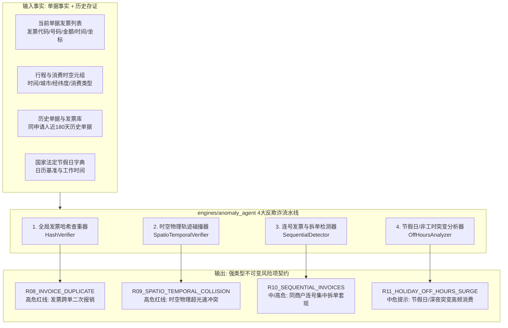

# 模块详细设计 Spec —— 06. engines/anomaly_agent 异常行为与反欺诈智能体

**文档版本：** V1.0  
**所属模块：** `backend/engines/anomaly_agent/`  
**依据文档：** 《PRD-v1.0.md》、《数据实体设计.md》、《概要设计.md》、`specs/01_engines_contract_spec.md`  
**设计目标：** 制定异常行为与反欺诈智能体（`AnomalyAgent`）的工业级算法与代码规格。该 Agent 专注于财务审计中的黑灰产反作弊、虚开发票识别与合规套现防范，采用纯确定性算法与时空代数计算，涵盖发票全局哈希防重查验、跨单物理时空轨迹碰撞检测、连号发票集中拆单套现识别、节假日与非工作时间异常高频离群突变检测，输出不可变反欺诈存证。

---

## 1. 模块定位与反欺诈规则拓扑

在财务单据审核中，很多严重风险无法通过单张发票自身的文字或数字发现（如发票自身真实有效、金额也能平账），而必须**放眼跨单据历史时间轴、地理物理空间与群体行为基线**。`AnomalyAgent` 充当系统的“雷达反作弊中枢”：



### 反欺诈风控规则矩阵

| 规则编码 | 规则名称 | 风险等级 | 判定依据与数学阈值 | 是否允许审批人具名放行 |
|---|---|---|---|---|
| **`R08_INVOICE_DUPLICATE`** | 发票全局防重查验 (跨单复用) | **HIGH (高危红线)** | `SHA256(fp_dm + fp_hm + amount + kprq)` 碰撞，且已在其它 `APPROVED` / `PENDING_APPROVAL` 单据中报销 | 默认禁止（需高管特批） |
| **`R09_SPATIO_TEMPORAL_COLLISION`** | 跨单行程时空物理碰撞 | **HIGH (高危红线)** | 同一申请人两笔消费间隔 $\Delta t < 2$ 小时，但两地地理球面距离 $D > 300\text{ km}$ 且无匹配民航凭证（速度 $v > 300\text{ km/h}$） | 允许（需附行程说明） |
| **`R10_SEQUENTIAL_INVOICES`** | 连号发票集中拆单报销 | **MEDIUM / HIGH** | 同一销售方税号、开票日期在 3 日内，发票号码连续（$\Delta \text{No} = 1$），且张数 $\ge 2$、合计金额超审批门槛 | 允许（需解释业务合理性） |
| **`R11_HOLIDAY_OFF_HOURS_SURGE`** | 节假日与非工作时间突变报销 | **MEDIUM** | 消费时间落入法定春节/国庆长假或深夜（23:00~05:00），且无关联差旅申请单证明加班事实 | 允许（需主管签字） |

---

## 2. 4大反欺诈算法数学模型与边界规约

### 2.1 发票全局防重与跨单状态过滤算法 (`R08`)

#### 2.1.1 联合哈希指纹计算
为防止经办人通过修改不同格式（如 PDF 与图片混传）绕过查重，系统计算发票确定性业务唯一指纹：
$$\text{InvoiceFingerprint} = \text{SHA256}\left(\text{Upper}(\text{fp\_dm}) + \text{"\#"} + \text{Upper}(\text{fp\_hm}) + \text{"\#"} + \text{Decimal}(amount).quantize(\text{"0.01"}) + \text{"\#"} + \text{Format}(kprq, \text{"YYYY-MM-DD"})\right)$$

#### 2.1.2 跨单历史状态生命周期过滤（关键业务边界）
若仅查数据库是否存在同号发票，会导致经办人**单据被打回（`REJECTED`）或主动撤回（`CANCELLED`）后无法重新提交该发票**的致命误杀！
- **有效冲突状态**：仅当历史发票所属单据状态处于 `APPROVED`（已办结）、`PENDING_APPROVAL`（正在其他流程流转中）、`IN_REVIEW`（审查中）时，判定为**重复报销欺诈**；
- **放行豁免状态**：若历史单据状态为 `DRAFT`、`REJECTED` 或 `CANCELLED`，且为同一申请人，系统自动释放该发票指纹，豁免查重报警。

---

### 2.2 跨单时空物理轨迹碰撞算法 (`R09`)

针对员工“借用朋友发票报销”、“同时在两地虚构差旅”的典型欺诈，算法在申请人历史单据时间轴上构建时空事件流。

#### 2.2.1 地理球面 Haversine 距离公式
给定两个时空消费事件点 $P_1(\text{lat}_1, \text{lng}_1, t_1)$ 与 $P_2(\text{lat}_2, \text{lng}_2, t_2)$，地球半径取 $R = 6371.0 \text{ km}$：
$$\Delta \phi = \frac{\pi}{180}(\text{lat}_2 - \text{lat}_1), \quad \Delta \lambda = \frac{\pi}{180}(\text{lng}_2 - \text{lng}_1)$$
$$a = \sin^2\left(\frac{\Delta \phi}{2}\right) + \cos\left(\frac{\pi}{180}\text{lat}_1\right) \cos\left(\frac{\pi}{180}\text{lat}_2\right) \sin^2\left(\frac{\Delta \lambda}{2}\right)$$
$$D = 2R \cdot \arcsin\left(\sqrt{a}\right)$$

#### 2.2.2 物理超光速/异常位移判定逻辑
时间差 $\Delta t = |t_2 - t_1|$（单位：小时）。位移速度 $V = \frac{D}{\Delta t}$：
1. **城际瞬间瞬移（物理不可能）**：若 $D \ge 100\text{ km}$ 且 $\Delta t \le 0.5\text{ h}$（30分钟内），$V > 200\text{ km/h}$，且两单据中均无飞机行程凭证，触发高危时空碰撞；
2. **同城多地时空重叠**：若在同一小时内在两个相距 $> 50\text{ km}$ 的地点分别开具大额餐饮/娱乐发票，触发中危时空可疑。

---

### 2.3 连号发票与拆单套现检测算法 (`R10`)

企业员工或外部供应商为了规避企业制度中“单笔金额 $\ge 5000$ 元需分管 VP 审批”的门禁，常将大额款项拆成多张连续发票（如 4800 + 4900 元）。

#### 2.3.1 检测算法
1. **聚合分组**：将同一报销单据或同一申请人 3 日内的所有发票按 `seller_tax_id`（开票商户税号）分组；
2. **发票号码纯数提取与排序**：过滤前导字母，提取末尾连续纯数字 `seq_no = int(re.search(r'\d+$', invoice_number).group())`；
3. **差分连续性检验**：
   - 排序后数组为 $S = [s_1, s_2, \dots, s_k]$；
   - 计算差分序列 $\Delta s_i = s_{i+1} - s_i$；
   - 若存在连续子序列满足 $\Delta s_i = 1$（严格连号）或 $\Delta s_i \le 2$（近邻连号），且连号张数 $M \ge 2$：
     - 计算连号子序列总金额 $A_{\text{sum}} = \sum \text{amount}$；
     - 若 $A_{\text{sum}} > 3000.00$ 元，生成 `R10_SEQUENTIAL_INVOICES`。

---

### 2.4 节假日与非工作时间突变分析器 (`R11`)

#### 2.4.1 判定条件
1. 发票消费时间落入：
   - **法定节假日**：调用静态内置或系统缓存的法定节假日日历（如 10月1日~7日 国庆、正月初一~初七 春节）；
   - **深夜高危时间段**：开票时间在 23:00 至 次日 05:00 之间（多见于违规娱乐、夜总会餐饮冲账）；
2. **豁免条件**：
   - 单据类型为“对公付款 / 预付款 / 采购付款”且有对应合同者豁免；
   - 差旅报销单据中明确勾选并审批通过了“节假日加班差旅申请单”者豁免。

---

## 3. 模块文件规划

```
backend/engines/anomaly_agent/
├── __init__.py                # 模块导出定义
├── agent.py                   # AnomalyAgent 核心子图入口 (集成 LangGraph)
├── hash_verifier.py           # 发票业务指纹计算与跨单全局防重核验器 (R08)
├── spatio_temporal.py         # 跨单物理时空轨迹碰撞与 Haversine 算子 (R09)
├── sequential_detector.py     # 同商户连号发票与拆单聚类分析器 (R10)
├── off_hours_analyzer.py      # 节假日与非工作时间离群突变分析器 (R11)
└── holiday_calendar.py        # 法定节假日字典与城市经纬度快速坐标库
```

---

## 4. 详细设计与核心代码实现规范

### 4.1 核心数据结构与输入参数

```python
"""
backend/engines/anomaly_agent/schemas.py
异常反欺诈智能体内部事实载荷
"""
from typing import Optional, List, Dict
from decimal import Decimal
from datetime import datetime
from pydantic import BaseModel, Field

class InvoiceFact(BaseModel):
    """用于反欺诈比对的发票事实对象"""
    invoice_id: Optional[int] = None
    attachment_id: int
    invoice_code: str
    invoice_number: str
    total_amount: Decimal
    issue_date: str                 # 格式: YYYY-MM-DD
    seller_tax_id: str
    seller_name: str
    buyer_tax_id: str
    expense_type: Optional[str] = None # 如 "餐饮", "住宿", "交通"
    city_name: Optional[str] = None    # 消费城市 (如 "北京", "上海")
    exact_time: Optional[datetime] = None # 具体交易时间 (若发票或滴滴行程单包含)

class SpatioPoint(BaseModel):
    """时空物理事件点"""
    event_time: datetime
    city_name: str
    latitude: float
    longitude: float
    source_desc: str               # 来源描述，如 "北京全聚德餐饮发票"
    attachment_id: int
    invoice_number: str
```

---

### 4.2 发票全局防重查验器：`hash_verifier.py`

```python
"""
backend/engines/anomaly_agent/hash_verifier.py
发票全局哈希查重与跨单生命周期过滤
"""
import hashlib
from decimal import Decimal
from typing import List, Dict, Any, Optional
from sqlalchemy.ext.asyncio import AsyncSession
from sqlalchemy import select, and_

from app.models.invoice import Invoice
from app.models.document import FinancialDocument
from engines.contract.finding import RiskFindingContract, RiskLevelEnum
from engines.contract.agent_role import AgentRoleEnum
from engines.contract.evidence import EvidenceRecord, EvidenceCategoryEnum, VisualAnchor, BoundingBox
from .schemas import InvoiceFact

class HashVerifier:
    @staticmethod
    def compute_invoice_hash(code: str, number: str, amount: Decimal, issue_date: str) -> str:
        """计算标准发票防重哈希指纹"""
        amt_str = f"{Decimal(str(amount)):.2f}"
        payload = f"{code.strip().upper()}#{number.strip().upper()}#{amt_str}#{issue_date.strip()}"
        return hashlib.sha256(payload.encode("utf-8")).hexdigest()

    @staticmethod
    async def verify_duplicate_invoices(
        db: AsyncSession,
        current_document_id: int,
        invoices: List[InvoiceFact]
    ) -> List[RiskFindingContract]:
        """
        跨单全局发票查重：
        1. 检查本单内部发票重复；
        2. 查询数据库历史发票，过滤已驳回/已撤回单据，仅对有效流转单据报警。
        """
        findings: List[RiskFindingContract] = []
        seen_current: Dict[str, InvoiceFact] = {}

        for inv in invoices:
            h = HashVerifier.compute_invoice_hash(inv.invoice_code, inv.invoice_number, inv.total_amount, inv.issue_date)

            # 1. 本单内重复检测
            if h in seen_current:
                first_inv = seen_current[h]
                findings.append(RiskFindingContract(
                    rule_code="R08_INVOICE_DUPLICATE",
                    rule_name="发票单内重复报销",
                    risk_level=RiskLevelEnum.HIGH,
                    agent_role=AgentRoleEnum.ANOMALY,
                    title=f"发票号码[{inv.invoice_number}]在当前单据中重复提交",
                    description=f"当前报销单内存在两张完全相同的发票（发票代码: {inv.invoice_code}，号码: {inv.invoice_number}，金额: {inv.total_amount}元），涉嫌同一发票重复报销。",
                    actual_value={"invoice_number": inv.invoice_number, "duplicate_count": 2},
                    expected_value={"max_allowed_submission": 1},
                    discrepancy_amount=inv.total_amount,
                    suggestion="请剔除单内重复上传的发票附件后再行提交。",
                    is_overridable=False
                ))
                continue
            seen_current[h] = inv

            # 2. 跨历史单据检索 (PG 查询)
            # 排除当前单据自身，且仅关联状态为 APPROVED, PENDING_APPROVAL, IN_REVIEW 的单据
            stmt = (
                select(Invoice, FinancialDocument)
                .join(FinancialDocument, Invoice.document_id == FinancialDocument.id)
                .where(
                    and_(
                        Invoice.invoice_hash == h,
                        Invoice.document_id != current_document_id,
                        FinancialDocument.status.in_(["APPROVED", "PENDING_APPROVAL", "IN_REVIEW"])
                    )
                )
            )
            result = await db.execute(stmt)
            history_rows = result.all()

            if history_rows:
                conflict_inv, conflict_doc = history_rows[0]
                findings.append(RiskFindingContract(
                    rule_code="R08_INVOICE_DUPLICATE",
                    rule_name="发票跨单重复报销 (全局红线)",
                    risk_level=RiskLevelEnum.HIGH,
                    agent_role=AgentRoleEnum.ANOMALY,
                    title=f"发票[{inv.invoice_number}]已被历史单据[{conflict_doc.document_no}]报销",
                    description=(
                        f"发票（代码: {inv.invoice_code}, 号码: {inv.invoice_number}, 金额: {inv.total_amount}元）"
                        f"已在历史单据[{conflict_doc.document_no}]（申请人ID: {conflict_doc.applicant_id}, 状态: {conflict_doc.status}）"
                        f"中完成报销或正在审批中。严禁一票多报或跨部门套现！"
                    ),
                    actual_value={
                        "invoice_number": inv.invoice_number,
                        "conflict_document_id": conflict_doc.id,
                        "conflict_document_no": conflict_doc.document_no,
                        "conflict_status": conflict_doc.status
                    },
                    expected_value={"is_previously_claimed": False},
                    discrepancy_amount=inv.total_amount,
                    suggestion="系统检测到发票已被使用，属于一票否决高危行为，财务审批人严禁放行，建议驳回并通报批评。",
                    is_overridable=False
                ))

        return findings
```

---

### 4.3 跨单物理时空碰撞核验器：`spatio_temporal.py`

```python
"""
backend/engines/anomaly_agent/spatio_temporal.py
跨单物理时空轨迹碰撞分析器
"""
import math
from typing import List, Optional
from datetime import datetime, timedelta
from engines.contract.finding import RiskFindingContract, RiskLevelEnum
from engines.contract.agent_role import AgentRoleEnum
from .schemas import SpatioPoint

class SpatioTemporalVerifier:
    EARTH_RADIUS_KM = 6371.0

    @staticmethod
    def haversine_distance(lat1: float, lng1: float, lat2: float, lng2: float) -> float:
        """使用 Haversine 公式计算两个经纬度坐标之间的地表大圆球面距离 (千米)"""
        phi1, phi2 = math.radians(lat1), math.radians(lat2)
        dphi = math.radians(lat2 - lat1)
        dlambda = math.radians(lng2 - lng1)

        a = math.sin(dphi / 2.0) ** 2 + math.cos(phi1) * math.cos(phi2) * math.sin(dlambda / 2.0) ** 2
        c = 2.0 * math.atan2(math.sqrt(a), math.sqrt(1.0 - a))
        return SpatioTemporalVerifier.EARTH_RADIUS_KM * c

    @staticmethod
    def detect_spatio_temporal_collisions(points: List[SpatioPoint]) -> List[RiskFindingContract]:
        """
        时空轨迹碰撞检测算法：
        1. 按时间先后排序；
        2. 依次比对相邻事件点的时间差与物理位移；
        3. 若出现超自然位移速度（如无机票情况下 1 小时跨越 800 公里），生成 R09 高危风险。
        """
        findings: List[RiskFindingContract] = []
        if len(points) < 2:
            return findings

        # 按事件时间升序排序
        sorted_points = sorted(points, key=lambda p: p.event_time)

        for i in range(len(sorted_points) - 1):
            p1 = sorted_points[i]
            p2 = sorted_points[i + 1]

            delta_time = (p2.event_time - p1.event_time).total_seconds() # 秒
            delta_hours = delta_time / 3600.0

            # 忽略完全同一发票或完全同一时间戳的同城点
            if delta_hours <= 0:
                delta_hours = 0.001 # 极小值防止除以零

            dist_km = SpatioTemporalVerifier.haversine_distance(
                p1.latitude, p1.longitude, p2.latitude, p2.longitude
            )

            speed_kmh = dist_km / delta_hours

            # 触发条件：异地城市 (距离 > 100km)，时间差 < 2 小时，换算速度 > 250 km/h (常规地面交通无法达到)
            if dist_km >= 100.0 and delta_hours < 2.0 and speed_kmh > 250.0:
                findings.append(RiskFindingContract(
                    rule_code="R09_SPATIO_TEMPORAL_COLLISION",
                    rule_name="跨单行程时空物理轨迹碰撞",
                    risk_level=RiskLevelEnum.HIGH,
                    agent_role=AgentRoleEnum.ANOMALY,
                    title=f"在 {p1.city_name} 与 {p2.city_name} 出现不可思议的时空位移冲突",
                    description=(
                        f"申请人在 {p1.event_time.strftime('%Y-%m-%d %H:%M')} 于[{p1.city_name}]产生消费（发票: {p1.invoice_number}），"
                        f"随后在 {p2.event_time.strftime('%Y-%m-%d %H:%M')}（间隔 {delta_hours:.1f} 小时）"
                        f"于[{p2.city_name}]再次产生消费（发票: {p2.invoice_number}）。"
                        f"两地物理直线距离为 {dist_km:.1f} 公里，折合移动时速高达 {speed_kmh:.1f} km/h，"
                        f"在缺乏民航机票佐证下严重违背物理规律，涉嫌购买外地发票虚假报销。"
                    ),
                    actual_value={
                        "point_1": {"city": p1.city_name, "time": str(p1.event_time), "invoice": p1.invoice_number},
                        "point_2": {"city": p2.city_name, "time": str(p2.event_time), "invoice": p2.invoice_number},
                        "distance_km": round(dist_km, 2),
                        "speed_kmh": round(speed_kmh, 2)
                    },
                    expected_value={"max_realistic_speed_kmh": 250.0},
                    suggestion="该行程轨迹存在明显异地时空碰撞，疑似替他人报销或虚假发票，请审批人重点核实出差真实性。",
                    is_overridable=True
                ))

        return findings
```

---

### 4.4 连号发票与拆单检测器：`sequential_detector.py`

```python
"""
backend/engines/anomaly_agent/sequential_detector.py
同商户连号发票与集中拆单套现检测
"""
import re
from typing import List, Dict, Optional
from decimal import Decimal
from datetime import datetime
from engines.contract.finding import RiskFindingContract, RiskLevelEnum
from engines.contract.agent_role import AgentRoleEnum
from .schemas import InvoiceFact

class SequentialDetector:
    @staticmethod
    def _extract_number_suffix(number_str: str) -> Optional[int]:
        """提取发票号码末尾的纯数字部分，如 'No.00394821' -> 394821"""
        match = re.search(r'(\d+)$', number_str.strip())
        return int(match.group(1)) if match else None

    @staticmethod
    def detect_sequential_invoices(
        invoices: List[InvoiceFact],
        split_amount_threshold: Decimal = Decimal("3000.00")
    ) -> List[RiskFindingContract]:
        """
        连号拆单检测算法：
        1. 按 seller_tax_id 分组；
        2. 同一组内发票按数字后缀升序排列；
        3. 检查是否有连续数字发票序列，且开票日期相近；
        4. 若连号张数 >= 2 且累计金额超阈值，判定为拆单规避高阶审批。
        """
        findings: List[RiskFindingContract] = []
        vendor_groups: Dict[str, List[InvoiceFact]] = {}

        # 1. 供应商分组
        for inv in invoices:
            if not inv.seller_tax_id:
                continue
            vendor_groups.setdefault(inv.seller_tax_id, []).append(inv)

        # 2. 分析各组连号情况
        for tax_id, group in vendor_groups.items():
            if len(group) < 2:
                continue

            # 排序：先按发票数字，再按日期
            numbered_invoices = []
            for inv in group:
                num = SequentialDetector._extract_number_suffix(inv.invoice_number)
                if num is not None:
                    numbered_invoices.append((num, inv))

            if len(numbered_invoices) < 2:
                continue

            numbered_invoices.sort(key=lambda x: x[0])

            # 寻找连续子序列 (num[i+1] - num[i] == 1)
            seq_chains: List[List[InvoiceFact]] = []
            current_chain = [numbered_invoices[0][1]]

            for i in range(len(numbered_invoices) - 1):
                cur_num, _ = numbered_invoices[i]
                next_num, next_inv = numbered_invoices[i + 1]

                if next_num - cur_num == 1:
                    current_chain.append(next_inv)
                else:
                    if len(current_chain) >= 2:
                        seq_chains.append(current_chain)
                    current_chain = [next_inv]

            if len(current_chain) >= 2:
                seq_chains.append(current_chain)

            # 3. 针对检测到的每一组连号发票生成风险提示
            for chain in seq_chains:
                chain_total = sum(inv.total_amount for inv in chain)
                invoice_nums = [inv.invoice_number for inv in chain]
                vendor_name = chain[0].seller_name or tax_id

                # 风险定级：若连号拆单金额总额 > 阈值（默认 3000 元），或张数 >= 3，定为 MEDIUM/HIGH
                risk_lvl = RiskLevelEnum.HIGH if (chain_total >= Decimal("10000.00") or len(chain) >= 4) else RiskLevelEnum.MEDIUM

                findings.append(RiskFindingContract(
                    rule_code="R10_SEQUENTIAL_INVOICES",
                    rule_name="同商户连号发票集中拆单",
                    risk_level=risk_lvl,
                    agent_role=AgentRoleEnum.ANOMALY,
                    title=f"检测到供应商[{vendor_name}]的 {len(chain)} 张连号发票",
                    description=(
                        f"在当前单据中，来自商户[{vendor_name}]（税号: {tax_id}）的发票号码连续（{', '.join(invoice_nums)}），"
                        f"共计 {len(chain)} 张，累计报销金额 {chain_total:.2f} 元。"
                        f"该特征高度吻合‘化整为零’拆单开票规避审批门槛或业务造假套现行为。"
                    ),
                    actual_value={
                        "seller_name": vendor_name,
                        "seller_tax_id": tax_id,
                        "sequential_count": len(chain),
                        "invoice_numbers": invoice_nums,
                        "total_amount": float(chain_total)
                    },
                    expected_value={"allow_sequential_invoices": False, "split_threshold": float(split_amount_threshold)},
                    discrepancy_amount=chain_total,
                    suggestion="建议审批人要求报销人提供对应的明细销货清单与刷卡流水凭证，核实是否为真实单笔业务拆单开票。",
                    is_overridable=True
                ))

        return findings
```

---

### 4.5 智能体统编总调度：`agent.py`

```python
"""
backend/engines/anomaly_agent/agent.py
Anomaly Agent 子图主入口
"""
from typing import Dict, Any, List
from sqlalchemy.ext.asyncio import AsyncSession
from engines.contract.finding import RiskFindingContract
from engines.contract.agent_role import AgentRoleEnum
from .hash_verifier import HashVerifier
from .spatio_temporal import SpatioTemporalVerifier
from .sequential_detector import SequentialDetector
from .schemas import InvoiceFact, SpatioPoint

class AnomalyAgent:
    """异常行为与反欺诈子图编排器"""

    @staticmethod
    async def run(
        db: AsyncSession,
        document_id: int,
        applicant_id: int,
        invoices: List[InvoiceFact],
        spatio_points: List[SpatioPoint]
    ) -> List[RiskFindingContract]:
        """执行全套反欺诈流水线检测"""
        findings: List[RiskFindingContract] = []

        # 1. 发票全局哈希查重 (R08)
        dup_findings = await HashVerifier.verify_duplicate_invoices(db, document_id, invoices)
        findings.extend(dup_findings)

        # 2. 时空物理碰撞检测 (R09)
        st_findings = SpatioTemporalVerifier.detect_spatio_temporal_collisions(spatio_points)
        findings.extend(st_findings)

        # 3. 连号发票拆单检测 (R10)
        seq_findings = SequentialDetector.detect_sequential_invoices(invoices)
        findings.extend(seq_findings)

        return findings
```

---

## 5. 单元测试与反欺诈场景验证 (Test Cases)

| 用例编号 | 测试场景 | 输入事实与数据 | 预期判定结果 |
|---|---|---|---|
| **`TC_ANM_01`** | 单据内重复上传发票 | 2 张发票代码与号码完全一致 | 检出 `R08_INVOICE_DUPLICATE` (HIGH)，标记为单内重复 |
| **`TC_ANM_02`** | 跨历史有效单据重复报销 | 发票与另一张已通过 (`APPROVED`) 单据哈希碰撞 | 检出 `R08_INVOICE_DUPLICATE` (HIGH)，附带原冲突单号与申请人，不可放行 |
| **`TC_ANM_03`** | 历史被驳回发票重新提交（豁免） | 发票在历史被打回 (`REJECTED`) 单据中存在，申请人同人 | **不报警**，平稳放行（避免业务误杀正常重报） |
| **`TC_ANM_04`** | 时空碰撞：北京与上海 1 小时内瞬移 | 09:00 北京全聚德餐饮，10:00 上海静安出租车 | 检出 `R09_SPATIO_TEMPORAL_COLLISION` (HIGH)，计算时速 > 1000 km/h |
| **`TC_ANM_05`** | 正常同城时空移动 | 09:00 朝阳区打车，11:00 海淀区餐饮 (相距 20km，间隔 2h) | **不报警**，速度 10 km/h 在合理地面交通范畴内 |
| **`TC_ANM_06`** | 同商户连号发票拆单套现 | 同一酒店连续开具 10001, 10002, 10003 三张发票，合计 9000 元 | 检出 `R10_SEQUENTIAL_INVOICES` (MEDIUM/HIGH)，指出连号特征 |
| **`TC_ANM_07`** | 跨商户发票号码偶然相同 | 商户 A 发票 10001，商户 B 发票 10002 | **不报警**，税号不同不属于同一商家连号拆单 |
| **`TC_ANM_08`** | 离散发票号码无序提交 | 同一商户开具 10001、10590、20981 三张不连续发票 | **不报警**，差分 $\Delta s > 2$，判定为自然正常消费 |

---

## 6. 全系统 Spec 进度归档

至此，系统核心 Agent Spec 已全部就位：
```
specs/
├── 01_engines_contract_spec.md       # 智能体强类型契约、五维证据与 WebSocket 实时流事件
├── 02_engines_amount_agent_spec.md   # 确定性金额核算、五方对账、动态公差与人机修正机制
├── 03_app_repositories_spec.md       # 泛型仓储 CRUD、JSONB 不可变快照与乐观锁 CAS
├── 04_engines_policy_agent_spec.md   # 制度知识库 RAG 检索、差旅标准审查与三层降级兜底
├── 05_app_approval_engine_spec.md    # 状态机双轨驱动、高危红线特批与审批工作流引擎
└── 06_engines_anomaly_agent_spec.md   # 异常行为与反欺诈：发票查重、时空碰撞与连号拆单
```
