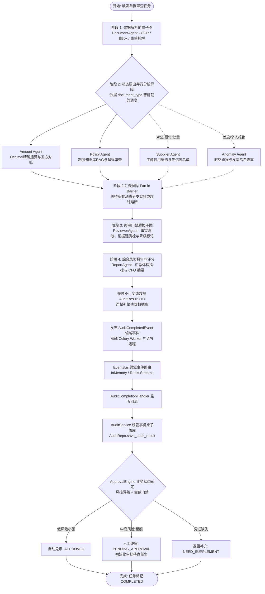
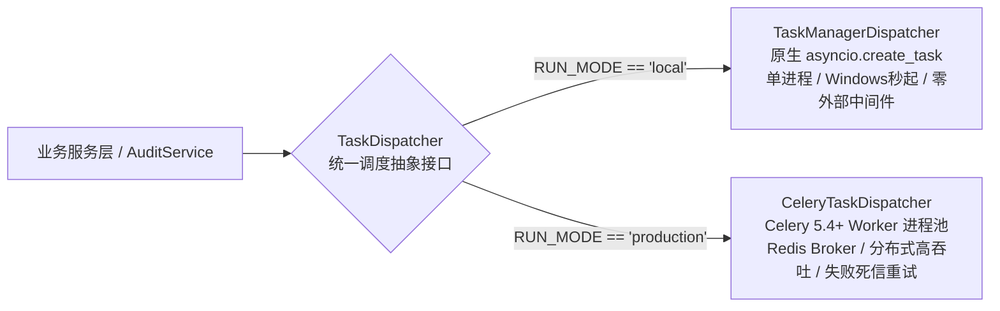

# 模块详细设计 Spec —— 07. engines/orchestrator 编排中枢与双模调度引擎

**文档版本：** V1.0  
**所属模块：** `backend/engines/orchestrator/`  
**依据文档：** 《PRD-v1.0.md》、《数据实体设计.md》、《概要设计.md》、`specs/01_engines_contract_spec.md`  
**设计目标：** 制定多 Agent 编排中枢（`MasterOrchestrator`）与双模任务调度器（`TaskDispatcher`）的技术实现规范。该引擎负责协调 7 大智能体按照分层子图（Hierarchical Subgraphs）的流水线拓扑高效协同，提供扇出并行执行屏障（Fan-out/Fan-in Barrier）、超时容错熔断降级、双模执行环境隔离（本地轻量 TaskManager 与生产集群 Celery 5.4+ 无缝切换），并通过 Redis Streams 输出实时可断点续传的 WebSocket 审计事件流。

---

## 1. 编排拓扑与双模调度架构

### 1.1 LangGraph 分层子图协同执行流

系统抛弃“单图大扁平 State”的反模式，采用**“主图轻量调度 + 子图私有封装 + 强类型契约汇聚”**的四阶段确定性流水线拓扑：



---

### 1.2 五大核心单据类型的 Agent 动态调度矩阵 (Dynamic Dispatch Matrix)

并非所有单据类型都需要无脑拉起全部 4 个 Agent。主控 Supervisor 在阶段 1 解析出 `document_type` 后，依据以下矩阵**动态裁剪生成执行 DAG**，避免算力浪费与不合理核验：

| 单据类型 (`document_type`) | Document (票据解析) | Amount (精算核对) | Policy (制度合规) | Supplier (工商风控) | Anomaly (反欺诈) | 调度考量与裁剪理由 |
|---|:---:|:---:|:---:|:---:|:---:|---|
| **对公付款单** | ✅ 必选 | ✅ 必选 (五方对账) | ✅ 必选 (采购合同条款) | ✅ **必选 (深度穿透)** | ✅ 必选 (发票查重/拆单) | 重点防范空壳供应商套现与超合同付款；**时空碰撞跳过**（无个人差旅轨迹）。 |
| **预付款单** | ✅ 必选 | ✅ 必选 (比例核算) | ✅ 必选 (首付上限规定) | ✅ **必选 (资信与诉讼)** | ✅ 必选 (发票查重) | 重点防范供应商暴雷跑路与超比例付款。 |
| **批量付款单** | ✅ 必选 | ✅ **必选 (多笔汇总)** | ⚠️ 可选 (轻量限额) | ✅ 必选 (批量账户核验) | ✅ 必选 (批内/跨单防重) | 重点核验上百条明细加和与收款方银行账号一致性。 |
| **费用报销单** | ✅ 必选 | ✅ 必选 (明细校验) | ✅ **必选 (日常标准)** | ❌ **跳过** (常规商户) | ✅ 必选 (发票查重/突变) | 员工日常餐饮办公消费，对滴滴/京东等正规平台无需做失信调查；重点防周末深夜异常突变。 |
| **差旅报销单** | ✅ 必选 | ✅ 必选 (差旅求和) | ✅ **必选 (城市/双门禁)** | ❌ **跳过** (交通住宿) | ✅ **必选 (时空碰撞/查重)** | 重点审查城市差旅标准与**异地时空物理超光速碰撞**（秒抓异地借票冲账）。 |

---

### 1.3 故障隔离、工具缺失与优雅降级屏障 (Graceful Degradation & Hierarchical Timeouts)

在真实工业环境中，外部微服务抖动、大模型网络超时、知识库未导入制度、缺少外部商用工商查询接口（如企查查/天眼查 API）是常态。系统彻底废除单一固定超时反模式，采用 **生产级 Agent Harness 八大管控底座与分级 Timeout / Deadline 体系**，贯彻 **金融级 Safe-Fail（安全降级）** 核心法则：

#### 分层超时与终极截止时间规约 (Hierarchical Timeouts & Deadline Matrix)

| 保护层级 | 超时阈值 | 对应常量 / 门禁 | 适用范围与熔断保护策略 |
|---|:---:|---|---|
| **确定性纯计算工具门禁** | **500 ms** | `DETERMINISTIC_TOOL_TIMEOUT` | `DecimalAmountCalculator` / `TaxpayerIdValidator` / `InvoiceFingerprintCalculator`。纯代码与算法，超时即视作死循环直接切断。 |
| **制度知识库 RAG 检索** | **3.0 s** | `RAG_RETRIEVAL_TIMEOUT` | Milvus / Qdrant 向量检索与混合重排。超时降级为本地轻量规则或触发 `R14_POLICY_NOT_FOUND`。 |
| **外部第三方企业征信 API** | **5.0 s** | `ENTERPRISE_API_TIMEOUT` | 工商穿透、失信被执行人查询。超时触发本地启发式校验与标黄降级。 |
| **LLM 单次推理生成** | **20.0 s** | `LLM_CALL_TIMEOUT` | 单次 `/v1/chat/completions` API 调用上限，防止推理连接悬挂。 |
| **单 Agent 复合认知执行限额** | **30.0 s** | `SINGLE_AGENT_TIMEOUT` | 单个专业智能体（包含工具调用与反思循环）的总生命周期上限，超时由 `_safe_run_agent` 拦截。 |
| **整单任务终极截止大限** | **120.0 s** | `TASK_OVERALL_DEADLINE` | 整个单据审核任务（涵盖全流水线与并行子图）的全局硬 Deadline，防止任何僵尸任务滞留后台。 |

```
                    ┌─────────────────────────────────────────────────────────┐
                    │               单 Agent 遭遇异常或工具/资料缺失           │
                    └───────────┬─────────────────────────┬───────────────────┘
                                │                         │
               [分支 1: 外部调用/Agent 超时熔断]   [分支 2: 制度缺失 / 无外部接口]
                                │                         │
                                ▼                         ▼
                      触发分层超时截断 (3s/5s/20s/30s)    触发 Soft Fallback 柔性降级
                      _safe_run_agent 拦截生成降级证据     生成 INFO 提示 (如 R14)
                                │                         │
                                └───────────┬─────────────┘
                                            ▼
                     ┌──────────────────────────────────────────────┐
                     │ 阶段 2 汇聚屏障 Fan-in Barrier 正常收拢      │
                     │ (不阻断全图，后续 Stage 3 / 4 / 5 顺畅执行)   │
                     └──────────────────────┬───────────────────────┘
                                            ▼
                     ┌──────────────────────────────────────────────┐
                     │ 阶段 3 & 4: Reviewer 与 Report 汇总标记      │
                     │ 报告顶端醒目标黄：“部分项目降级，请人工审验” │
                     └──────────────────────┬───────────────────────┘
                                            ▼
                     ┌──────────────────────────────────────────────┐
                     │ 阶段 5: ApprovalEngine 派发人工待办审批      │
                     │ (绝不静默放行，确保财务资金安全)             │
                     └──────────────────────────────────────────────┘
```

1. **后续阶段绝对继续执行**：
   - 扇出并行屏障（Fan-in Barrier）通过 `asyncio.gather` 封装了独立的异常捕获与分层超时截断（`_safe_run_agent`）。
   - 哪怕某个 Agent（如 SupplierAgent）因工商接口超时挂掉，**其余 3 个 Agent 产出的证据项依然会被完整收集，流程毫无阻碍地进入 Stage 3（Reviewer 质检）与 Stage 4（Report 报告生成）**！
2. **知识库缺乏资料（如无对应差旅制度）**：
   - 遵照 Spec 04 规划，PolicyAgent 不崩溃、不编造，输出 `R14_POLICY_NOT_FOUND`（INFO 级别温和提示：“系统知识库未收录当前城市最新标准，已标记为待财务人工裁定”）。
3. **缺乏外部商用接口（如未配置工商查询 API 密钥）**：
   - SupplierAgent 自动启动 **本地轻量级启发式校验**（仅比对 18 位统一社会信用代码校验位合规性、本地离线黑名单库）；
   - 在证据链中打上标记：`"mcp_tool_available": false`，生成提示：“外部实时工商接口未启用，已完成基础格式校验，建议审批人人工登录企信网抽检”。
4. **资金安全底线（Safe-Fail 原则）**：
   - 发生降级时，报告自动追加警告标识，审批流**严禁将包含降级项的单据判定为低危免审直通**，强制推进至人工审批链，交由财务人员肉眼把关，彻底杜绝“因系统故障导致违规款项被自动放行”。

---

### 1.4 双模任务调度器 (Dual-Mode Task Dispatcher)

针对日常本地 Windows 开发调试与生产高并发集群部署的异构环境，系统定义统一的 `TaskDispatcher` 抽象基类：



#### 调度器运行模式对比规约

| 特性维度 | 本地开发模式 (`local`) | 生产集群模式 (`production`) |
|---|---|---|
| **底层驱动** | Python 原生 `asyncio.create_task` + 内存任务字典 | `Celery 5.4+` + `Redis 7` 消息代理 |
| **外部依赖** | 零依赖（无需安装启动 Redis/RabbitMQ/Worker） | 依赖 Redis 服务与独立 Celery Worker 进程 |
| **操作系统兼容** | 完美兼容 Windows 10/11 与 macOS，无 fork 异常 | 生产推荐 Linux 容器化（Docker / K8s） |
| **OCR 进程隔离** | 线程池 `run_in_executor` 隔离 CPU 密集型任务 | Celery Prefork / Eventlet 独立子进程完全隔离 |
| **故障恢复机制** | 进程崩溃任务标记中断，重启自动补偿 | Celery Task ACK + 死信队列 + 自动重试 |

---

## 2. 状态模型与上下文生命周期

### 2.1 主图状态模型 (`MasterAuditState`)

主图只记录轻量级生命周期指针与证据引用集合，杜绝大图深拷贝导致内存膨胀：

```python
"""
backend/engines/orchestrator/state.py
LangGraph 主图状态模型
"""
from typing import List, Dict, Any, Optional, Annotated
from datetime import datetime
from pydantic import BaseModel, Field
import operator

from engines.contract.finding import RiskFindingContract
from engines.contract.evidence import EvidenceRecord
from engines.contract.agent_role import AgentRoleEnum

class MasterAuditState(BaseModel):
    """
    主图全局状态 (在各阶段节点间流转)
    采用 Annotated[List, operator.add] 声明并行收集字段
    """
    task_id: str = Field(..., description="审查任务唯一 UUID")
    document_id: int = Field(..., description="待审核单据 ID")
    document_type: str = Field(default="TRAVEL_REIMBURSEMENT", description="单据类型 (如 CORPORATE_PAYMENT, TRAVEL_REIMBURSEMENT)")
    tenant_id: int = Field(..., description="租户 ID")
    applicant_id: int = Field(..., description="申请人 ID")
    
    # 执行进度指针
    current_stage: str = Field(default="INIT", description="当前执行阶段")
    started_at: datetime = Field(default_factory=datetime.utcnow)
    completed_at: Optional[datetime] = Field(default=None)

    # 阶段 1: 票据解析产物
    document_facts: Dict[str, Any] = Field(default_factory=dict, description="结构化单据与发票事实")
    
    # 阶段 2: 并行收集的风险项与证据链 (并发累加)
    findings: Annotated[List[RiskFindingContract], operator.add] = Field(default_factory=list)
    evidence_pool: Annotated[List[EvidenceRecord], operator.add] = Field(default_factory=list)
    
    # 阶段 2: 各 Agent 状态健康快照 (用于超时熔断追踪)
    agent_execution_status: Dict[str, str] = Field(default_factory=dict)

    # 阶段 3 & 4: 质检与报告产物
    verified_findings: List[RiskFindingContract] = Field(default_factory=list)
    overall_risk_level: str = Field(default="low")
    final_score: int = Field(default=100)
    report_id: Optional[int] = Field(default=None)
    error_message: Optional[str] = Field(default=None)
```

### 2.2 任务上下文装配快照 (`AuditExecutionContext`)

为恪守“Agent 执行层 0 数据库直接读写”铁律，所有推理前置数据由应用服务层 `AuditContextBuilder` 统一在调度前从数据库中提取并装配为不可变上下文对象（兼容别名 `DocumentContext = AuditExecutionContext`）：

```python
"""
backend/engines/contract/context.py
"""
class AuditExecutionContext(BaseModel):
    """
    单据不可变执行快照 (冻结入参，0 ORM 实体，0 DB 会话)
    """
    model_config = ConfigDict(frozen=True)

    document_id: int
    tenant_id: int
    applicant_id: int
    document_type: str
    total_amount: Decimal
    currency: str = "CNY"
    department: str = ""
    description: str = ""
    created_at: Optional[datetime] = None

    # 明细与票据要素列表
    line_items: List[Dict[str, Any]] = Field(default_factory=list)
    invoices: List[Dict[str, Any]] = Field(default_factory=list)

    # 差旅/反欺诈时空轨迹数据
    spatio_points: List[Dict[str, Any]] = Field(default_factory=list)

    # 申请人信用画像 (预付、借款历史与违规记录)
    applicant_profile: Dict[str, Any] = Field(default_factory=dict)

    # 预加载的制度规则切片 (无需 Agent 运行时直连向量库)
    rules: List[Dict[str, Any]] = Field(default_factory=list)

    # 外部关联上下文 (关联合同、关联审批流等)
    approval_context: Dict[str, Any] = Field(default_factory=dict)
```

---

## 3. 模块文件规划

```
backend/engines/orchestrator/
├── __init__.py                # 模块导出定义
├── master_graph.py            # LangGraph StateGraph 主图构建器与四阶段流水线
├── dispatcher/                # 双模任务调度器实现
│   ├── __init__.py
│   ├── base.py                # TaskDispatcher 统一抽象基类
│   ├── local_dispatcher.py    # 基于原生 asyncio 的轻量 TaskManager 实现
│   └── celery_dispatcher.py   # 基于 Celery 5.4+ 的生产集群调度实现
├── stream_producer.py         # Redis Streams 审计事件推流与断点暂存服务
└── timeout_guard.py           # Agent 超时熔断保护器与降级安全兜底
```

---

## 4. 详细设计与核心代码实现规范

### 4.1 双模任务调度器基类与工厂：`dispatcher/`

```python
"""
backend/engines/orchestrator/dispatcher/base.py
统一任务调度器抽象基类
"""
from abc import ABC, abstractmethod
from typing import Dict, Any, Optional

class TaskDispatcher(ABC):
    @abstractmethod
    async def dispatch_audit_task(
        self,
        task_id: str,
        document_id: int,
        applicant_id: int,
        tenant_id: int
    ) -> bool:
        """异步派发单据智能风险审核任务"""
        pass

    @abstractmethod
    async def cancel_task(self, task_id: str) -> bool:
        """撤销正在执行的异步任务"""
        pass

    @abstractmethod
    async def get_task_status(self, task_id: str) -> Dict[str, Any]:
        """获取当前后台任务的执行生命周期状态"""
        pass
```

```python
"""
backend/engines/orchestrator/dispatcher/local_dispatcher.py
本地轻量开发模式：基于 asyncio.create_task 的 TaskManager
"""
import asyncio
import logging
from typing import Dict, Any, Optional
from datetime import datetime

from .base import TaskDispatcher

logger = logging.getLogger("orchestrator.local_dispatcher")

class LocalTaskInfo:
    def __init__(self, task_id: str, async_task: asyncio.Task):
        self.task_id = task_id
        self.async_task = async_task
        self.status = "RUNNING"
        self.start_time = datetime.utcnow()
        self.error: Optional[str] = None

class LocalTaskManagerDispatcher(TaskDispatcher):
    """
    针对 Windows 10/11 本地秒级冷启动设计的轻量任务调度器
    避免 Windows 环境下 Celery prefork 进程池的各种序列化与权限报错
    """
    _instance: Optional["LocalTaskManagerDispatcher"] = None
    _tasks: Dict[str, LocalTaskInfo] = {}

    def __new__(cls):
        if cls._instance is None:
            cls._instance = super().__new__(cls)
            cls._tasks = {}
        return cls._instance

    async def dispatch_audit_task(
        self,
        task_id: str,
        document_id: int,
        applicant_id: int,
        tenant_id: int
    ) -> bool:
        from engines.orchestrator.master_graph import MasterOrchestrator

        # 封装异步执行闭包
        async def _runner():
            task_info = self._tasks.get(task_id)
            try:
                logger.info(f"[LocalTaskManager] 任务[{task_id}] 启动异步审核 (单据ID: {document_id})...")
                await MasterOrchestrator.run(
                    task_id=task_id,
                    document_id=document_id,
                    applicant_id=applicant_id,
                    tenant_id=tenant_id
                )
                if task_info:
                    task_info.status = "COMPLETED"
                logger.info(f"[LocalTaskManager] 任务[{task_id}] 审核成功完毕！")
            except asyncio.CancelledError:
                if task_info:
                    task_info.status = "CANCELLED"
                logger.warning(f"[LocalTaskManager] 任务[{task_id}] 被主动撤销。")
            except Exception as e:
                if task_info:
                    task_info.status = "FAILED"
                    task_info.error = str(e)
                logger.exception(f"[LocalTaskManager] 任务[{task_id}] 异常崩溃: {e}")

        # 使用当前运行的 event loop 创建无阻塞后台任务
        loop = asyncio.get_running_loop()
        task = loop.create_task(_runner())
        self._tasks[task_id] = LocalTaskInfo(task_id, task)
        return True

    async def cancel_task(self, task_id: str) -> bool:
        task_info = self._tasks.get(task_id)
        if task_info and not task_info.async_task.done():
            task_info.async_task.cancel()
            task_info.status = "CANCELLED"
            return True
        return False

    async def get_task_status(self, task_id: str) -> Dict[str, Any]:
        task_info = self._tasks.get(task_id)
        if not task_info:
            return {"task_id": task_id, "status": "NOT_FOUND"}
        return {
            "task_id": task_id,
            "status": task_info.status,
            "start_time": task_info.start_time.isoformat(),
            "error": task_info.error
        }
```

---

### 4.2 Redis Streams 审计事件推流与断点续传：`stream_producer.py`

解决 WebSocket 瞬断丢失事件问题，严格实现 PRD 2.7.12 的实时流事件投递：

```python
"""
backend/engines/orchestrator/stream_producer.py
Redis Streams 实时事件分发器
"""
import json
import logging
from typing import Optional, Dict, Any
from datetime import datetime
import redis.asyncio as aioredis

from engines.contract.events import AuditEventMessage, EventTypeEnum
from engines.contract.settings import engine_settings

logger = logging.getLogger("orchestrator.stream")

class StreamProducer:
    _redis_pool: Optional[aioredis.Redis] = None

    @classmethod
    async def get_redis(cls) -> Optional[aioredis.Redis]:
        """获取 Redis 异步连接，若未配置或为本地单机模式则安全降级为 None"""
        if not engine_settings.REDIS_URL:
            return None
        if cls._redis_pool is None:
            cls._redis_pool = aioredis.from_url(
                engine_settings.REDIS_URL,
                decode_responses=True,
                max_connections=20
            )
        return cls._redis_pool

    @classmethod
    async def publish_event(
        cls,
        task_id: str,
        event_type: EventTypeEnum,
        agent_role: str,
        payload: Dict[str, Any],
        step_progress: int = 0
    ) -> str:
        """
        向 Redis Stream 发布标准化审计事件：
        Key: stream:task:{task_id} (自动设置 1 小时过期 TTL)
        """
        event = AuditEventMessage(
            task_id=task_id,
            event_type=event_type,
            agent_role=agent_role,
            payload=payload,
            step_progress=step_progress,
            timestamp=datetime.utcnow()
        )
        serialized_msg = {"data": event.model_dump_json()}

        redis = await cls.get_redis()
        stream_key = f"stream:task:{task_id}"

        if redis:
            try:
                # XADD 写入 Stream
                msg_id = await redis.xadd(stream_key, serialized_msg)
                # 首次写入时为 Stream 设定 1 小时 TTL，防止脏数据堆积
                await redis.expire(stream_key, 3600)
                return msg_id
            except Exception as e:
                logger.error(f"写入 Redis Stream 失败: {e}，转为内存日志流转")

        # 本地零 Redis 环境下仅作日志输出，不阻断执行
        logger.info(f"[STREAM LOCAL] {task_id} | {event_type.value} | {agent_role} | 进度:{step_progress}%")
        return f"local-{int(datetime.utcnow().timestamp() * 1000)}"
```

---

### 4.3 编排主控中枢与扇入扇出屏障：`master_graph.py`

```python
"""
backend/engines/orchestrator/master_graph.py
LangGraph 主图编排器
"""
import asyncio
import logging
from typing import Dict, Any, List
from datetime import datetime
from langgraph.graph import StateGraph, END

from engines.contract.events import EventTypeEnum
from engines.contract.agent_role import AgentRoleEnum
from engines.contract.finding import RiskFindingContract
from engines.contract.evidence import EvidenceRecord
from engines.orchestrator.state import MasterAuditState
from engines.orchestrator.stream_producer import StreamProducer

logger = logging.getLogger("orchestrator.master_graph")

class MasterOrchestrator:
    """
    主控编排中枢：驱动 4 阶段多 Agent 审查流水线
    """

    @staticmethod
    async def stage1_intake_and_parse(state: MasterAuditState) -> Dict[str, Any]:
        """阶段 1: 票据解析子图 (Document Agent)"""
        await StreamProducer.publish_event(
            task_id=state.task_id,
            event_type=EventTypeEnum.STAGE_STARTED,
            agent_role=AgentRoleEnum.DOCUMENT.value,
            payload={"stage": "STAGE_1_PARSING", "description": "启动票据多模态 OCR 与版面分析..."},
            step_progress=10
        )

        # 模拟调用 DocumentAgent 子图提取事实
        # 实际代码中调用: facts = await DocumentAgent.run(state.document_id)
        mock_facts = {
            "document_id": state.document_id,
            "total_claimed_amount": 1250.00,
            "invoices": [
                {"invoice_code": "011002300111", "invoice_number": "18293812", "amount": 1250.00}
            ]
        }

        await StreamProducer.publish_event(
            task_id=state.task_id,
            event_type=EventTypeEnum.DOCUMENT_PARSED,
            agent_role=AgentRoleEnum.DOCUMENT.value,
            payload={"invoices_count": len(mock_facts["invoices"]), "status": "SUCCESS"},
            step_progress=25
        )

        return {"document_facts": mock_facts, "current_stage": "STAGE_1_COMPLETED"}

    @staticmethod
    async def stage2_parallel_analysis(state: MasterAuditState) -> Dict[str, Any]:
        """
        阶段 2: 扇出并行分析屏障 (Fan-out / Fan-in Barrier)
        并发调度 Amount, Policy, Supplier, Anomaly 4 大 Agent
        采用 asyncio.gather 配合超时保护
        """
        await StreamProducer.publish_event(
            task_id=state.task_id,
            event_type=EventTypeEnum.STAGE_STARTED,
            agent_role=AgentRoleEnum.SUPERVISOR.value,
            payload={"stage": "STAGE_2_PARALLEL", "description": "并行启动精算、制度、工商、反欺诈4大智能体..."},
            step_progress=30
        )

        # 1. 模拟各 Agent 异步子图调用 (实际调用各 Agent.run())
        async def _call_amount():
            await asyncio.sleep(0.5) # 模拟计算耗时
            return [] # 假设算平

        async def _call_policy():
            await asyncio.sleep(0.8)
            return [] # 假设合规

        async def _call_supplier():
            await asyncio.sleep(0.6)
            return [] # 假设正常

        async def _call_anomaly():
            await asyncio.sleep(0.4)
            return [] # 假设无碰撞

        # 2. 动态 DAG 路由构建：依据 document_type 智能裁剪调度目标
        target_coros = [
            ("AmountAgent", _call_amount()), # 精算核验：全单据必选
            ("PolicyAgent", _call_policy()), # 制度合规：全单据必选
        ]

        # 工商风控：仅在对公付款、预付款、批量付款单据中拉起；员工差旅/日常报销跳过
        if state.document_type in ["CORPORATE_PAYMENT", "ADVANCE_PAYMENT", "BATCH_PAYMENT"]:
            target_coros.append(("SupplierAgent", _call_supplier()))

        # 反欺诈中枢：全单据必选 (发票查重全覆盖；时空碰撞仅差旅单执行)
        target_coros.append(("AnomalyAgent", _call_anomaly()))

        # 3. 定义安全执行与优雅降级包装器 (防单个 Agent 挂掉或工具缺失拖垮全图)
        async def _safe_run_agent(agent_name: str, coro):
            try:
                # 设定 20 秒单 Agent 硬超时保护
                return await asyncio.wait_for(coro, timeout=20.0)
            except asyncio.TimeoutError:
                logger.error(f"[Orchestrator] {agent_name} 执行超时，触发降级熔断！")
                # 生成柔性降级提示，绝不抛出异常中断全图
                return [
                    RiskFindingContract(
                        rule_code="R16_AGENT_DEGRADED",
                        rule_name="智能体执行降级提示",
                        risk_level=RiskLevelEnum.LOW,
                        agent_role=AgentRoleEnum.SUPERVISOR,
                        title=f"{agent_name} 响应超时，已启动安全降级",
                        description=f"子图 {agent_name} 外部接口响应超 20 秒阈值，系统已平稳熔断降级，转由后续人工终审复核。",
                        suggestion="请财务审批人在审批时重点肉眼核验该维度的事实。",
                        is_overridable=True
                    )
                ]
            except Exception as e:
                logger.exception(f"[Orchestrator] {agent_name} 执行异常: {e}")
                return []

        # 4. 并发执行动态扇出 (Fan-out)
        results = await asyncio.gather(*[_safe_run_agent(name, c) for name, c in target_coros])

        # 5. 汇聚屏障收拢所有风险项 (Fan-in Barrier)
        collected_findings: List[RiskFindingContract] = []
        for agent_res in results:
            if isinstance(agent_res, list):
                collected_findings.extend(agent_res)

        await StreamProducer.publish_event(
            task_id=state.task_id,
            event_type=EventTypeEnum.RISK_AGGREGATED,
            agent_role=AgentRoleEnum.SUPERVISOR.value,
            payload={"findings_count": len(collected_findings)},
            step_progress=70
        )

        return {"findings": collected_findings, "current_stage": "STAGE_2_COMPLETED"}

    @staticmethod
    async def stage3_reviewer_quality_gate(state: MasterAuditState) -> Dict[str, Any]:
        """阶段 3: 终审门禁与反思质检子图 (Reviewer Agent)"""
        await StreamProducer.publish_event(
            task_id=state.task_id,
            event_type=EventTypeEnum.STAGE_STARTED,
            agent_role=AgentRoleEnum.REVIEWER.value,
            payload={"stage": "STAGE_3_REVIEWER", "description": "执行风险项事实消歧与五维证据完整性门禁质检..."},
            step_progress=75
        )

        # 过滤未挂载有效事实依据的幻觉项 (按需装配证据链)
        verified: List[RiskFindingContract] = []
        for finding in state.findings:
            # 门禁法则：高危项必须包含确定性精算公式或客观原图 BBox
            if finding.risk_level.value == "high":
                if not finding.discrepancy_amount and not finding.primary_visual_anchor:
                    logger.warning(f"高危风险项[{finding.title}]缺少精算与视觉原图依据，门禁予以剔除！")
                    continue
            verified.append(finding)

        return {"verified_findings": verified, "current_stage": "STAGE_3_COMPLETED"}

    @staticmethod
    async def stage4_report_generation(state: MasterAuditState) -> AuditResultDTO:
        """阶段 4: 综合风险报告生成 (纯内存不可变 DTO 组装，严禁直接操作数据库)"""
        await StreamProducer.publish_event(
            task_id=state.task_id,
            event_type=EventTypeEnum.STAGE_STARTED,
            agent_role=AgentRoleEnum.REPORT.value,
            payload={"stage": "STAGE_4_REPORT", "description": "生成综合审计报告与加权风险评分..."},
            step_progress=90
        )

        # 计算加权分值与最高风险等级
        high_cnt = sum(1 for f in state.verified_findings if f.risk_level.value == "high")
        med_cnt = sum(1 for f in state.verified_findings if f.risk_level.value == "medium")
        low_cnt = sum(1 for f in state.verified_findings if f.risk_level.value == "low")

        overall_lvl = "high" if high_cnt > 0 else ("medium" if med_cnt > 0 else "low")
        score = max(0, 100 - (high_cnt * 25 + med_cnt * 10 + low_cnt * 3))

        state.overall_risk_level = overall_lvl
        state.final_score = score
        state.completed_at = datetime.utcnow()

        # 生成纯数据 AuditResultDTO (report_id 初始为 None，由 AuditService 事务落库后回填)
        result_dto = AuditResultDTO(
            task_id=state.task_id,
            document_id=state.document_id,
            overall_risk_level=overall_lvl,
            score=score,
            findings=state.verified_findings,
            summary=f"审查完毕: 高危 {high_cnt} 项, 中危 {med_cnt} 项, 低危 {low_cnt} 项, 综合评分 {score} 分。",
            completed_at=state.completed_at
        )

        await StreamProducer.publish_event(
            task_id=state.task_id,
            event_type=EventTypeEnum.REPORT_GENERATED,
            agent_role=AgentRoleEnum.REPORT.value,
            payload={
                "overall_risk_level": overall_lvl,
                "final_score": score,
                "findings_count": len(state.verified_findings)
            },
            step_progress=100
        )

        return result_dto

    @classmethod
    def build_graph(cls):
        """构建 LangGraph 状态图拓扑"""
        workflow = StateGraph(MasterAuditState)

        workflow.add_node("stage1_intake", cls.stage1_intake_and_parse)
        workflow.add_node("stage2_parallel", cls.stage2_parallel_analysis)
        workflow.add_node("stage3_reviewer", cls.stage3_reviewer_quality_gate)
        workflow.add_node("stage4_report", cls.stage4_report_generation)

        # 严格流水线拓扑
        workflow.set_entry_point("stage1_intake")
        workflow.add_edge("stage1_intake", "stage2_parallel")
        workflow.add_edge("stage2_parallel", "stage3_reviewer")
        workflow.add_edge("stage3_reviewer", "stage4_report")
        workflow.add_edge("stage4_report", END)

        return workflow.compile()

    @classmethod
    async def run(cls, task_id: str, document_id: int, applicant_id: int, tenant_id: int) -> AuditResultDTO:
        """
        执行端到端完整审核 (无副作用认知推理)
        执行完毕后通过 EventPublisher 发布 AuditCompletedEvent 领域事件
        """
        graph = cls.build_graph()
        init_state = MasterAuditState(
            task_id=task_id,
            document_id=document_id,
            applicant_id=applicant_id,
            tenant_id=tenant_id
        )
        final_state = await graph.ainvoke(init_state)
        result_dto = final_state.get("audit_result")

        # 发布领域事件回流至业务服务层 (解耦 Celery 分布式 Worker 进程)
        from engines.contract.events import AuditCompletedEvent
        from engines.contract.event_bus import event_bus
        await event_bus.publish_domain_event(
            AuditCompletedEvent(
                task_id=task_id,
                document_id=document_id,
                result=result_dto
            )
        )
        return result_dto
```

---

### 4.4 六边形架构事件总线与领域事件回流 (EventBus Port & Adapters)

为解决分布式环境下 Celery Worker 进程与 FastAPI 服务进程物理隔离、以及多环境（Windows 单机开发 vs 生产 Kubernetes 集群）兼容性问题，系统引入**六边形架构端口与适配器（Port & Adapters）**设计：

```mermaid
flowchart TD
    subgraph Core[核心推理引擎 / Celery Worker]
        Graph[LangGraph 编排引擎] -->|产出不可变| DTO[AuditResultDTO]
        DTO -->|封装领域事件| DomainEvent[AuditCompletedEvent<br/>event_id + audit_version]
        Graph -->|推流过程事件| ProgressEvent[TASK_PROGRESS / REVIEW_REFLECT]
    end

    subgraph Ports[应用契约端口层 Application Ports]
        DomainPort["DomainEventPublisher (Protocol)<br>• publish(event: DomainEvent)"]
        RealtimePort["RealtimeEventPublisher (Protocol)<br>• publish(event: BaseEventEnvelope)"]
    end

    subgraph Adapters[基础设施适配器层 Infrastructure Adapters]
        MemDomainBus[InMemoryDomainEventBus<br/>本地单机领域总线]
        RedisStreamsBus[RedisStreamsEventBus<br/>基于 Redis 7 Streams 可靠消息队列]
        MemRealtimeBus[InMemoryRealtimeEventBus<br/>本地单机推流总线]
        RedisPubSubBus[RedisPubSubEventBus<br/>基于 Redis Pub/Sub 广播推流]
        
        MemDomainBus -.->|implements| DomainPort
        RedisStreamsBus -.->|implements| DomainPort
        MemRealtimeBus -.->|implements| RealtimePort
        RedisPubSubBus -.->|implements| RealtimePort
    end

    subgraph Handlers[应用服务消费回流 (Unit of Work 事务边界)]
        AuditHandler[AuditCompletionHandler<br>Unit of Work 事务幂等防线]
        ProcessedTable[(processed_events<br>event_id UNIQUE)]
        AuditSvc[AuditService<br>原子持久化: AuditRepo.save_audit_result]
        ApprEngine[ApprovalEngine<br>evaluate_transition 业务后果裁定<br>AUTO_APPROVE / CREATE_TASKS / REQUEST_SUPPLEMENT]
    end

    DomainEvent --> DomainPort
    ProgressEvent --> RealtimePort
    DomainPort --> RedisStreamsBus
    DomainPort --> MemDomainBus
    RealtimePort --> RedisPubSubBus
    RealtimePort --> MemRealtimeBus

    RedisStreamsBus --> AuditHandler
    MemDomainBus --> AuditHandler
    AuditHandler --> ProcessedTable
    AuditHandler --> AuditSvc
    AuditSvc --> ApprEngine
```

#### 领域事件 (Redis Streams) vs 过程推流事件 (Redis Pub/Sub)
| 维度 | 领域事件 (Domain Events) | 过程事件 (Progress Events) |
|---|---|---|
| **代表事件** | `AuditCompletedEvent`, `ApprovalRequestedEvent` | `TASK_PROGRESS`, `REVIEW_REFLECT`, `TASK_COMPLETED` |
| **应用端口** | `DomainEventPublisher (Protocol)` | `RealtimeEventPublisher (Protocol)` |
| **底层通道** | **Redis 7 Streams** (带消费者组 Consumer Group) | **Redis Pub/Sub** (瞬态广播信道) |
| **业务语义** | 核心业务事实完成，触发数据库事务落库与状态机跃迁 | UI 实时展示进度条、步骤提示、高亮坐标定位 |
| **传输目标** | 后端应用服务监听器 (`AuditCompletionHandler`) | 前端浏览器客户端 (SSE / WebSocket 网关) |
| **可靠性要求** | **高可靠 (At-Least-Once + XACK)**，严禁丢失，驱动状态机闭环 | **瞬态流式**，无存储负担，断线丢弃或基于 Last-Event-ID 重放 |
| **幂等保障** | **数据库唯一键 (`processed_events.event_id`) + Unit of Work 事务** | 幂等不敏感（仅影响前端页面展示渲染） |
| **持久化影响** | 直接触发生命周期状态写入与审批任务初始化 | 不触发数据库物理写入 |

#### 确定性工具纯粹性规约 (Pure Tools vs Repositories)
1. **发票规范化唯一指纹计算器 `InvoiceFingerprintCalculator`**：
   - 依赖：纯 Python 原生 `hashlib.sha256`，0 网络调用，0 数据库依赖；
   - 职责：要素标准化与唯一哈希指纹计算 `compute_fingerprint`，排查当前单据批次内的多张发票冲突（一票多报）；绝非用来“防伪”证明真伪；
2. **仓储数据查询 `InvoiceRepository.exists_by_fingerprint`**：
   - 依赖：SQLAlchemy 2.0 异步会话与数据库唯一索引；
   - 职责：跨历史单据检索发票指纹是否存在，由应用层服务在注入上下文前调用，严格杜绝 Agent 内部执行 SQL。

---

## 5. 单元测试与编排流转验证 (Test Cases)

| 用例编号 | 场景描述 | 触发条件 / 操作输入 | 预期结果 |
|---|---|---|---|
| **`TC_ORCH_01`** | 四阶段正常端到端流水线 | 提交标准合规单据 | 顺序流经 Stage 1->2->3->4，最终评定为 `low`，评分 100 分，发布 5 组 WebSocket 事件 |
| **`TC_ORCH_02`** | 单 Agent 异常熔断与优雅降级 | 阶段 2 中 SupplierAgent 抛出网络超时 | `_safe_run_agent` 捕获超时熔断，不影响其余 3 个 Agent，整体流程顺利生成报告 |
| **`TC_ORCH_03`** | Reviewer 门禁过滤假阳性风险 | 上游 Agent 抛出缺少坐标的高危项 | 阶段 3 门禁质检自动识别并剔除无事实支撑的伪风险项 |
| **`TC_ORCH_04`** | 本地模式 TaskManager 零依赖 | 配置 `RUN_MODE=local` 启动 | 使用 `LocalTaskManagerDispatcher`，无需 Redis 正常完成异步任务 |
| **`TC_ORCH_05`** | Redis Streams 断点重连事件补发 | 前端中断 5 秒后携带 `last_event_id` 重连 | 服务端通过 `XREAD` 补发断线期间产生的所有进度与高亮事件 |
| **`TC_ORCH_06`** | 异步任务主动取消 | 在阶段 2 并行核算时调用 `cancel_task` | 任务被成功标记 `CANCELLED`，底层协程优雅终止并释放资源 |

---

## 6. 全系统 7 大核心设计 Spec 矩阵圆满封顶

至此，系统 7 大核心模块 Spec 全部设计就位，形成严丝合缝的技术设计闭环：

```
specs/
├── 01_engines_contract_spec.md       # 智能体强类型契约、五维证据与 WebSocket 实时流事件
├── 02_engines_amount_agent_spec.md   # 确定性金额核算、五方对账、动态公差与人机修正机制
├── 03_app_repositories_spec.md       # 泛型仓储 CRUD、JSONB 不可变快照与乐观锁 CAS
├── 04_engines_policy_agent_spec.md   # 制度知识库 RAG 检索、差旅标准审查与三层降级兜底
├── 05_app_approval_engine_spec.md    # 状态机双轨驱动、高危红线特批与审批工作流引擎
├── 06_engines_anomaly_agent_spec.md   # 异常行为与反欺诈：发票查重、时空碰撞与连号拆单
└── 07_engines_orchestrator_spec.md   # LangGraph 编排中枢、双模调度器与 Redis Streams 推流
```
