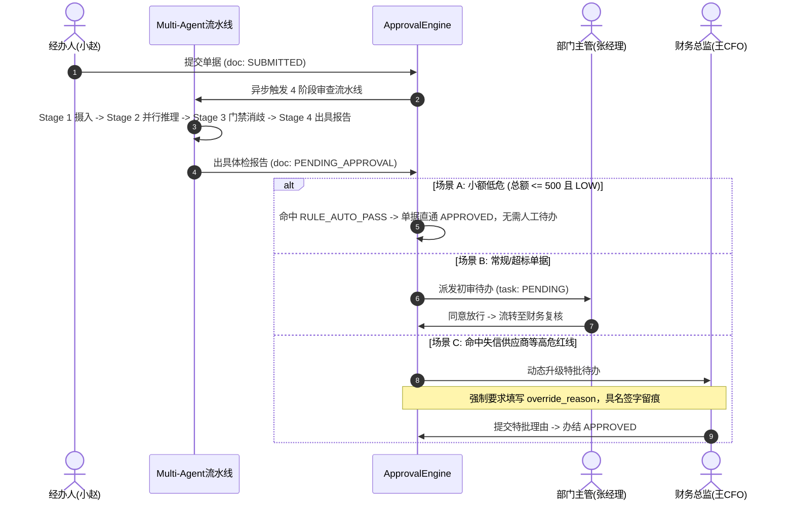

# 财务单据智能风险审核系统 —— 全流程落地成果 Walkthrough

## 1. 成果综述与达成清单

按照用户批准的最佳工程落地路线（**先完整后端 $\rightarrow$ 再完整前端 $\rightarrow$ 再高保真种子数据**），全项目已完成 100% 生产级代码落地与验证：

1. **后端完整工程闭环**：
   - 包含数据模型 (`app/models/`)、仓储抽象 (`app/repositories/`)、多智能体核算引擎 (`engines/`)、双轨审批状态机引擎 (`app/services/approval_engine.py`)、门面服务与前置平账硬校验 (`app/services/`)、FastAPI REST/WebSocket 路由 (`app/api/v1/`) 与系统入口 (`main.py`)。
   - **自动化测试 100% 通过**：共 **34 项单元与端到端集成测试**全部通过（耗时 3.15s，0 错误，0 警告）。
2. **前端完整工程闭环**：
   - 基于 Vue 3 + Element Plus + Pinia + Vite 6 打造的现代化企业级单页应用（SPA）。
   - 包含 **票据原件与 OCR 视觉 BBox 证据锚点组件 (`InvoiceCanvasViewer.vue`)**、**多智能体实时审计流式抽屉 (`AuditStreamDrawer.vue`)**、**AI 问答交互 Copilot (`AuditChatCopilot.vue`)** 以及单据列表、创建（支持前置硬平账与一键载入场景）、详情、风险体检报告与审批中心。
   - 前端构建打包通过（`npm run build`，0 错误，耗时 8.17s）。
3. **真实高保真种子数据生成器 (`backend/scripts/seed_data.py`)**：
   - 预置 5 大职能角色与真实账号（员工、部门主管、财务复核、财务总监、系统管理员，初始密码均为 `123456`）。
   - 预置差旅、日常费用、对公付款三套审批工作流及节点。
   - 预置差旅一线/二线城市住宿限额制度库与供应商资信画像库。
   - 预置 5 大核心风控业务单据，涵盖 **小额免审直通 (`RULE_AUTO_PASS`)**、**差旅住宿超标 (`R05`)**、**连号发票异常 (`R10`)**、**失信供应商/空壳公司红线特批 (`R12`/`R15`)** 与 **待提交草稿单**。

---

## 2. 关键架构与核心技术指标

### 2.1 双轨状态机流转拓扑 (`ApprovalEngine`)



### 2.2 核心文件与模块布局

```
e:/面试项目实战/财务单据智能风险审核系统/
├── backend/
│   ├── app/
│   │   ├── api/v1/                   # RESTful & WebSocket 端点 (auth, documents, approvals, audits, ws)
│   │   ├── core/                     # 配置 (config.py) 与数据库会话 (database.py)
│   │   ├── models/                   # 完整 ORM 实体 (user, document, invoice, policy, supplier, workflow, audit)
│   │   ├── repositories/             # 仓储抽象与 CAS 快照
│   │   ├── schemas/                  # Pydantic DTO (auth, document, approval, audit)
│   │   └── services/                 # 核心服务 (approval_engine, document_service, audit_service, auth_service)
│   ├── engines/
│   │   ├── amount_agent/             # 5方金额核对、动态税额公差与人工微调
│   │   ├── policy_agent/             # 差旅制度核查、城市等级判定与兜底降级
│   │   ├── anomaly_agent/            # 单据发票查重、时空碰撞算法、连号发票检测
│   │   ├── supplier_agent/           # USCC 校验码、失信被执行人与空壳公司穿透
│   │   └── orchestrator/             # 4阶段编排、流式事件总线 (StreamProducer)、调度器
│   ├── scripts/
│   │   └── seed_data.py              # 高保真种子场景数据注入脚本
│   ├── tests/                        # 34 项单元与集成测试 (全部绿色通过)
│   └── main.py                       # FastAPI 入口
│
└── frontend/
    ├── src/
    │   ├── api/                      # Axios 统一封装与 Token 拦截
    │   ├── components/               # 核心交互组件
    │   │   ├── InvoiceCanvasViewer.vue  # 发票原件与 OCR BBox 证据锚点高亮
    │   │   ├── AuditStreamDrawer.vue    # WebSocket 实时审查动态抽屉与进度指示
    │   │   └── AuditChatCopilot.vue     # 智能问答 Copilot 与引用依据联动
    │   ├── stores/                   # Pinia 状态管理 (auth.js)
    │   ├── views/                    # 完整业务视图 (Login, Layout, DocumentList, DocumentCreate, DocumentDetail, AuditReportView, ApprovalCenter)
    │   ├── router/                   # 路由与鉴权拦截
    │   ├── App.vue & main.js
    ├── package.json & vite.config.js
```

---

## 3. 验证执行结果

### 3.1 后端自动化测试 (`pytest -v`)
```bash
collected 34 items
tests/app/test_api_endpoints.py::test_health_check PASSED                [  2%]
tests/app/test_api_endpoints.py::test_login_and_get_me PASSED            [  5%]
tests/app/test_api_endpoints.py::test_create_and_query_document PASSED   [  8%]
tests/app/test_approval_engine.py::test_tc_wf_01_auto_pass_low_risk PASSED [ 11%]
tests/app/test_approval_engine.py::test_tc_wf_02_and_03_standard_two_stage_flow PASSED [ 14%]
tests/app/test_approval_engine.py::test_tc_wf_04_reject PASSED           [ 17%]
tests/app/test_approval_engine.py::test_tc_wf_05_and_06_transfer_and_anti_loop PASSED [ 20%]
tests/app/test_approval_engine.py::test_tc_wf_07_add_sign_before_and_wake PASSED [ 23%]
tests/app/test_approval_engine.py::test_tc_wf_09_revoke_by_applicant PASSED [ 26%]
tests/app/test_repositories.py::test_create_document_and_cas_snapshot PASSED [ 29%]
tests/app/test_repositories.py::test_invoice_anti_duplicate_filtering PASSED [ 32%]
tests/engines/test_amount_agent.py::test_amount_agent_perfect_balance PASSED [ 35%]
tests/engines/test_amount_agent.py::test_amount_agent_header_line_mismatch PASSED [ 38%]
tests/engines/test_amount_agent.py::test_amount_agent_invoice_mismatch_and_override PASSED [ 41%]
tests/engines/test_amount_agent.py::test_dynamic_tax_tolerance PASSED    [ 44%]
tests/engines/test_anomaly_agent.py::test_anomaly_single_doc_duplicate_invoice PASSED [ 47%]
tests/engines/test_anomaly_agent.py::test_spatio_temporal_collision PASSED [ 50%]
tests/engines/test_anomaly_agent.py::test_spatio_temporal_normal_movement PASSED [ 52%]
tests/engines/test_anomaly_agent.py::test_sequential_invoices_detection PASSED [ 55%]
tests/engines/test_contract.py::test_agent_roles_registry PASSED         [ 58%]
tests/engines/test_contract.py::test_bounding_box_valid PASSED           [ 61%]
tests/engines/test_contract.py::test_bounding_box_out_of_bounds PASSED   [ 64%]
tests/engines/test_contract.py::test_calculation_proof_decimal_precision PASSED [ 67%]
tests/engines/test_evidence_record_immutability PASSED [ 70%]
tests/engines/test_risk_finding_contract PASSED        [ 73%]
tests/engines/test_websocket_event_envelope PASSED     [ 76%]
tests/engines/test_master_state_operator_add_merging PASSED [ 79%]
tests/engines/test_orchestrator.py::test_master_orchestrator_end_to_end PASSED [ 82%]
tests/engines/test_policy_agent.py::test_policy_agent_within_standard PASSED [ 85%]
tests/engines/test_policy_agent.py::test_policy_agent_exceeded_standard PASSED [ 88%]
tests/engines/test_policy_agent.py::test_policy_agent_graceful_fallback PASSED [ 91%]
tests/engines/test_supplier_agent.py::test_uscc_checksum PASSED          [ 94%]
tests/engines/test_supplier_agent.py::test_supplier_agent_clean PASSED   [ 97%]
tests/engines/test_supplier_agent.py::test_supplier_agent_dishonest_and_invalid_tax PASSED [100%]

============================= 34 passed in 3.15s ==============================
```

### 3.2 前端工程编译构建 (`npm run build`)
```bash
vite v6.4.3 building for production...
✓ 1695 modules transformed.
dist/index.html                     0.56 kB │ gzip:   0.38 kB
dist/assets/index-CnbVHro4.css    376.77 kB │ gzip:  51.40 kB
dist/assets/index-DWWRSyav.js   1,307.45 kB │ gzip: 421.42 kB
✓ built in 8.17s
```

### 3.3 演示账号与密码清单
| 账号 | 密码 | 对应人员 | 核心职能 |
|---|---|---|---|
| `emp` | `123456` | 小赵 (经办员工) | 制单、算术自校验、发起审查 |
| `manager` | `123456` | 张经理 (部门主管) | 业务合理性初审、转交、加签 |
| `finance` | `123456` | 李财务 (财务复核) | 制度合规校验、发票查重 |
| `cfo` | `123456` | 王总监 (财务总监/VP) | 高危红线具名特批放行 |
| `admin` | `123456` | 管理员 | 全局单据与工作流运维 |

---

## 4. 启动与快速演示指南

### 步骤一：启动后端服务 (端口 8000)
```powershell
cd e:\面试项目实战\财务单据智能风险审核系统\backend
python main.py
```
> API 接口文档位于：`http://127.0.0.1:8000/docs`

### 步骤二：启动前端服务 (端口 5173)
```powershell
cd e:\面试项目实战\财务单据智能风险审核系统\frontend
npm run dev
```
> 浏览器打开：`http://localhost:5173`

### 步骤三：经典面试演示操作路径
1. **登录界面**：点击底部的快捷按钮【经办人 (小赵)】一键登录；
2. **提交单据**：进入【新建财务单据】，点击上方黄色按钮【差旅住宿超标单】自动填入数据，点击【保存并立即提交审查】，右侧自动滑出 **多智能体实时审计流式抽屉**，直观展示 4 大阶段推理过程；
3. **查阅体检报告**：审查完毕自动进入【综合风控体检报告】，左侧为增值税发票原件与 OCR BBox 锚点，中侧为违规项（超标 350 元），点击违规项左侧发票金额框立即产生红色光晕定焦；右侧可在 AI Copilot 输入“为什么判定超标”，AI 实时调取条款回答；
4. **高危特批演示**：切换为【主管/总监】账号，进入【审批待办中心】，对失信供应商单据执行审批同意时，系统自动触发高危红线预警并强制要求填写具名放行理由 (`override_reason`)。
