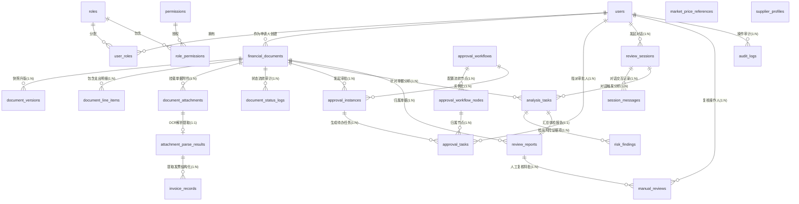

# 财务单据智能风险审核系统 —— 数据实体设计说明书

**文档版本：** V1.0  
**依据规范：** 《大模型项目实战.md》第 2.7.10 节规范与《PRD-v1.0.md》  
**适用数据库：** PostgreSQL 15+ / MySQL 8.0+（本规范以生产级 PostgreSQL 语法为基准）

---

## 1. 设计概述与全局设计原则

数据实体是业务系统的基石。根据项目实战要求，本系统需要支撑“五类单据全生命周期、多节点条件审批流、多轮人机对话交互、LangGraph 多 Agent 并行风控、五维证据链原图高亮以及不可变审计追溯”。

在数据建模中贯彻以下**六大核心设计原则**：

1. **金额零误差原则（Decimal 绝对精确）**：
   - 严禁在数据库中使用 `FLOAT`、`DOUBLE` 存储金额与税额。
   - 所有单据金额、明细金额、发票含税/不含税金额、市场参考价均采用 `NUMERIC(14, 2)`（最高支持千亿级金额，精确至分，四舍五入严格遵循国家财税标准）。
2. **时区一致性与不可变审计原则**：
   - 所有时间字段一律采用 `TIMESTAMPTZ`（带时区的时间戳），存储统一采用 UTC，展示时按用户客户端本地时区转换。
   - 业务流转中产生的快照（`document_versions`）、状态日志（`document_status_logs`）、多 Agent 识别结果（`risk_findings`）与操作记录（`audit_logs`）**采用单向追加写入（Append-only），严禁物理覆盖更新**。
3. **发票全局防重报唯一性约束**：
   - 在 `invoice_records` 表中建立 `UNIQUE (invoice_code, invoice_no)` 联合唯一索引。
   - 对数电发票（全电发票，无发票代码），约定 `invoice_code` 填入固定默认值（如 `0000000000` 或 `NONE`），确保全国 20 位数电发票号码在整个企业库中全局唯一，彻底从数据库底座拦截重复报销。
4. **证据链空间坐标（BBox）标准化**：
   - 附件中发票/合同字段在原图上的物理位置统一采用归一化千分比坐标：`[ymin, xmin, ymax, xmax]`，取值范围 `0 ~ 1000`。
   - 存储于 `JSONB` 格式的 `evidence_positions_json` 字段中，前端 PDF/图片阅览器无需重新换算 DPI 即可直接绘制高亮矩形框。
5. **制度知识库不可变版本引用**：
   - 风险项中引用的企业制度依据，严格记录 `policy_unit_id`、`unit_version`、`chunk_id` 和当次引用的文字快照，即便知识库制度后续调整，历史审核依据永不失效。
6. **主外键级联与软删除规范**：
   - 核心业务单据采用 `document_status = 'voided'` 逻辑作废，不物理删除单据主记录。
   - 草稿状态下的单据若主动删除明细（`document_line_items`）或附件（`document_attachments`），允许做物理级联清理。

---

## 2. 核心实体域关系全景图 (ER Diagram)

系统包含 **25 张核心数据表**，划分为 **六大业务实体域**：



---

## 3. 25 张实体数据表详细字段设计规范

### 域一：用户、角色与权限体系（5张表）

#### 3.1 `users` —— 系统用户表
| 字段名 | 数据类型 | 约束 | 默认值 | 描述说明 |
|---|---|---|---|---|
| `id` | `BIGSERIAL` | PRIMARY KEY | - | 用户主键 ID |
| `username` | `VARCHAR(64)` | NOT NULL, UNIQUE | - | 登录账号/工号 |
| `display_name` | `VARCHAR(64)` | NOT NULL | - | 用户真实姓名/展示名 |
| `password_hash` | `VARCHAR(255)` | NOT NULL | - | 加盐哈希密码（Argon2id/Bcrypt） |
| `department_name`| `VARCHAR(64)` | NOT NULL | - | 归属部门全称 |
| `job_title` | `VARCHAR(64)` | NULL | - | 职务头衔/职级代码（如 P3/M2，用于差旅匹配） |
| `email` | `VARCHAR(128)` | NULL | - | 电子邮箱 |
| `phone` | `VARCHAR(32)` | NULL | - | 联系手机号 |
| `status` | `VARCHAR(32)` | NOT NULL | `'active'` | 状态：`active`（正常）、`disabled`（禁用） |
| `created_at` | `TIMESTAMPTZ` | NOT NULL | `NOW()` | 账号创建时间 |
| `updated_at` | `TIMESTAMPTZ` | NOT NULL | `NOW()` | 账号修改时间 |

#### 3.2 `roles` —— 角色定义表
| 字段名 | 数据类型 | 约束 | 默认值 | 描述说明 |
|---|---|---|---|---|
| `id` | `BIGSERIAL` | PRIMARY KEY | - | 角色主键 ID |
| `role_code` | `VARCHAR(64)` | NOT NULL, UNIQUE | - | 角色唯一编码（`applicant`, `approver`, `finance_officer`, `system_admin`, `auditor`） |
| `role_name` | `VARCHAR(64)` | NOT NULL | - | 角色中文名称（如“单据申请人”、“风控财务专员”） |
| `description` | `VARCHAR(255)` | NULL | - | 角色职责与权限范围说明 |
| `status` | `VARCHAR(32)` | NOT NULL | `'active'` | 状态：`active`、`disabled` |
| `created_at` | `TIMESTAMPTZ` | NOT NULL | `NOW()` | 创建时间 |
| `updated_at` | `TIMESTAMPTZ` | NOT NULL | `NOW()` | 更新时间 |

#### 3.3 `permissions` —— 细粒度权限资源表
| 字段名 | 数据类型 | 约束 | 默认值 | 描述说明 |
|---|---|---|---|---|
| `id` | `BIGSERIAL` | PRIMARY KEY | - | 权限主键 ID |
| `permission_code`| `VARCHAR(64)` | NOT NULL, UNIQUE | - | 权限全局编码（如 `doc:create`, `doc:approve`, `rule:config`） |
| `permission_name`| `VARCHAR(64)` | NOT NULL | - | 权限中文说明 |
| `resource_type` | `VARCHAR(32)` | NOT NULL | - | 资源类型（`document`, `task`, `rule`, `user`, `report`） |
| `action_type` | `VARCHAR(32)` | NOT NULL | - | 操作动作（`read`, `write`, `approve`, `export`, `manage`） |

#### 3.4 `user_roles` —— 用户角色关联表
| 字段名 | 数据类型 | 约束 | 描述说明 |
|---|---|---|---|
| `id` | `BIGSERIAL` | PRIMARY KEY | 关联主键 ID |
| `user_id` | `BIGINT` | NOT NULL, FK(`users.id`) ON DELETE CASCADE | 关联用户主键 |
| `role_id` | `BIGINT` | NOT NULL, FK(`roles.id`) ON DELETE CASCADE | 关联角色主键 |
| *约束* | - | `UNIQUE(user_id, role_id)` | 防止单个用户重复赋予同一角色 |

#### 3.5 `role_permissions` —— 角色权限关联表
| 字段名 | 数据类型 | 约束 | 描述说明 |
|---|---|---|---|
| `id` | `BIGSERIAL` | PRIMARY KEY | 关联主键 ID |
| `role_id` | `BIGINT` | NOT NULL, FK(`roles.id`) ON DELETE CASCADE | 关联角色主键 |
| `permission_id` | `BIGINT` | NOT NULL, FK(`permissions.id`) ON DELETE CASCADE | 关联权限主键 |
| *约束* | - | `UNIQUE(role_id, permission_id)` | 防止同一角色重复配置同一权限项 |

---

### 域二：财务单据、明细、附件与发票事实域（6张表）

#### 3.6 `financial_documents` —— 财务单据主表
| 字段名 | 数据类型 | 约束 | 默认值 | 描述说明 |
|---|---|---|---|---|
| `id` | `BIGSERIAL` | PRIMARY KEY | - | 单据主键 ID |
| `document_type` | `VARCHAR(32)` | NOT NULL | - | 单据类型：`CORP_PAYMENT`（对公付款）、`PREPAYMENT`（预付款）、`BATCH_PAYMENT`（批量付款）、`EXPENSE_REIMBURSE`（费用报销）、`TRAVEL_REIMBURSE`（差旅报销） |
| `document_no` | `VARCHAR(64)` | NOT NULL, UNIQUE | - | 业务唯一单号（如 `EXP-20260901-001`） |
| `applicant_id` | `BIGINT` | NOT NULL, FK(`users.id`) | - | 申请人用户 ID |
| `applicant_department`| `VARCHAR(64)` | NOT NULL | - | 申请人所属行政部门 |
| `budget_department` | `VARCHAR(64)` | NOT NULL | - | 费用承担/出资预算部门 |
| `payee_name` | `VARCHAR(128)` | NOT NULL | - | 收款方全称（个人姓名或企业供应商名称） |
| `payee_account` | `VARCHAR(64)` | NOT NULL | - | 收款银行账号/支付宝账号 |
| `payee_bank_name`| `VARCHAR(128)` | NULL | - | 收款人开户行名称（支行） |
| `expense_category`| `VARCHAR(64)` | NOT NULL | - | 费用科目类别（如“差旅交通费”、“IT设备采购”、“市场营销服务”） |
| `total_amount` | `NUMERIC(14, 2)`| NOT NULL | `0.00` | 单据填报总金额 |
| `currency` | `VARCHAR(8)` | NOT NULL | `'CNY'` | 币种（`CNY`, `USD`, `EUR`, `HKD`） |
| `apply_date` | `DATE` | NOT NULL | - | 业务申报日期 |
| `reason_text` | `TEXT` | NOT NULL | - | 申请事由及业务背景详细陈述 |
| `document_status`| `VARCHAR(32)` | NOT NULL | `'draft'` | 单据状态：`draft`、`pending_review`、`reviewing`、`returned`、`approved`、`rejected`、`withdrawn`、`voided` |
| `current_version`| `INTEGER` | NOT NULL | `1` | 当前生效的单据版本号（每退回重提递增） |
| `contract_no` | `VARCHAR(64)` | NULL | - | 关联关联合同编号（对公/预付款专属） |
| `supplier_code` | `VARCHAR(64)` | NULL | - | 供应商主数据编码（对公/预付款专属） |
| `payment_terms` | `VARCHAR(255)` | NULL | - | 付款条件说明（如“到货验收后付50%”） |
| `planned_payment_date`| `DATE` | NULL | - | 计划付款日期 |
| `travel_start_date`| `DATE` | NULL | - | 出差开始日期（差旅报销专属） |
| `travel_end_date`| `DATE` | NULL | - | 出差结束日期（差旅报销专属） |
| `travel_departure`| `VARCHAR(64)` | NULL | - | 出发地城市（差旅报销专属） |
| `travel_destination`| `VARCHAR(64)`| NULL | - | 目的地城市（差旅报销专属） |
| `batch_total_count`| `INTEGER` | NULL | - | 批量付款总笔数（批量付款专属） |
| `created_at` | `TIMESTAMPTZ` | NOT NULL | `NOW()` | 创建时间 |
| `updated_at` | `TIMESTAMPTZ` | NOT NULL | `NOW()` | 最近更新时间 |

#### 3.7 `document_versions` —— 单据历史快照版本表
| 字段名 | 数据类型 | 约束 | 默认值 | 描述说明 |
|---|---|---|---|---|
| `id` | `BIGSERIAL` | PRIMARY KEY | - | 快照主键 ID |
| `document_id` | `BIGINT` | NOT NULL, FK(`financial_documents.id`) ON DELETE CASCADE | - | 归属单据 ID |
| `version_no` | `INTEGER` | NOT NULL | - | 版本序号（1, 2, 3...） |
| `document_snapshot_json`| `JSONB` | NOT NULL | - | 当次提交冻结的单据全量快照（含主表信息、明细清单、附件列表完整镜像） |
| `created_by` | `BIGINT` | NOT NULL, FK(`users.id`) | - | 快照生成人（提交人） |
| `created_at` | `TIMESTAMPTZ` | NOT NULL | `NOW()` | 快照创建时间 |
| *约束* | - | `UNIQUE(document_id, version_no)` | 同一单据内部版本序号唯一递增 |

#### 3.8 `document_line_items` —— 单据支出/付款明细项表
| 字段名 | 数据类型 | 约束 | 默认值 | 描述说明 |
|---|---|---|---|---|
| `id` | `BIGSERIAL` | PRIMARY KEY | - | 明细主键 ID |
| `document_id` | `BIGINT` | NOT NULL, FK(`financial_documents.id`) ON DELETE CASCADE | - | 关联单据主键 ID |
| `item_type` | `VARCHAR(32)` | NOT NULL | - | 明细分类：`HOTEL`（住宿）、`TRAFFIC`（大交通）、`MEAL`（餐饮/补贴）、`PURCHASE`（采购物资）、`PAY_TRANSFER`（批量付款子笔） |
| `item_name` | `VARCHAR(128)` | NOT NULL | - | 明细项目名称（如“广州富力丽思卡尔顿大床房1晚”） |
| `expense_date` | `DATE` | NOT NULL | - | 消费发生日期/单笔付款日期 |
| `expense_location`| `VARCHAR(64)` | NULL | - | 消费发生地点（省市区城市） |
| `quantity` | `NUMERIC(10, 2)`| NOT NULL | `1.00` | 数量（如天数、件数、人次） |
| `unit_price` | `NUMERIC(14, 2)`| NOT NULL | `0.00` | 单价 |
| `amount` | `NUMERIC(14, 2)`| NOT NULL | `0.00` | 行总金额（`quantity * unit_price`） |
| `payee_sub_account`| `VARCHAR(64)`| NULL | - | 子收款人账号（批量付款明细专属） |
| `payee_sub_name`| `VARCHAR(128)` | NULL | - | 子收款人姓名（批量付款明细专属） |
| `remark` | `VARCHAR(255)` | NULL | - | 行备注说明 |

#### 3.9 `document_attachments` —— 单据上传附件表
| 字段名 | 数据类型 | 约束 | 默认值 | 描述说明 |
|---|---|---|---|---|
| `id` | `BIGSERIAL` | PRIMARY KEY | - | 附件主键 ID |
| `document_id` | `BIGINT` | NOT NULL, FK(`financial_documents.id`) ON DELETE CASCADE | - | 关联单据主键 ID |
| `document_version`| `INTEGER` | NOT NULL | `1` | 关联上传时的单据版本号 |
| `file_name` | `VARCHAR(255)` | NOT NULL | - | 原始文件名（如 `上海全季酒店发票.pdf`） |
| `file_type` | `VARCHAR(16)` | NOT NULL | - | 文件类型：`PDF`, `PNG`, `JPG`, `JPEG` |
| `file_size` | `BIGINT` | NOT NULL | - | 文件大小（字节 Byte） |
| `file_path` | `VARCHAR(512)` | NOT NULL | - | 对象存储/本地存储相对路径 |
| `file_hash` | `VARCHAR(64)` | NOT NULL | - | 文件 SHA-256 哈希值（用于秒传与完整性校验） |
| `storage_status` | `VARCHAR(32)` | NOT NULL | `'stored'` | 存储状态：`uploading`、`stored`、`failed` |
| `parse_status` | `VARCHAR(32)` | NOT NULL | `'pending'` | OCR解析状态：`pending`、`parsing`、`succeeded`、`failed`、`manual_review` |
| `created_at` | `TIMESTAMPTZ` | NOT NULL | `NOW()` | 上传时间 |

#### 3.10 `attachment_parse_results` —— 附件版面与 OCR 提取结果表
| 字段名 | 数据类型 | 约束 | 默认值 | 描述说明 |
|---|---|---|---|---|
| `id` | `BIGSERIAL` | PRIMARY KEY | - | 解析结果主键 ID |
| `attachment_id` | `BIGINT` | NOT NULL, UNIQUE, FK(`document_attachments.id`) ON DELETE CASCADE | - | 对应附件主键（1:1 关系） |
| `document_category`| `VARCHAR(32)`| NOT NULL | `'INVOICE'`| 文档识别分类：`INVOICE`（发票）、`CONTRACT`（合同）、`ITINERARY`（行程单/机票水单）、`RECEIPT`（收据/送货单） |
| `full_text` | `TEXT` | NOT NULL | - | OCR 抽取的全文字符流文本 |
| `fields_json` | `JSONB` | NOT NULL | `'{}'` | 结构化关键字段键值对集合（发票代码、税额、开票日期、购买方税号等） |
| `evidence_positions_json`| `JSONB` | NOT NULL | `'[]'` | 视觉定位坐标列表：含页码、字段名、文字摘录及归一化 BBox 坐标 |
| `confidence` | `NUMERIC(4, 3)`| NOT NULL | `0.000` | 综合识别置信度分数（0.000 ~ 1.000） |
| `created_at` | `TIMESTAMPTZ` | NOT NULL | `NOW()` | 解析完成时间 |

#### 3.11 `invoice_records` —— 发票业务明细与全局查重底账表
| 字段名 | 数据类型 | 约束 | 默认值 | 描述说明 |
|---|---|---|---|---|
| `id` | `BIGSERIAL` | PRIMARY KEY | - | 发票记录主键 ID |
| `attachment_id` | `BIGINT` | NOT NULL, FK(`document_attachments.id`) ON DELETE CASCADE | - | 来源附件 ID |
| `invoice_code` | `VARCHAR(32)` | NOT NULL | `'NONE'` | 发票代码（普通/专票为10-12位；数电票填 `'NONE'`） |
| `invoice_no` | `VARCHAR(32)` | NOT NULL | - | 发票号码（普通发票8位；数电发票20位） |
| `seller_name` | `VARCHAR(128)` | NOT NULL | - | 销售方/开票商户企业全称 |
| `seller_tax_id` | `VARCHAR(32)` | NULL | - | 销售方统一社会信用代码/纳税人识别号 |
| `buyer_name` | `VARCHAR(128)` | NOT NULL | - | 购买方全称（必须与本公司主体一致） |
| `buyer_tax_id` | `VARCHAR(32)` | NULL | - | 购买方纳税人识别号 |
| `invoice_date` | `DATE` | NOT NULL | - | 开票日期 |
| `amount_excluding_tax`| `NUMERIC(14, 2)`| NOT NULL | `0.00` | 不含税金额（净价） |
| `tax_amount` | `NUMERIC(14, 2)`| NOT NULL | `0.00` | 税额合计 |
| `amount_including_tax`| `NUMERIC(14, 2)`| NOT NULL | `0.00` | 价税合计（实际报销有效金额） |
| `currency` | `VARCHAR(8)` | NOT NULL | `'CNY'` | 发票币种 |
| `check_status` | `VARCHAR(32)` | NOT NULL | `'unverified'`| 税局查验真伪状态：`verified`（验真有效）、`cancelled`（作废）、`red_冲`（红冲）、`unverified`（离线未验） |
| *核心防重约束* | - | `UNIQUE(invoice_code, invoice_no)` | **企业级发票全局查重唯一索引，直接物理阻断二次报销** |

---

### 域三：多节点审批工作流引擎域（5张表）

#### 3.12 `approval_workflows` —— 审批流程定义表
| 字段名 | 数据类型 | 约束 | 默认值 | 描述说明 |
|---|---|---|---|---|
| `id` | `BIGSERIAL` | PRIMARY KEY | - | 流程定义主键 ID |
| `workflow_name` | `VARCHAR(64)` | NOT NULL | - | 流程名称（如“大额对公付款审批流程”、“差旅常规审批流”） |
| `document_type` | `VARCHAR(32)` | NOT NULL | - | 适用的单据类型 |
| `match_conditions_json`| `JSONB`| NOT NULL | `'{}'` | 适用规则表达式（如 `{"amount_min": 100000, "dept": "研发部"}`） |
| `status` | `VARCHAR(32)` | NOT NULL | `'active'` | 状态：`active`、`disabled` |
| `created_at` | `TIMESTAMPTZ` | NOT NULL | `NOW()` | 创建时间 |
| `updated_at` | `TIMESTAMPTZ` | NOT NULL | `NOW()` | 更新时间 |

#### 3.13 `approval_workflow_nodes` —— 审批流程节点定义表
| 字段名 | 数据类型 | 约束 | 默认值 | 描述说明 |
|---|---|---|---|---|
| `id` | `BIGSERIAL` | PRIMARY KEY | - | 节点定义主键 ID |
| `workflow_id` | `BIGINT` | NOT NULL, FK(`approval_workflows.id`) ON DELETE CASCADE | - | 所属流程主键 ID |
| `node_name` | `VARCHAR(64)` | NOT NULL | - | 节点名称（如“直属部门经理审”、“财务主管初审”、“副总裁终审”） |
| `node_order` | `INTEGER` | NOT NULL | - | 节点执行次序（从 1 开始递增） |
| `approver_role` | `VARCHAR(64)` | NOT NULL | - | 审批人员角色代码（关联 `roles.role_code`） |
| `approval_mode` | `VARCHAR(16)` | NOT NULL | `'OR'` | 多人审批模式：`OR`（或签，一人通过即推进）、`AND`（会签，全员通过方推进） |
| `created_at` | `TIMESTAMPTZ` | NOT NULL | `NOW()` | 创建时间 |
| *约束* | - | `UNIQUE(workflow_id, node_order)` | 同一流程内节点序号唯一 |

#### 3.14 `approval_instances` —— 单据审批运行实例表
| 字段名 | 数据类型 | 约束 | 默认值 | 描述说明 |
|---|---|---|---|---|
| `id` | `BIGSERIAL` | PRIMARY KEY | - | 审批实例主键 ID |
| `workflow_id` | `BIGINT` | NOT NULL, FK(`approval_workflows.id`) | - | 绑定的流程定义主键 |
| `document_id` | `BIGINT` | NOT NULL, FK(`financial_documents.id`) ON DELETE CASCADE | - | 关联的单据 ID |
| `document_version`| `INTEGER` | NOT NULL | `1` | 对应的单据版本快照号 |
| `instance_status`| `VARCHAR(32)` | NOT NULL | `'pending'` | 实例运行状态：`pending`、`running`、`approved`、`returned`、`rejected`、`cancelled` |
| `current_node_id`| `BIGINT` | NULL, FK(`approval_workflow_nodes.id`) | - | 当前正在执行的流程节点 ID |
| `started_at` | `TIMESTAMPTZ` | NOT NULL | `NOW()` | 审批流启动时间 |
| `finished_at` | `TIMESTAMPTZ` | NULL | - | 流程终结时间（通过/驳回） |

#### 3.15 `approval_tasks` —— 具名审批人待办任务表
| 字段名 | 数据类型 | 约束 | 默认值 | 描述说明 |
|---|---|---|---|---|
| `id` | `BIGSERIAL` | PRIMARY KEY | - | 审批任务主键 ID |
| `instance_id` | `BIGINT` | NOT NULL, FK(`approval_instances.id`) ON DELETE CASCADE | - | 归属审批实例主键 |
| `node_id` | `BIGINT` | NOT NULL, FK(`approval_workflow_nodes.id`) | - | 对应的节点主键 |
| `approver_id` | `BIGINT` | NOT NULL, FK(`users.id`) | - | 被指派的具名审批人用户 ID |
| `task_status` | `VARCHAR(32)` | NOT NULL | `'pending'` | 任务状态：`pending`（待办）、`approved`（同意）、`returned`（退回修改）、`rejected`（驳回终止）、`cancelled`（作废） |
| `review_comment`| `TEXT` | NULL | - | 审批人录入的处理意见或特批理由 |
| `created_at` | `TIMESTAMPTZ` | NOT NULL | `NOW()` | 任务到达派发时间 |
| `processed_at` | `TIMESTAMPTZ` | NULL | - | 审批人实际点击处理时间 |

#### 3.16 `document_status_logs` —— 单据生命周期流转轨迹日志表
| 字段名 | 数据类型 | 约束 | 默认值 | 描述说明 |
|---|---|---|---|---|
| `id` | `BIGSERIAL` | PRIMARY KEY | - | 日志主键 ID |
| `document_id` | `BIGINT` | NOT NULL, FK(`financial_documents.id`) ON DELETE CASCADE | - | 关联单据 ID |
| `from_status` | `VARCHAR(32)` | NOT NULL | - | 变更前状态 |
| `to_status` | `VARCHAR(32)` | NOT NULL | - | 变更后状态 |
| `operator_id` | `BIGINT` | NOT NULL, FK(`users.id`) | - | 执行操作人 ID |
| `remark` | `VARCHAR(255)` | NULL | - | 动作说明（如“申请人提交”、“审批人退回修改”） |
| `created_at` | `TIMESTAMPTZ` | NOT NULL | `NOW()` | 状态变更发生时间 |

---

### 域四：智能审核多轮对话与交互会话域（2张表）

#### 3.17 `review_sessions` —— 智能审核对话会话表
| 字段名 | 数据类型 | 约束 | 默认值 | 描述说明 |
|---|---|---|---|---|
| `id` | `BIGSERIAL` | PRIMARY KEY | - | 会话主键 ID |
| `user_id` | `BIGINT` | NOT NULL, FK(`users.id`) | - | 发起会话的用户 ID |
| `document_type` | `VARCHAR(32)` | NULL | - | 当前会话锁定的单据类型槽位（若尚未明确则为 NULL） |
| `document_no` | `VARCHAR(64)` | NULL | - | 当前会话锁定的单据编号槽位（若尚未明确则为 NULL） |
| `session_status` | `VARCHAR(32)` | NOT NULL | `'active'` | 会话状态：`active`（交互中）、`analyzing`（分析中）、`completed`（已完成）、`closed`（已关闭） |
| `created_at` | `TIMESTAMPTZ` | NOT NULL | `NOW()` | 会话开启时间 |
| `updated_at` | `TIMESTAMPTZ` | NOT NULL | `NOW()` | 会话最近活跃时间 |

#### 3.18 `session_messages` —— 对话会话历史消息表
| 字段名 | 数据类型 | 约束 | 默认值 | 描述说明 |
|---|---|---|---|---|
| `id` | `BIGSERIAL` | PRIMARY KEY | - | 消息主键 ID |
| `session_id` | `BIGINT` | NOT NULL, FK(`review_sessions.id`) ON DELETE CASCADE | - | 归属审核会话 ID |
| `role` | `VARCHAR(16)` | NOT NULL | - | 发言角色：`user`（人类用户）、`assistant`（AI审查助手）、`system`（系统通知） |
| `content` | `TEXT` | NOT NULL | - | 消息正文（自然语言问答文本或 Markdown 卡片） |
| `message_type` | `VARCHAR(32)` | NOT NULL | `'text'` | 消息类型：`text`（普通文本）、`slot_req`（槽位追问）、`candidate_select`（候选确认）、`task_card`（分析任务进度卡片） |
| `created_at` | `TIMESTAMPTZ` | NOT NULL | `NOW()` | 消息发送时间 |

---

### 域五：多 Agent 异步风控、证据链与体检报告域（4张表）

#### 3.19 `analysis_tasks` —— 多 Agent 风险分析任务表
| 字段名 | 数据类型 | 约束 | 默认值 | 描述说明 |
|---|---|---|---|---|
| `id` | `BIGSERIAL` | PRIMARY KEY | - | 分析任务主键 ID |
| `session_id` | `BIGINT` | NULL, FK(`review_sessions.id`) | - | 关联对话会话（由对话发起时记录，单据直接提交时可为空） |
| `document_id` | `BIGINT` | NOT NULL, FK(`financial_documents.id`) ON DELETE CASCADE | - | 目标分析单据 ID |
| `task_status` | `VARCHAR(32)` | NOT NULL | `'queued'` | 任务调度状态：`queued`、`querying_document`、`loading_attachments`、`parsing_attachments`、`analyzing`、`succeeded`、`failed`、`cancelled` |
| `current_step` | `VARCHAR(64)` | NULL | - | 当前子 Agent 步骤名称（如 `AmountAgent:calculating`） |
| `started_at` | `TIMESTAMPTZ` | NULL | - | 任务实际开始执行时间 |
| `finished_at` | `TIMESTAMPTZ` | NULL | - | 任务结束时间 |
| `error_message` | `TEXT` | NULL | - | 若失败，记录异常报错堆栈信息 |

#### 3.20 `risk_findings` —— 识别出的风险项与五维证据链表
| 字段名 | 数据类型 | 约束 | 默认值 | 描述说明 |
|---|---|---|---|---|
| `id` | `BIGSERIAL` | PRIMARY KEY | - | 风险项主键 ID |
| `task_id` | `BIGINT` | NOT NULL, FK(`analysis_tasks.id`) ON DELETE CASCADE | - | 归属分析任务主键 |
| `risk_type` | `VARCHAR(32)` | NOT NULL | - | 风险类型编码（如 `R01_AMOUNT_MISMATCH`, `R05_POLICY_EXCEEDED`, `R07_TIME_CONFLICT`, `R10_DUPLICATE_INVOICE`） |
| `risk_level` | `VARCHAR(16)` | NOT NULL | - | 严重等级：`high`（红线阻断）、`medium`（人工复核）、`low`（合规提示） |
| `risk_title` | `VARCHAR(128)` | NOT NULL | - | 风险项简短标题（如“广州住宿发票超出 P2 级限额标准”） |
| `description` | `TEXT` | NOT NULL | - | 风险违规事实详细陈述（包含时间、人员、背景） |
| `actual_value_json`| `JSONB` | NOT NULL | `'{}'` | 申报实际发生值（如 `{"amount": 700.00, "city": "广州"}`） |
| `reference_value_json`| `JSONB` | NOT NULL | `'{}'` | 制度/基准参考值（如 `{"limit": 400.00, "source": "差旅制度v2"}`） |
| `threshold_json`| `JSONB` | NOT NULL | `'{}'` | 触发规则判定的阈值（如 `{"max_tolerance": 0.00, "excess": 300.00}`） |
| `evidence_json` | `JSONB` | NOT NULL | `'[]'` | **核心五维证据链**：关联附件 ID、页码、图片 BBox 坐标、制度切片 Chunk ID、确定性计算公式 |
| `suggestion_text`| `TEXT` | NOT NULL | - | AI 提供的合规处理建议（如“建议扣减超标的300元后予以报销”） |
| `review_status` | `VARCHAR(32)` | NOT NULL | `'pending'` | 风险项人工处理状态：`pending`（待复核）、`confirmed`（采纳该风险）、`dismissed`（审批人忽略该项） |
| `created_at` | `TIMESTAMPTZ` | NOT NULL | `NOW()` | 检出时间 |

#### 3.21 `review_reports` —— 综合风险体检报告表
| 字段名 | 数据类型 | 约束 | 默认值 | 描述说明 |
|---|---|---|---|---|
| `id` | `BIGSERIAL` | PRIMARY KEY | - | 报告主键 ID |
| `task_id` | `BIGINT` | NOT NULL, UNIQUE, FK(`analysis_tasks.id`) ON DELETE CASCADE | - | 关联分析任务（1:1 关系） |
| `document_id` | `BIGINT` | NOT NULL, FK(`financial_documents.id`) ON DELETE CASCADE | - | 关联单据 ID |
| `overall_risk_level`| `VARCHAR(16)`| NOT NULL | - | 综合评估等级：`high`、`medium`、`low` |
| `risk_summary_json`| `JSONB` | NOT NULL | `'{}'` | 风险统计大盘数据（如 `{"high_count": 1, "medium_count": 2, "low_count": 0}`） |
| `amount_comparison_json`| `JSONB`| NOT NULL | `'{}'` | **五方金额交叉核对表**（单据额 vs 明细和 vs 发票和 vs 合同额 vs 实付额） |
| `recommendation`| `VARCHAR(32)` | NOT NULL | - | 综合处理建议：`PASS`（建议通过）、`MANUAL_REVIEW`（人工复核）、`REJECT`（建议驳回）、`SUPPLEMENT`（补充材料） |
| `report_markdown`| `TEXT` | NOT NULL | - | 面向人类财务审批人渲染的完整体检 Markdown 报告正文 |
| `created_at` | `TIMESTAMPTZ` | NOT NULL | `NOW()` | 报告出具时间 |

#### 3.22 `manual_reviews` —— 审批人人工复核与特批结论记录表
| 字段名 | 数据类型 | 约束 | 默认值 | 描述说明 |
|---|---|---|---|---|
| `id` | `BIGSERIAL` | PRIMARY KEY | - | 复核记录主键 ID |
| `report_id` | `BIGINT` | NOT NULL, FK(`review_reports.id`) ON DELETE CASCADE | - | 关联体检报告 ID |
| `reviewer_id` | `BIGINT` | NOT NULL, FK(`users.id`) | - | 执行人工复核的操作人员 ID |
| `review_result` | `VARCHAR(32)` | NOT NULL | - | 人工终审结论：`approved`（确认合规放行）、`returned`（打回修改）、`rejected`（驳回单据） |
| `review_comment`| `TEXT` | NOT NULL | - | 财务人员录入的复核理由、特批豁免依据（必填留痕） |
| `reviewed_at` | `TIMESTAMPTZ` | NOT NULL | `NOW()` | 复核提交时间 |

---

### 域六：参考基准、供应商主数据与操作审计域（3张表）

#### 3.23 `market_price_references` —— 市场基准指导价格库表
| 字段名 | 数据类型 | 约束 | 默认值 | 描述说明 |
|---|---|---|---|---|
| `id` | `BIGSERIAL` | PRIMARY KEY | - | 参考价主键 ID |
| `item_name` | `VARCHAR(128)` | NOT NULL | - | 商品/耗材/服务标准名称（如“ThinkPad T14 笔记本电脑”） |
| `specification` | `VARCHAR(128)` | NULL | - | 规格型号/服务等级（如“i7/32G/1TB/集显”） |
| `region` | `VARCHAR(64)` | NOT NULL | `'全国'` | 适用区域（如“全国”、“华东”、“北京”） |
| `price_min` | `NUMERIC(14, 2)`| NOT NULL | `0.00` | 市场合理参考区间低位 |
| `price_max` | `NUMERIC(14, 2)`| NOT NULL | `0.00` | 市场合理参考区间高位（超出此上限触发偏离预警） |
| `currency` | `VARCHAR(8)` | NOT NULL | `'CNY'` | 币种 |
| `source_name` | `VARCHAR(64)` | NOT NULL | - | 数据来源（如“京东企业购采集”、“中直机关协议供货目录”） |
| `effective_date`| `DATE` | NOT NULL | - | 生效基准日期 |

#### 3.24 `supplier_profiles` —— 供应商风控档案主数据表
| 字段名 | 数据类型 | 约束 | 默认值 | 描述说明 |
|---|---|---|---|---|
| `id` | `BIGSERIAL` | PRIMARY KEY | - | 供应商主键 ID |
| `supplier_code` | `VARCHAR(64)` | NOT NULL, UNIQUE | - | 供应商统一主数据编码（MDM Code） |
| `supplier_name` | `VARCHAR(128)` | NOT NULL | - | 供应商工商注册全称 |
| `credit_status` | `VARCHAR(32)` | NOT NULL | `'normal'` | 工商经营资信状态：`normal`（正常）、`abnormal`（经营异常）、`revoked`（吊销） |
| `blacklist_status`| `BOOLEAN` | NOT NULL | `FALSE` | 是否列入内部合规或外部失信黑名单（`TRUE` 直接阻断付款） |
| `risk_tags_json`| `JSONB` | NOT NULL | `'[]'` | 风险标签数组（如 `["成立不足3个月", "参保人数为0", "涉诉被执行人"]`） |
| `bank_accounts_json`| `JSONB` | NOT NULL | `'[]'` | 已认证受信任对公银行账户清单（用于比对单据中的收款账户突变） |
| `updated_at` | `TIMESTAMPTZ` | NOT NULL | `NOW()` | 资信信息同步更新时间 |

#### 3.25 `audit_logs` —— 全局安全与数据合规审计日志表
| 字段名 | 数据类型 | 约束 | 默认值 | 描述说明 |
|---|---|---|---|---|
| `id` | `BIGSERIAL` | PRIMARY KEY | - | 审计日志主键 ID |
| `user_id` | `BIGINT` | NULL, FK(`users.id`) | - | 操作人用户 ID（系统异步调度或匿名时可为空） |
| `action_type` | `VARCHAR(64)` | NOT NULL | - | 动作类型（如 `DOC_SUBMIT`, `DOC_APPROVE`, `DOC_RETURN`, `RULE_UPDATE`, `REPORT_EXPORT`） |
| `resource_type` | `VARCHAR(32)` | NOT NULL | - | 被操作资源实体（`document`, `attachment`, `rule`, `user`） |
| `resource_id` | `VARCHAR(64)` | NOT NULL | - | 对应资源的主键或业务编号 |
| `detail_json` | `JSONB` | NOT NULL | `'{}'` | 操作上下文字段快照（含客户端 IP、UserAgent、前后数据变化 Diff） |
| `created_at` | `TIMESTAMPTZ` | NOT NULL | `NOW()` | 审计事件记录时间（只写不可改） |

---

## 4. 关键核心状态机与枚举值标准

### 4.1 单据状态机 (`financial_documents.document_status`)

| 状态标识 | 中文含义 | 允许的后续操作动作与流转目标 |
|---|---|---|
| `draft` | 草稿中 | 编辑字段、维护明细、上传附件、`submit`（提交审批）、`void`（作废） |
| `pending_review`| 待审批（已锁单）| 撤回（`withdraw` 回草稿）、自动/手动触发多 Agent 分析（`analyzing`） |
| `reviewing` | 审批中 | 审批人复核证据、`approve`（下一节点）、`return`（退回修改）、`reject`（驳回） |
| `returned` | 退回修改中 | 申请人重新编辑明细与附件，升版为 `V2` 并重新 `submit` |
| `approved` | 终审已通过 | 流程归档，允许打印报销单/进入 ERP 会计凭证记账排款 |
| `rejected` | 流程已驳回 | 流程彻底终止，不可再修改提交 |
| `withdrawn` | 已主动撤回 | 申请人在审批介入前撤回，恢复为草稿状态可再次编辑 |
| `voided` | 单据已作废 | 单据逻辑废弃，保留底账，不允许后续操作 |

### 4.2 多 Agent 分析任务状态 (`analysis_tasks.task_status`)
- `queued`：排队等待 Celery 异步调度
- `querying_document`：读取单据结构化数据与历史版本
- `loading_attachments`：拉取附件存储路径并验证完整性
- `parsing_attachments`：`Document Agent` 调用 OCR 解析 PDF/图片提取字段与坐标
- `analyzing`：`Amount` / `Policy` / `Supplier` / `Anomaly` 四大专业 Agent 并行核验
- `succeeded`：`Reviewer Agent` 质检门禁通过，`Report Agent` 生成完整报告落库
- `failed`：解析或调度异常报错中断
- `cancelled`：单据被撤回或作废时任务强制取消

---

## 5. 复杂 JSONB 字段标准 Schema 规范（契约约定）

在前后端交互与多 Agent 通信中，JSONB 绝不是随意的“杂物堆”，必须有严密的 Schema 契约定义：

### 5.1 单据不可变快照 (`document_versions.document_snapshot_json`)
```json
{
  "document_info": {
    "document_id": 1001,
    "document_no": "EXP-20260901-001",
    "document_type": "TRAVEL_REIMBURSE",
    "total_amount": "4200.00",
    "currency": "CNY",
    "applicant": {
      "user_id": 88,
      "username": "zhangsan",
      "display_name": "张三",
      "job_title": "P2"
    }
  },
  "line_items": [
    {
      "item_id": 501,
      "item_type": "TRAFFIC",
      "item_name": "北京南-广州南 高铁二等座",
      "expense_date": "2026-09-04",
      "amount": "1400.00"
    },
    {
      "item_id": 502,
      "item_type": "HOTEL",
      "item_name": "广州某某国际大酒店(3晚)",
      "expense_date": "2026-09-04",
      "quantity": "3.00",
      "unit_price": "700.00",
      "amount": "2100.00"
    }
  ],
  "attachments": [
    {
      "attachment_id": 901,
      "file_name": "广州酒店发票.pdf",
      "file_hash": "e3b0c44298fc1c149afbf4c8996fb92427ae41e4649b934ca495991b7852b855"
    }
  ]
}
```

### 5.2 视觉高亮坐标 (`attachment_parse_results.evidence_positions_json`)
```json
[
  {
    "field_name": "invoice_total_amount",
    "page_number": 1,
    "ocr_text": "（小写）￥2100.00",
    "bounding_box": [320, 680, 350, 850],
    "confidence": 0.985
  },
  {
    "field_name": "seller_name",
    "page_number": 1,
    "ocr_text": "广州富力丽思卡尔顿酒店有限公司",
    "bounding_box": [140, 210, 165, 520],
    "confidence": 0.992
  }
]
```

### 5.3 五维证据链实体 (`risk_findings.evidence_json`)
```json
[
  {
    "dimension": "ATTACHMENT_PROOF",
    "attachment_id": 901,
    "file_name": "广州酒店发票.pdf",
    "page_number": 1,
    "bounding_box": [320, 680, 350, 850],
    "ocr_quote": "单价: 700.00, 金额: 2100.00",
    "description": "附件发票原件中载明的住宿每日单价为 700.00 元"
  },
  {
    "dimension": "POLICY_RULE",
    "policy_unit_id": "POL-TRAVEL-2025",
    "unit_version": "v1.4",
    "chunk_id": "CHUNK-HOTEL-GZ-P2",
    "policy_title": "《集团差旅管理规范（2025修订单）》",
    "clause_quote": "第三章第十二条：P2及以下员工赴一类城市（广州、深圳）出差，酒店住宿限额为 400.00 元/间夜（含税），超标部分自理。",
    "description": "差旅制度明确规定 P2 员工广州限额为 400.00 元/天"
  },
  {
    "dimension": "DETERMINISTIC_CALC",
    "tool_name": "decimal_diff_calculator",
    "formula": "(700.00 - 400.00) * 3",
    "variance_amount": "+900.00",
    "excess_rate": "+75.0%",
    "description": "调用 Python Decimal 工具核算：每晚超标 300 元，3晚合计超标 900.00 元"
  }
]
```

### 5.4 五方金额核对表 (`review_reports.amount_comparison_json`)
```json
{
  "currency": "CNY",
  "document_total_amount": "4200.00",
  "line_items_sum_amount": "4200.00",
  "invoices_valid_sum_amount": "3300.00",
  "contract_total_amount": null,
  "actual_payable_amount": "3300.00",
  "reconciled": false,
  "discrepancies": [
    {
      "comparison_pair": "document_vs_invoices",
      "difference": "+900.00",
      "status": "UNMATCHED",
      "reason": "单据总申报金额(4200.00)与有效发票合计(3300.00)存在 900.00 元缺口，其中 900.00 元属于酒店超标剔除项"
    }
  ]
}
```

---

## 6. 完整 PostgreSQL 初始化 DDL 脚本 (Ready-to-Run)

```sql
-- =============================================================================
-- 财务单据智能风险审核系统 PostgreSQL 15+ 数据库全量建表脚本
-- 严格对齐 25 张核心表规范与发票防重报全局约束
-- =============================================================================

-- 开启扩展 (UUID 或 JSON 处理支持)
CREATE EXTENSION IF NOT EXISTS "uuid-ossp";

-- -----------------------------------------------------------------------------
-- 域一：用户、角色与权限体系 (5张表)
-- -----------------------------------------------------------------------------

CREATE TABLE IF NOT EXISTS users (
    id BIGSERIAL PRIMARY KEY,
    username VARCHAR(64) NOT NULL UNIQUE,
    display_name VARCHAR(64) NOT NULL,
    password_hash VARCHAR(255) NOT NULL,
    department_name VARCHAR(64) NOT NULL,
    job_title VARCHAR(64),
    email VARCHAR(128),
    phone VARCHAR(32),
    status VARCHAR(32) NOT NULL DEFAULT 'active',
    created_at TIMESTAMPTZ NOT NULL DEFAULT NOW(),
    updated_at TIMESTAMPTZ NOT NULL DEFAULT NOW()
);

CREATE TABLE IF NOT EXISTS roles (
    id BIGSERIAL PRIMARY KEY,
    role_code VARCHAR(64) NOT NULL UNIQUE,
    role_name VARCHAR(64) NOT NULL,
    description VARCHAR(255),
    status VARCHAR(32) NOT NULL DEFAULT 'active',
    created_at TIMESTAMPTZ NOT NULL DEFAULT NOW(),
    updated_at TIMESTAMPTZ NOT NULL DEFAULT NOW()
);

CREATE TABLE IF NOT EXISTS permissions (
    id BIGSERIAL PRIMARY KEY,
    permission_code VARCHAR(64) NOT NULL UNIQUE,
    permission_name VARCHAR(64) NOT NULL,
    resource_type VARCHAR(32) NOT NULL,
    action_type VARCHAR(32) NOT NULL
);

CREATE TABLE IF NOT EXISTS user_roles (
    id BIGSERIAL PRIMARY KEY,
    user_id BIGINT NOT NULL REFERENCES users(id) ON DELETE CASCADE,
    role_id BIGINT NOT NULL REFERENCES roles(id) ON DELETE CASCADE,
    CONSTRAINT uq_user_role UNIQUE (user_id, role_id)
);

CREATE TABLE IF NOT EXISTS role_permissions (
    id BIGSERIAL PRIMARY KEY,
    role_id BIGINT NOT NULL REFERENCES roles(id) ON DELETE CASCADE,
    permission_id BIGINT NOT NULL REFERENCES permissions(id) ON DELETE CASCADE,
    CONSTRAINT uq_role_permission UNIQUE (role_id, permission_id)
);

-- -----------------------------------------------------------------------------
-- 域二：财务单据、明细、附件与发票事实域 (6张表)
-- -----------------------------------------------------------------------------

CREATE TABLE IF NOT EXISTS financial_documents (
    id BIGSERIAL PRIMARY KEY,
    document_type VARCHAR(32) NOT NULL,
    document_no VARCHAR(64) NOT NULL UNIQUE,
    applicant_id BIGINT NOT NULL REFERENCES users(id),
    applicant_department VARCHAR(64) NOT NULL,
    budget_department VARCHAR(64) NOT NULL,
    payee_name VARCHAR(128) NOT NULL,
    payee_account VARCHAR(64) NOT NULL,
    payee_bank_name VARCHAR(128),
    expense_category VARCHAR(64) NOT NULL,
    total_amount NUMERIC(14, 2) NOT NULL DEFAULT 0.00,
    currency VARCHAR(8) NOT NULL DEFAULT 'CNY',
    apply_date DATE NOT NULL,
    reason_text TEXT NOT NULL,
    document_status VARCHAR(32) NOT NULL DEFAULT 'draft',
    current_version INTEGER NOT NULL DEFAULT 1,
    contract_no VARCHAR(64),
    supplier_code VARCHAR(64),
    payment_terms VARCHAR(255),
    planned_payment_date DATE,
    travel_start_date DATE,
    travel_end_date DATE,
    travel_departure VARCHAR(64),
    travel_destination VARCHAR(64),
    batch_total_count INTEGER,
    created_at TIMESTAMPTZ NOT NULL DEFAULT NOW(),
    updated_at TIMESTAMPTZ NOT NULL DEFAULT NOW()
);
CREATE INDEX idx_docs_applicant ON financial_documents(applicant_id);
CREATE INDEX idx_docs_status ON financial_documents(document_status);
CREATE INDEX idx_docs_apply_date ON financial_documents(apply_date);

CREATE TABLE IF NOT EXISTS document_versions (
    id BIGSERIAL PRIMARY KEY,
    document_id BIGINT NOT NULL REFERENCES financial_documents(id) ON DELETE CASCADE,
    version_no INTEGER NOT NULL,
    document_snapshot_json JSONB NOT NULL,
    created_by BIGINT NOT NULL REFERENCES users(id),
    created_at TIMESTAMPTZ NOT NULL DEFAULT NOW(),
    CONSTRAINT uq_doc_version UNIQUE (document_id, version_no)
);

CREATE TABLE IF NOT EXISTS document_line_items (
    id BIGSERIAL PRIMARY KEY,
    document_id BIGINT NOT NULL REFERENCES financial_documents(id) ON DELETE CASCADE,
    item_type VARCHAR(32) NOT NULL,
    item_name VARCHAR(128) NOT NULL,
    expense_date DATE NOT NULL,
    expense_location VARCHAR(64),
    quantity NUMERIC(10, 2) NOT NULL DEFAULT 1.00,
    unit_price NUMERIC(14, 2) NOT NULL DEFAULT 0.00,
    amount NUMERIC(14, 2) NOT NULL DEFAULT 0.00,
    payee_sub_account VARCHAR(64),
    payee_sub_name VARCHAR(128),
    remark VARCHAR(255)
);
CREATE INDEX idx_line_items_doc_id ON document_line_items(document_id);

CREATE TABLE IF NOT EXISTS document_attachments (
    id BIGSERIAL PRIMARY KEY,
    document_id BIGINT NOT NULL REFERENCES financial_documents(id) ON DELETE CASCADE,
    document_version INTEGER NOT NULL DEFAULT 1,
    file_name VARCHAR(255) NOT NULL,
    file_type VARCHAR(16) NOT NULL,
    file_size BIGINT NOT NULL,
    file_path VARCHAR(512) NOT NULL,
    file_hash VARCHAR(64) NOT NULL,
    storage_status VARCHAR(32) NOT NULL DEFAULT 'stored',
    parse_status VARCHAR(32) NOT NULL DEFAULT 'pending',
    created_at TIMESTAMPTZ NOT NULL DEFAULT NOW()
);
CREATE INDEX idx_attachments_doc_id ON document_attachments(document_id);

CREATE TABLE IF NOT EXISTS attachment_parse_results (
    id BIGSERIAL PRIMARY KEY,
    attachment_id BIGINT NOT NULL UNIQUE REFERENCES document_attachments(id) ON DELETE CASCADE,
    document_category VARCHAR(32) NOT NULL DEFAULT 'INVOICE',
    full_text TEXT NOT NULL,
    fields_json JSONB NOT NULL DEFAULT '{}',
    evidence_positions_json JSONB NOT NULL DEFAULT '[]',
    confidence NUMERIC(4, 3) NOT NULL DEFAULT 0.000,
    created_at TIMESTAMPTZ NOT NULL DEFAULT NOW()
);

CREATE TABLE IF NOT EXISTS invoice_records (
    id BIGSERIAL PRIMARY KEY,
    attachment_id BIGINT NOT NULL REFERENCES document_attachments(id) ON DELETE CASCADE,
    invoice_code VARCHAR(32) NOT NULL DEFAULT 'NONE',
    invoice_no VARCHAR(32) NOT NULL,
    seller_name VARCHAR(128) NOT NULL,
    seller_tax_id VARCHAR(32),
    buyer_name VARCHAR(128) NOT NULL,
    buyer_tax_id VARCHAR(32),
    invoice_date DATE NOT NULL,
    amount_excluding_tax NUMERIC(14, 2) NOT NULL DEFAULT 0.00,
    tax_amount NUMERIC(14, 2) NOT NULL DEFAULT 0.00,
    amount_including_tax NUMERIC(14, 2) NOT NULL DEFAULT 0.00,
    currency VARCHAR(8) NOT NULL DEFAULT 'CNY',
    check_status VARCHAR(32) NOT NULL DEFAULT 'unverified',
    CONSTRAINT uq_invoice_code_no UNIQUE (invoice_code, invoice_no)
);
CREATE INDEX idx_invoice_seller ON invoice_records(seller_name);

-- -----------------------------------------------------------------------------
-- 域三：多节点审批工作流引擎域 (5张表)
-- -----------------------------------------------------------------------------

CREATE TABLE IF NOT EXISTS approval_workflows (
    id BIGSERIAL PRIMARY KEY,
    workflow_name VARCHAR(64) NOT NULL,
    document_type VARCHAR(32) NOT NULL,
    match_conditions_json JSONB NOT NULL DEFAULT '{}',
    status VARCHAR(32) NOT NULL DEFAULT 'active',
    created_at TIMESTAMPTZ NOT NULL DEFAULT NOW(),
    updated_at TIMESTAMPTZ NOT NULL DEFAULT NOW()
);

CREATE TABLE IF NOT EXISTS approval_workflow_nodes (
    id BIGSERIAL PRIMARY KEY,
    workflow_id BIGINT NOT NULL REFERENCES approval_workflows(id) ON DELETE CASCADE,
    node_name VARCHAR(64) NOT NULL,
    node_order INTEGER NOT NULL,
    approver_role VARCHAR(64) NOT NULL,
    approval_mode VARCHAR(16) NOT NULL DEFAULT 'OR',
    created_at TIMESTAMPTZ NOT NULL DEFAULT NOW(),
    CONSTRAINT uq_workflow_node_order UNIQUE (workflow_id, node_order)
);

CREATE TABLE IF NOT EXISTS approval_instances (
    id BIGSERIAL PRIMARY KEY,
    workflow_id BIGINT NOT NULL REFERENCES approval_workflows(id),
    document_id BIGINT NOT NULL REFERENCES financial_documents(id) ON DELETE CASCADE,
    document_version INTEGER NOT NULL DEFAULT 1,
    instance_status VARCHAR(32) NOT NULL DEFAULT 'pending',
    current_node_id BIGINT REFERENCES approval_workflow_nodes(id),
    started_at TIMESTAMPTZ NOT NULL DEFAULT NOW(),
    finished_at TIMESTAMPTZ
);
CREATE INDEX idx_approval_instances_doc ON approval_instances(document_id);

CREATE TABLE IF NOT EXISTS approval_tasks (
    id BIGSERIAL PRIMARY KEY,
    instance_id BIGINT NOT NULL REFERENCES approval_instances(id) ON DELETE CASCADE,
    node_id BIGINT NOT NULL REFERENCES approval_workflow_nodes(id),
    approver_id BIGINT NOT NULL REFERENCES users(id),
    task_status VARCHAR(32) NOT NULL DEFAULT 'pending',
    review_comment TEXT,
    created_at TIMESTAMPTZ NOT NULL DEFAULT NOW(),
    processed_at TIMESTAMPTZ
);
CREATE INDEX idx_approval_tasks_user_status ON approval_tasks(approver_id, task_status);

CREATE TABLE IF NOT EXISTS document_status_logs (
    id BIGSERIAL PRIMARY KEY,
    document_id BIGINT NOT NULL REFERENCES financial_documents(id) ON DELETE CASCADE,
    from_status VARCHAR(32) NOT NULL,
    to_status VARCHAR(32) NOT NULL,
    operator_id BIGINT NOT NULL REFERENCES users(id),
    remark VARCHAR(255),
    created_at TIMESTAMPTZ NOT NULL DEFAULT NOW()
);
CREATE INDEX idx_status_logs_doc ON document_status_logs(document_id);

-- -----------------------------------------------------------------------------
-- 域四：智能审核多轮对话与交互会话域 (2张表)
-- -----------------------------------------------------------------------------

CREATE TABLE IF NOT EXISTS review_sessions (
    id BIGSERIAL PRIMARY KEY,
    user_id BIGINT NOT NULL REFERENCES users(id),
    document_type VARCHAR(32),
    document_no VARCHAR(64),
    session_status VARCHAR(32) NOT NULL DEFAULT 'active',
    created_at TIMESTAMPTZ NOT NULL DEFAULT NOW(),
    updated_at TIMESTAMPTZ NOT NULL DEFAULT NOW()
);

CREATE TABLE IF NOT EXISTS session_messages (
    id BIGSERIAL PRIMARY KEY,
    session_id BIGINT NOT NULL REFERENCES review_sessions(id) ON DELETE CASCADE,
    role VARCHAR(16) NOT NULL,
    content TEXT NOT NULL,
    message_type VARCHAR(32) NOT NULL DEFAULT 'text',
    created_at TIMESTAMPTZ NOT NULL DEFAULT NOW()
);
CREATE INDEX idx_messages_session ON session_messages(session_id);

-- -----------------------------------------------------------------------------
-- 域五：多 Agent 异步风控、证据链与体检报告域 (4张表)
-- -----------------------------------------------------------------------------

CREATE TABLE IF NOT EXISTS analysis_tasks (
    id BIGSERIAL PRIMARY KEY,
    session_id BIGINT REFERENCES review_sessions(id),
    document_id BIGINT NOT NULL REFERENCES financial_documents(id) ON DELETE CASCADE,
    task_status VARCHAR(32) NOT NULL DEFAULT 'queued',
    current_step VARCHAR(64),
    started_at TIMESTAMPTZ,
    finished_at TIMESTAMPTZ,
    error_message TEXT
);
CREATE INDEX idx_tasks_doc ON analysis_tasks(document_id);

CREATE TABLE IF NOT EXISTS risk_findings (
    id BIGSERIAL PRIMARY KEY,
    task_id BIGINT NOT NULL REFERENCES analysis_tasks(id) ON DELETE CASCADE,
    risk_type VARCHAR(32) NOT NULL,
    risk_level VARCHAR(16) NOT NULL,
    risk_title VARCHAR(128) NOT NULL,
    description TEXT NOT NULL,
    actual_value_json JSONB NOT NULL DEFAULT '{}',
    reference_value_json JSONB NOT NULL DEFAULT '{}',
    threshold_json JSONB NOT NULL DEFAULT '{}',
    evidence_json JSONB NOT NULL DEFAULT '[]',
    suggestion_text TEXT NOT NULL,
    review_status VARCHAR(32) NOT NULL DEFAULT 'pending',
    created_at TIMESTAMPTZ NOT NULL DEFAULT NOW()
);
CREATE INDEX idx_findings_task_id ON risk_findings(task_id);
CREATE INDEX idx_findings_risk_level ON risk_findings(risk_level);

CREATE TABLE IF NOT EXISTS review_reports (
    id BIGSERIAL PRIMARY KEY,
    task_id BIGINT NOT NULL UNIQUE REFERENCES analysis_tasks(id) ON DELETE CASCADE,
    document_id BIGINT NOT NULL REFERENCES financial_documents(id) ON DELETE CASCADE,
    overall_risk_level VARCHAR(16) NOT NULL,
    risk_summary_json JSONB NOT NULL DEFAULT '{}',
    amount_comparison_json JSONB NOT NULL DEFAULT '{}',
    recommendation VARCHAR(32) NOT NULL,
    report_markdown TEXT NOT NULL,
    created_at TIMESTAMPTZ NOT NULL DEFAULT NOW()
);
CREATE INDEX idx_reports_doc ON review_reports(document_id);

CREATE TABLE IF NOT EXISTS manual_reviews (
    id BIGSERIAL PRIMARY KEY,
    report_id BIGINT NOT NULL REFERENCES review_reports(id) ON DELETE CASCADE,
    reviewer_id BIGINT NOT NULL REFERENCES users(id),
    review_result VARCHAR(32) NOT NULL,
    review_comment TEXT NOT NULL,
    reviewed_at TIMESTAMPTZ NOT NULL DEFAULT NOW()
);
CREATE INDEX idx_manual_reviews_report ON manual_reviews(report_id);

-- -----------------------------------------------------------------------------
-- 域六：参考基准、供应商主数据与操作审计域 (3张表)
-- -----------------------------------------------------------------------------

CREATE TABLE IF NOT EXISTS market_price_references (
    id BIGSERIAL PRIMARY KEY,
    item_name VARCHAR(128) NOT NULL,
    specification VARCHAR(128),
    region VARCHAR(64) NOT NULL DEFAULT '全国',
    price_min NUMERIC(14, 2) NOT NULL DEFAULT 0.00,
    price_max NUMERIC(14, 2) NOT NULL DEFAULT 0.00,
    currency VARCHAR(8) NOT NULL DEFAULT 'CNY',
    source_name VARCHAR(64) NOT NULL,
    effective_date DATE NOT NULL
);
CREATE INDEX idx_market_prices_item ON market_price_references(item_name);

CREATE TABLE IF NOT EXISTS supplier_profiles (
    id BIGSERIAL PRIMARY KEY,
    supplier_code VARCHAR(64) NOT NULL UNIQUE,
    supplier_name VARCHAR(128) NOT NULL,
    credit_status VARCHAR(32) NOT NULL DEFAULT 'normal',
    blacklist_status BOOLEAN NOT NULL DEFAULT FALSE,
    risk_tags_json JSONB NOT NULL DEFAULT '[]',
    bank_accounts_json JSONB NOT NULL DEFAULT '[]',
    updated_at TIMESTAMPTZ NOT NULL DEFAULT NOW()
);
CREATE INDEX idx_suppliers_name ON supplier_profiles(supplier_name);

CREATE TABLE IF NOT EXISTS audit_logs (
    id BIGSERIAL PRIMARY KEY,
    user_id BIGINT REFERENCES users(id),
    action_type VARCHAR(64) NOT NULL,
    resource_type VARCHAR(32) NOT NULL,
    resource_id VARCHAR(64) NOT NULL,
    detail_json JSONB NOT NULL DEFAULT '{}',
    created_at TIMESTAMPTZ NOT NULL DEFAULT NOW()
);
CREATE INDEX idx_audit_resource ON audit_logs(resource_type, resource_id);
CREATE INDEX idx_audit_user_action ON audit_logs(user_id, action_type);
```
